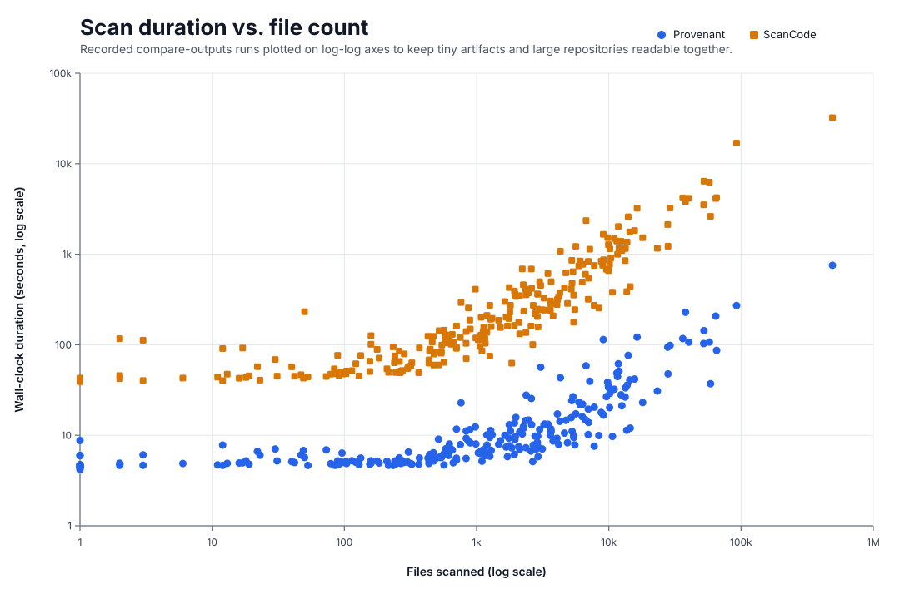

# Scan Benchmarks

This document records explicit [`compare-outputs`](../xtask/README.md#compare-outputs) benchmark runs with high-level timing metrics and notable end-state Provenant-vs-ScanCode outcomes on recorded targets.

These rows are not ad hoc performance snapshots. They are the public record of an iterative compare-review-fix-rerun loop on one concrete target at a time.

Provenant and ScanCode are run on the same repository or artifact with the maintained shared profile, the resulting deltas are reviewed to find where ScanCode currently performs better on that target, Provenant is improved with generic fixes and focused regression coverage, and the comparison is rerun until Provenant reaches parity or a justified better result on that target. Each row is therefore a maintained verification checkpoint and a snapshot of one recorded `compare-outputs` run, not a blanket claim about every scan mode, target, or future revision.

## Scan duration vs. file count

The chart below uses a log-log scatter plot: file count on the x-axis, wall-clock duration in seconds on the y-axis, and both scanners on the same numeric axes. That keeps tiny artifact snapshots and very large repository scans readable in one view without flattening the smaller runs.

> Provenant is faster on 254 of 254 recorded runs, with a **19.7× median speedup** and **19.7× geometric-mean speedup** overall; the median gap grows from **9.1×** on sub-100-file targets to **37.2×** on 10k+ file targets.
> Generated from the benchmark timing rows in this document via `cargo run --manifest-path xtask/Cargo.toml --bin generate-benchmark-chart`.

## Current benchmark examples

The quick index below links to benchmark sections. Each benchmark entry then records the snapshot size, benchmark date, machine context, raw timing comparison, and notable end-state Provenant-vs-ScanCode outcome for that target.

<!-- benchmark-quick-index:start -->

### Quick index

- **Repository-backed targets**
  - [Android / AOSP](#android--aosp)
  - [Chef](#chef)
  - [Python / Conda / Pixi](#python--conda--pixi)
  - [R / CRAN](#r--cran)
  - [Hugging Face / AI model repositories](#hugging-face--ai-model-repositories)
  - [Hex / Elixir / Erlang / OTP](#hex--elixir--erlang--otp)
  - [JavaScript / TypeScript / web stacks](#javascript--typescript--web-stacks)
  - [JVM / Java / Scala / Clojure](#jvm--java--scala--clojure)
  - [Rust / Go / native / infrastructure](#rust--go--native--infrastructure)
  - [Apple / Swift / Flutter / mobile](#apple--swift--flutter--mobile)
  - [.NET / NuGet / Windows / vcpkg](#net--nuget--windows--vcpkg)
  - [Ruby / PHP / Perl](#ruby--php--perl)
  - [Julia / Nix / Haskell / other ecosystems](#julia--nix--haskell--other-ecosystems)
- **Artifact/rootfs-backed targets**
  - [Container image layouts](#container-image-layouts)
  - [Linux rootfs images](#linux-rootfs-images)
  - [Installed package database snapshots](#installed-package-database-snapshots)
  - [Package archives](#package-archives)
  - [Mobile app artifacts](#mobile-app-artifacts)
  - [Release binaries and extracted app snapshots](#release-binaries-and-extracted-app-snapshots)
  - [Generated dependency lock manifests](#generated-dependency-lock-manifests)
  - [Legacy NuGet manifest sets](#legacy-nuget-manifest-sets)
  - [Conan lockfiles](#conan-lockfiles)
  - [Debian source packages](#debian-source-packages)

<!-- benchmark-quick-index:end -->

### Repository-backed targets

#### Android / AOSP

##### [aosp-mirror/platform_build @ 045a3d6](https://github.com/aosp-mirror/platform_build/tree/045a3d6a3e359633a14853a5a5e1e4f2a11cbdae) — **17.87× faster**

- Files: 1,515
- Run context: 2026-06-15 · macOS 26.5.1 · Apple M5 Pro · 64 GB · arm64 · 4 proc
- Timing: Provenant `8.68s`; ScanCode `155.12s`
- Richer file-level Android package extraction (`31` vs `18` package_data records) and dependency coverage (`148` vs `145`) across committed Soong `METADATA`, `AndroidManifest.xml`, `TestApp.apk`, cargo, and `go.work` surfaces, with correct `The Android Open Source Project` holder attribution where ScanCode leaves it null, plus declared licenses that avoid conflating the `tools/compliance` test-fixture licenses ScanCode pulls into the package expression

##### [facebook/fresco @ c991a69](https://github.com/facebook/fresco/tree/c991a692a254358d1cf56c5b4b06e6c5dd96cfab) — **37.03× faster**

- Files: 2,900
- Run context: 2026-06-17 · macOS 26.5.1 · Apple M5 Pro · 64 GB · arm64 · 4 proc
- Timing: Provenant `9.79s`; ScanCode `362.51s`
- Richer Android and Gradle dependency extraction (`768` vs `688`) across committed `build.gradle`, nearby Kotlin `buildSrc` constant catalogs, and `AndroidManifest.xml` surfaces, with exact Maven coordinates for symbolic Gradle references such as `Deps.AndroidX.*`, `Deps.Bolts.*`, and `TestDeps.*` where ScanCode emits placeholder-only names like `AndroidX`, `Bolts`, or `junit`, plus direct Android package visibility and cleaner URL normalization

##### [KhronosGroup/Vulkan-ValidationLayers @ d72c5f5](https://github.com/KhronosGroup/Vulkan-ValidationLayers/tree/d72c5f52886913598d4064fe8d03bf8ac471e215) — **33.22× faster**

- Files: 979
- Run context: 2026-06-17 · macOS 26.5.1 · Apple M5 Pro · 64 GB · arm64 · 4 proc
- Timing: Provenant `12.37s`; ScanCode `410.98s`
- Direct AndroidManifest package visibility (`1` vs `0` on `tests/android/AndroidManifest.xml`), clue-only weak GPL handling across Graphics Pipeline Library acronym sites instead of ScanCode's hard `GPL-1.0-or-later` detections, and cleaner Khronos documentation copyright or holder recovery without appended `- ! Khronos Vulkan` noise

#### Chef

##### [chef/chef @ 0e353ff](https://github.com/chef/chef/tree/0e353ffcc8c03ac5b57025081787913121c785d5) — **19.55× faster**

- Files: 2,274
- Run context: 2026-06-17 · macOS 26.5.1 · Apple M5 Pro · 64 GB · arm64 · 4 proc
- Timing: Provenant `12.03s`; ScanCode `235.22s`
- Richer mixed-surface package identity with fewer placeholder-only Debian rows and far broader dependency extraction (`351` vs `278`) across `Gemfile`, `Gemfile.lock`, `chef-*/Gemfile`, gemspec, Dockerfile, and fixture archive/control surfaces, plus email-preserving author normalization and cleaner placeholder-holder filtering

##### [sous-chefs/apache2 @ 420d824](https://github.com/sous-chefs/apache2/tree/420d82402811a131729a6bcc80aaac08d307ac87) — **10.22× faster**

- Files: 245
- Run context: 2026-06-15 · macOS 26.5.1 · Apple M5 Pro · 64 GB · arm64 · 4 proc
- Timing: Provenant `4.83s`; ScanCode `49.37s`
- Matched Chef package and dependency coverage on committed `metadata.rb` surfaces, with fuller Debian-style script-header author capture and cleaner rejection of weak README maintainer prose as an author

##### [sous-chefs/mysql @ 6b7110b](https://github.com/sous-chefs/mysql/tree/6b7110bee2bc64c9149f24d524cbb740387e527a) — **9.60× faster**

- Files: 91
- Run context: 2026-06-15 · macOS 26.5.1 · Apple M5 Pro · 64 GB · arm64 · 4 proc
- Timing: Provenant `4.79s`; ScanCode `45.99s`
- Matched Chef package and dependency coverage on committed `metadata.rb` surfaces, with cleaner rejection of config-word author noise such as `chef-client` and fuller `Author:: Name (<email>)` identity capture

#### Python / Conda / Pixi

##### [aboutcode-org/dejacode @ 4938cd4](https://github.com/aboutcode-org/dejacode/tree/4938cd4f28aec23afe6b88c4443e573c2db930ea) — **16.97× faster**

- Files: 1,278
- Run context: 2026-06-16 · macOS 26.5.1 · Apple M5 Pro · 64 GB · arm64 · 4 proc
- Timing: Provenant `11.28s`; ScanCode `191.41s`
- Broader ABOUT, Python, wheel, and Docker package visibility (`127` vs `1` packages, `146` vs `104` dependencies) across committed `.ABOUT` sidecars, bundled `thirdparty/dist/*.whl` artifacts, and product manifests, with real ecosystem PURLs derived from `download_url` metadata instead of fallback `pkg:about/...` identities

##### [aboutcode-org/scancode.io @ 904373a](https://github.com/aboutcode-org/scancode.io/tree/904373abf472e0567a99a3b1b5213e084040b5c1) — **12.83× faster**

- Files: 763
- Run context: 2026-06-15 · macOS 26.5.1 · Apple M5 Pro · 64 GB · arm64 · 4 proc
- Timing: Provenant `22.82s`; ScanCode `292.75s`
- Broader ABOUT and Python package visibility (`28` vs `1` packages, `292` vs `56` dependencies) across committed `.ABOUT` files, root and suffixed `pyproject.toml` manifests, and `uv.lock`, plus zero scan-file errors where ScanCode times out on large generated scan-result JSON fixtures

##### [aboutcode-org/scancode-toolkit @ 6570c13](https://github.com/aboutcode-org/scancode-toolkit/tree/6570c131e2821388286f661368a70e0120aaf2c6) — **19.96× faster**

- Files: 64,369
- Run context: 2026-06-17 · macOS 26.5.1 · Apple M5 Pro · 64 GB · arm64 · 4 proc
- Timing: Provenant `207.10s`; ScanCode `4134.60s`
- Far broader ABOUT-adjacent package and dependency visibility (`1294` vs `6` packages, `10952` vs `377` dependencies) across committed `.ABOUT` sidecars, Python/Swift/Dart/CocoaPods fixture manifests, and bounded RPM header metadata recovery, with real ecosystem PURLs derived from ABOUT `download_url` metadata instead of `pkg:about/...` fallbacks and zero scan-file errors where ScanCode times out on heavy fixture snapshots; the remaining ScanCode edge is concentrated in a small set of license-detection corpus and legal-text cases where it still preserves extra detections beyond Provenant’s current policy or refinement choices

##### [apache/airflow @ 47ce5f3](https://github.com/apache/airflow/tree/47ce5f32b4fae95f5865ba256d409c778d53a3d5) — **22.72× faster**

- Files: 11,935
- Run context: 2026-06-17 · macOS 26.5.1 · Apple M5 Pro · 64 GB · arm64 · 4 proc
- Timing: Provenant `50.99s`; ScanCode `1158.57s`
- Far broader Python/provider package coverage (`142` vs `1`) and dependency extraction (`7599` vs `1014`) from `uv.lock`, provider `pyproject.toml`, and committed `pnpm-lock.yaml` inputs, plus extra Docker and Helm package visibility, safer URL credential stripping, and cleaner copyright/author normalization across large documentation and kernel-style metadata blocks

##### [apache/superset @ cd8ac41](https://github.com/apache/superset/tree/cd8ac41d169dfeced733b7db47b8146fe4667b3a) — **36.2× faster**

- Files: 9,925
- Run context: 2026-06-29 · macOS 26.5.1 · Apple M5 Pro · 64 GB · arm64 · 4 proc
- Timing: Provenant `35.25s`; ScanCode `1276.89s`
- Far broader Python/JS package and dependency extraction (`37` vs `1` packages, `8219` vs `171` dependencies) from `requirements/*.txt`, root and websocket `pyproject.toml`/`package.json`, `uv.lock`, multiple `yarn.lock`/`package-lock.json`, Docker, `.gitmodules` GitHub Actions, and Helm inputs — including Yarn `resolutions` and npm `overrides` surfaced as `is_pinned` dependencies ScanCode omits — with the assembled `pkg:pypi/apache-superset` package carrying the complete `apache-2.0 AND ofl-1.1` declared license from its `LICENSE.txt` where ScanCode reports only `apache-2.0`, plus rejection of the placeholder and binary-noise emails ScanCode emits such as the templated `GITHUB_ACTOR` actor address, the gettext `LL@li.org` placeholder, and `.parquet` byte-pairs

##### [astral-sh/uv @ 9581f2b](https://github.com/astral-sh/uv/tree/9581f2b0ea65550a3efe28bd7aabde19d98b39ba) — **28.81× faster**

- Files: 1,259
- Run context: 2026-06-18 · macOS 26.5.1 · Apple M5 Pro · 64 GB · arm64 · 4 proc
- Timing: Provenant `9.47s`; ScanCode `272.81s`
- Far broader Python-family package and dependency extraction (`113` vs `1` packages, `5279` vs `759` dependencies) from the large `test/requirements/**` tree, many fixture/workspace `pyproject.toml` files, and multiple `uv.lock` inputs that ScanCode leaves at zero, with safer URL credential stripping, Unicode-preserving party normalization, and METADATA-backed wheel identity instead of double-counting a misleading filename

##### [astropy/astropy @ 40280e3](https://github.com/astropy/astropy/tree/40280e3bd715a4968eda816c73bf88f05aa6cdc0) — **36.99× faster**

- Files: 1,962
- Run context: 2026-06-17 · macOS 26.5.1 · Apple M5 Pro · 64 GB · arm64 · 4 proc
- Timing: Provenant `9.63s`; ScanCode `356.23s`
- Broader Python package coverage (`3` vs `1` packages) including direct `CITATION.cff` citation-metadata visibility, with matched dependency coverage (`79` vs `77`) from `pyproject.toml` and `docs/rtd_environment.yaml`, cleaner vendored holder recovery, and Unicode-preserving copyright normalization

##### [conda/conda @ 37549c4](https://github.com/conda/conda/tree/37549c41a1925b0625e346e2823a5e15af03b862) — **15.79× faster**

- Files: 284
- Run context: 2026-06-17 · macOS 26.5.1 · Apple M5 Pro · 64 GB · arm64 · 4 proc
- Timing: Provenant `5.02s`; ScanCode `79.28s`
- Broader Conda and Python package coverage (`5` vs `2` packages, `73` vs `26` dependencies) from `conda.recipe/meta.yaml`, multiple `environment.yml` fixtures, and the root `setup.py`, with safer URL credential stripping across authentication test fixtures

##### [conda/conda-build @ 5da509d](https://github.com/conda/conda-build/tree/5da509d13764d96c02c80f24b54ab87d652b2538) — **7.61× faster**

- Files: 835
- Run context: 2026-06-14 · macOS 26.5.1 · Apple M5 Pro · 64 GB · arm64 · 4 proc
- Timing: Provenant `9.24s`; ScanCode `70.31s`
- Far broader Conda recipe and dependency extraction (`257` vs `1` packages, `164` vs `13` dependencies) across committed `meta.yaml` recipe fixtures, split-package test recipes, and sidecar Python manifests, with explicit malformed-recipe scan errors on duplicate-key negative fixtures instead of silently treating them as ordinary package metadata

##### [conda-forge/pandas-feedstock @ 4063b72](https://github.com/conda-forge/pandas-feedstock/tree/4063b725cd252c02b0cebe935a8859a6b540fe00) — **6.31× faster**

- Files: 49
- Run context: 2026-06-15 · macOS 26.5.1 · Apple M5 Pro · 64 GB · arm64 · 4 proc
- Timing: Provenant `6.79s`; ScanCode `42.84s`
- Direct schema-versioned conda-forge feedstock package visibility (`1` vs `0` packages, `51` vs `0` dependencies) from `recipe/recipe.yaml`, plus assembled top-level Conda package identity and preserved source/about metadata

##### [DefectDojo/django-DefectDojo @ 2f25c45](https://github.com/DefectDojo/django-DefectDojo/tree/2f25c4510361e2f27f63fbbcff3901cbd2ef4a07) — **24.94× faster**

- Files: 4,301
- Run context: 2026-06-18 · macOS 26.5.1 · Apple M5 Pro · 64 GB · arm64 · 4 proc
- Timing: Provenant `43.27s`; ScanCode `1079.38s`
- Broader full-repo package and dependency extraction (`3` vs `2` packages, `616` vs `535` dependencies) from `.gitmodules`, `helm/defectdojo/Chart.yaml`, `helm/defectdojo/Chart.lock`, and the root `requirements*.txt` manifests, with direct Helm chart package visibility, pinned PostgreSQL or Valkey chart dependencies, Git-submodule package metadata, and zero scan errors where ScanCode reports 3 scan-file failures on large vulnerability fixtures

##### [django/django @ 09f27cc](https://github.com/django/django/tree/09f27cc373eb1e6e5e8b286204809a79b61d55c3) — **39.22× faster**

- Files: 7,029
- Run context: 2026-06-17 · macOS 26.5.1 · Apple M5 Pro · 64 GB · arm64 · 4 proc
- Timing: Provenant `13.85s`; ScanCode `543.19s`
- Far broader Python-family package and dependency extraction (`2` vs `1` packages, `16` vs `6` dependencies) because `pyproject.toml` contributes both a real PyPI root package and 5 Python dependencies while `docs/requirements.txt` adds 5 more documentation dependencies that ScanCode leaves at zero, with clearer `BSD-3-Clause` declared-license capture and visibility into the vendored CVS marker that ScanCode skips

##### [OpenMDAO/OpenMDAO @ bf1fcb6](https://github.com/OpenMDAO/OpenMDAO/tree/bf1fcb6f09a07a49cdba27c2fd765153ec54694c) — **27.03× faster**

- Files: 1,199
- Run context: 2026-06-20 · macOS 26.5.1 · Apple M5 Pro · 64 GB · arm64 · 4 proc
- Timing: Provenant `7.80s`; ScanCode `210.82s`
- Broader Pixi, Julia, and Docker package visibility (`3` vs `1` packages, `1489` vs `76` dependencies) from the root `pixi.toml`, resolved `pixi.lock`, and the experimental Julia `Project.toml`, with no `pixi.lock` scan errors where ScanCode times out and much richer lockfile license visibility

##### [pandas-dev/pandas @ c385d01](https://github.com/pandas-dev/pandas/tree/c385d0188cbfb2294fb6362ec24b514b211c7fb1) — **32.0× faster**

- Files: 2,608
- Run context: 2026-06-14 · macOS 26.5.1 · Apple M5 Pro · 64 GB · arm64 · 4 proc
- Timing: Provenant `13.09s`; ScanCode `418.88s`
- Far broader Python/Conda/Pixi package and dependency extraction (`4` vs `1` packages, hundreds of additional dependencies) because `pixi.lock` and `environment.yml` surface large resolved Conda/Pixi package graphs with per-package license inventories ScanCode ignores entirely, while avoiding ScanCode's `pixi.lock` timeout, preserving SPDX-aligned `BSD-3-Clause` declared licensing, and skipping ScanCode's data-table copyright false positives such as `(c) Rain (mm) Wind`

##### [prefix-dev/pixi @ 6458b15](https://github.com/prefix-dev/pixi/tree/6458b15a855cf6beeaad1853ef007d9d20a5bccc) — **12.84× faster**

- Files: 2,372
- Run context: 2026-06-15 · macOS 26.5.1 · Apple M5 Pro · 64 GB · arm64 · 4 proc
- Timing: Provenant `27.77s`; ScanCode `356.55s`
- Broader Pixi package and dependency extraction (`233` vs `128` packages, `22369` vs `3116` dependencies) from the root and example `pixi.toml` or `pixi.lock` surfaces plus feature-scoped `pypi-dependencies` and cargo workspace members that inherit the declared `BSD-3-Clause` license ScanCode leaves unset, with no example-lock scan errors where ScanCode times out and safer credential stripping or git URL normalization across Pixi source fixtures

##### [pydata/xarray @ f7e47a1](https://github.com/pydata/xarray/tree/f7e47a19726321e56d74bca896eb55c6f330506b) — **22.17× faster**

- Files: 429
- Run context: 2026-06-20 · macOS 26.5.1 · Apple M5 Pro · 64 GB · arm64 · 4 proc
- Timing: Provenant `5.60s`; ScanCode `124.15s`
- Broader Pixi and Conda environment coverage (`3` vs `1` packages, `509` vs `84` dependencies) from the repo-root `pixi.toml` plus committed Binder and CI environment manifests, with direct Pixi package identity and cleaner URL normalization across docs and SVG metadata

##### [pyodide/pyodide @ 86e27b0](https://github.com/pyodide/pyodide/tree/86e27b004d06bccd91a937aa5fc2601978642b74) — **14.25× faster**

- Files: 540
- Run context: 2026-06-20 · macOS 26.5.1 · Apple M5 Pro · 64 GB · arm64 · 4 proc
- Timing: Provenant `5.67s`; ScanCode `80.78s`
- Broader dependency extraction (`796` vs `718`) and slightly broader package visibility (`53` vs `52`) from `environment.yml`, `.gitmodules`, and committed wheel artifacts, with extension-qualified wheel PURLs, richer patch-header author recovery, and the fuller `Pyodide contributors and Mozilla` documentation notice

##### [pypa/pipenv @ fbce7b4](https://github.com/pypa/pipenv/tree/fbce7b4ff5be762cef1b5b88afc5bb4230a759de) — **12.53× faster**

- Files: 835
- Run context: 2026-06-27 · macOS 26.5.1 · Apple M5 Pro · 64 GB · arm64 · 4 proc
- Timing: Provenant `11.16s`; ScanCode `139.82s`
- Far broader Python package and dependency extraction (`6` vs `1` packages, `392` vs `296` dependencies) from the repo's `Pipfile`, `Pipfile.lock`, `pyproject.toml`/`pylock.toml`, and committed `setup.py`/`setup.cfg` fixtures plus bundled sdist/wheel artifacts that ScanCode collapses to a single pyproject-only package, including build-time `setup_requires` dependencies and PEP 503-normalized PyPI names such as `jaraco-classes` where ScanCode keeps the dotted `jaraco.classes`, with the MIT/ISC declared licenses consolidated onto the assembled packages rather than duplicated across each datafile

##### [python/cpython @ 7a468a1](https://github.com/python/cpython/tree/7a468a101268d2b13105f94ae027df8b502d0c87) — **70.74× faster**

- Files: 5,627
- Run context: 2026-06-18 · macOS 26.5.1 · Apple M5 Pro · 64 GB · arm64 · 4 proc
- Timing: Provenant `17.27s`; ScanCode `1221.65s`
- Direct PEP 751 `Doc/pylock.toml` package visibility with 29 pinned PyPI documentation dependencies where ScanCode leaves the lockfile dependency-blind, plus cleaner FTP documentation URL extraction that keeps real FTP hosts while rejecting `ftp.*` method and member references

##### [python-poetry/poetry @ bfce511](https://github.com/python-poetry/poetry/tree/bfce5118814fa95445e823cb07a59bd77ffe1474) — **14.8× faster**

- Files: 987
- Run context: 2026-06-14 · macOS 26.5.1 · Apple M5 Pro · 64 GB · arm64 · 4 proc
- Timing: Provenant `8.01s`; ScanCode `118.91s`
- Far broader Python package and dependency extraction (`72` vs `16` packages, `840` vs `595` dependencies) from the root PEP 621 `pyproject.toml`, Poetry dependency groups, committed `poetry.lock` fixtures, and bundled wheel/sdist metadata, with the project's MIT license placed on the named `poetry` package rather than smeared onto a nameless lockfile aggregate, and clean handling of `.dist-info` `Author`/`Author-email` lines that ScanCode mangles into one malformed party

##### [scipy/scipy @ 8a4633f](https://github.com/scipy/scipy/tree/8a4633fa0e01d62e9ccdd06ebe5bb30551cfa056) — **43.01× faster**

- Files: 2,998
- Run context: 2026-06-20 · macOS 26.5.1 · Apple M5 Pro · 64 GB · arm64 · 4 proc
- Timing: Provenant `11.54s`; ScanCode `496.36s`
- Far broader Python/Conda/Pixi package and dependency extraction (`4` vs `1` packages, `1469` vs `78` dependencies) from `pixi.lock`'s large resolved Conda graph, `environment.yml`, `pixi.toml`, and the aggregated `requirements/*.txt` tree that ScanCode leaves at zero, with cleaner `pyproject.toml` requirement shaping for exact pins and environment markers

##### [UCBoulder/tardigrade_micromorphic_tools @ d03a8ca](https://github.com/UCBoulder/tardigrade_micromorphic_tools/tree/d03a8cae9e0983040487d2ecf32da98d9b297b92) — **7.70× faster**

- Files: 47
- Run context: 2026-06-06 · macOS 26.5.1 · Apple M5 Pro · 64 GB · arm64 · 4 proc
- Timing: Provenant `6.06s`; ScanCode `46.66s`
- Broader Conda dependency extraction (`17` vs `0` dependencies on `recipe/recipe.yaml`) by parsing the rattler-build `recipe.yaml` that ScanCode reads only as `recipe/meta.yaml`, with `${{ name|lower }}` context templating resolved into a real `pkg:conda/tardigrade_micromorphic_tools@0.0.0` identity and identical top-level license detection across the C++ source tree

#### R / CRAN

##### [r-lib/devtools @ a3447b9](https://github.com/r-lib/devtools/tree/a3447b9f3d59abb6cc8b63a54db3435819324c1e) — **9.89× faster**

- Files: 265
- Run context: 2026-06-15 · macOS 26.5.1 · Apple M5 Pro · 64 GB · arm64 · 4 proc
- Timing: Provenant `4.97s`; ScanCode `49.16s`
- Far broader CRAN package and dependency extraction (`14` vs `1` packages, `45` vs `1` dependencies) from the root `DESCRIPTION` plus committed test-package fixtures, with correct filtering of fake `pkg:cran/R` dependency noise and cleaner maintainer or URL normalization

##### [tidyverse/dplyr @ 2f9f49e](https://github.com/tidyverse/dplyr/tree/2f9f49ef0d361dc612abc55982d68db3fb3854d0) — **19.42× faster**

- Files: 462
- Run context: 2026-06-20 · macOS 26.5.1 · Apple M5 Pro · 64 GB · arm64 · 4 proc
- Timing: Provenant `5.52s`; ScanCode `107.21s`
- Direct CRAN package visibility on the root `DESCRIPTION` plus declared dependency extraction (`29` vs `0`) across `Depends`, `Imports`, `Suggests`, `Enhances`, and `LinkingTo`, with cleaner Rd or markdown URL normalization and preserved shipped license-holder metadata

##### [tidyverse/ggplot2 @ 7d79c95](https://github.com/tidyverse/ggplot2/tree/7d79c956b5707cb7c762d834caf842dc6496b032) — **17.82× faster**

- Files: 1,154
- Run context: 2026-06-20 · macOS 26.5.1 · Apple M5 Pro · 64 GB · arm64 · 4 proc
- Timing: Provenant `6.59s`; ScanCode `117.46s`
- Direct CRAN package visibility on the root `DESCRIPTION` plus declared dependency extraction (`41` vs `0`) across `Imports`, `Suggests`, and `Enhances`, with correct hyphenated CRAN version constraints such as `sf (>= 0.7-3)` and cleaner Rd or roxygen URL recovery

#### Hugging Face / AI model repositories

##### [openai/clip-vit-base-patch32 @ 3d74acf](https://huggingface.co/openai/clip-vit-base-patch32/tree/3d74acf9a28c67741b2f4f2ea7635f0aaf6f0268) — **11.66× faster**

- Files: 12
- Run context: 2026-06-27 · macOS 26.5.1 · Apple M5 Pro · 64 GB · arm64 · 4 proc
- Timing: Provenant `7.79s`; ScanCode `90.82s`
- Direct Hugging Face CLIP model package identity (`1` vs `0`) that ScanCode cannot model because it ships no Hugging Face parser: Provenant assembles the repository's `config.json` and model-card `README.md` into one `pkg:huggingface/openai/clip-vit-base-patch32` package, with both scanners reporting zero copyright and holder detections across the model weights and the BPE-merges `tokenizer.json` whose mojibake `©` byte-pairs (e.g. `pok é`) carry no genuine notice

##### [segmind/tiny-sd @ cad0bd7](https://huggingface.co/segmind/tiny-sd/tree/cad0bd7495fa6c4bcca01b19a723dc91627fe84f) — **18.6× faster**

- Files: 17
- Run context: 2026-06-27 · macOS 26.5.1 · Apple M5 Pro · 64 GB · arm64 · 4 proc
- Timing: Provenant `4.96s`; ScanCode `92.04s`
- Direct Hugging Face Diffusers pipeline package identity (`1` vs `0`) that ScanCode cannot model because it ships no Hugging Face parser: Provenant assembles the repository's `model_index.json` together with its `text_encoder`, `unet`, and `vae` component `config.json` files into one `pkg:huggingface/SG161222/Realistic_Vision_V4.0` Stable Diffusion pipeline package anchored on the config's `_name_or_path`

##### [sentence-transformers/all-MiniLM-L6-v2 @ 1110a24](https://huggingface.co/sentence-transformers/all-MiniLM-L6-v2/tree/1110a243fdf4706b3f48f1d95db1a4f5529b4d41) — **9.75× faster**

- Files: 30
- Run context: 2026-06-07 · macOS 26.5.1 · Apple M5 Pro · 64 GB · arm64 · 4 proc
- Timing: Provenant `7.05s`; ScanCode `68.76s`
- Direct Hugging Face model package identity (`1` vs `0` packages, `22` vs `0` dependencies) that ScanCode cannot model at all because it ships no HF parser: Provenant assembles the repository's `config.json` and model-card `README.md` into one `pkg:huggingface/nreimers/MiniLM-L6-H384-uncased` package, anchoring identity on the config's `_name_or_path`, normalizing the card's `apache-2.0` declared license, and hoisting the `base_model` and `datasets` frontmatter into `base_model`- and `dataset`-scoped `pkg:huggingface/...` dependencies, with identical top-level license detection across the repository tree

##### [bitwalker/distillery @ 3ab4d61](https://github.com/bitwalker/distillery/tree/3ab4d6146c7bc18139ed75d330e4fbb0fceb7591) — **8.76× faster**

- Files: 305
- Run context: 2026-06-06 · macOS 26.5.1 · Apple M5 Pro · 64 GB · arm64 · 4 proc
- Timing: Provenant `6.53s`; ScanCode `57.19s`
- Broader Hex package and dependency extraction (`6` vs `0` packages, `399` vs `0` dependencies): one `pkg:hex` package per `mix.exs` (the root `distillery` app plus five `test/fixtures/*` apps), each merging its sibling `mix.lock` for locked identities, parsing the root lockfile's legacy 7-element hex tuples ScanCode does not read and defaulting `hexpm` as the repository for tuples that omit it, with MIT license detection preserved across the Elixir source tree

##### [elixir-ecto/ecto @ 28d9282](https://github.com/elixir-ecto/ecto/tree/28d928267388018d5b0bb1f83e04368b7e8cae50) — **13.56× faster**

- Files: 156
- Run context: 2026-06-15 · macOS 26.5.1 · Apple M5 Pro · 64 GB · arm64 · 4 proc
- Timing: Provenant `4.85s`; ScanCode `65.75s`
- Broader Hex package and dependency extraction (`2` vs `0` packages, `27` vs `0` dependencies): a `pkg:hex/ecto` package and an `examples/friends` app, each pairing `mix.exs` identity with `mix.lock` locked dependencies such as `ecto_sql`, `postgrex`, and `telemetry` that ScanCode leaves dependency-blind

##### [elixir-plug/plug @ 47649aa](https://github.com/elixir-plug/plug/tree/47649aa7bb910f481b66cc3e98c14b2c3b761c3c) — **10.51× faster**

- Files: 104
- Run context: 2026-06-15 · macOS 26.5.1 · Apple M5 Pro · 64 GB · arm64 · 4 proc
- Timing: Provenant `4.88s`; ScanCode `51.28s`
- Direct Hex package and dependency extraction (`1` vs `0` packages, `13` vs `0` dependencies): a `pkg:hex/plug` package from `mix.exs` carrying locked `plug_crypto`, `telemetry`, `ex_doc`, and sibling Hex pins from `mix.lock` that ScanCode leaves at zero, with Unicode-preserving `Loïc Hoguin` holder normalization

##### [erlang/otp @ 6146f0d](https://github.com/erlang/otp/tree/6146f0df6794451472fac4735e694ec1f56b873e) — **32.84× faster**

- Files: 11,803
- Run context: 2026-08-21 · macOS 26.6.1 · Apple M5 Pro · 64 GB · arm64 · 4 proc
- Timing: Provenant `61.62s`; ScanCode `2023.39s`
- Broader OTP package and dependency visibility (`51` vs `0` packages, `16` vs `9` dependencies): one `pkg:hex/<app>` package per committed `lib/*/src/*.app.src` (`41`, with bounded `%PLACEHOLDER%` handling that keeps canonical manifests such as `diameter.app.src` scannable) alongside `10` `pkg:autotools` packages from per-application `configure.ac` build manifests and the `mix.lock` Hex pins ScanCode leaves unread, plus markedly lower-noise party and license detection across the doc and test tree, where ScanCode reads Erlang identifiers as licenses (`mpl-2.0` on `24` sites from `ModemDescriptor_mpl`, `boost-1.0` from the `bsl` bit-shift operator, `bsd-new` from `bsd style pthread_set_name_np`), a code comment as `proprietary-license`, Erlang variables as copyright holders (`(c), Ctxt, Ren, Env`), and an Erlang `.app` filename as `http://ftp.app/`; more precise license composition on the vendored `ryu` sources, whose alternative grant reads `(apache-2.0 OR boost-1.0)` rather than a conjunction; third-party `vendor.info` notices recorded without the trailing JSON key ScanCode appends; and source-faithful parties throughout — email addresses in their original case (`Paul.Green@stratus.com`) and Unicode-preserving names such as `Björn Gustavsson`, `Mickaël Rémond`, and `Claes Wikström`

##### [livebook-dev/livebook @ 77cbcd9](https://github.com/livebook-dev/livebook/tree/77cbcd98df133045f5a4adf7273e4cd077307714) — **17.14× faster**

- Files: 704
- Run context: 2026-06-27 · macOS 26.5.1 · Apple M5 Pro · 64 GB · arm64 · 4 proc
- Timing: Provenant `5.33s`; ScanCode `91.33s`
- Direct Elixir/Hex project package identity (`3` vs `0` `pkg:hex/*` packages) from Provenant's static `mix.exs` parser, which ScanCode does not model — it reports only the Rust NIF's `pkg:cargo/livebook`: each committed `mix.exs` assembles with its sibling `mix.lock` into a `pkg:hex/<app>` package (`livebook`, `livebook_proto`, `livebook_space`) that owns its resolved Hex dependencies (`106` locked hex deps total), with the same Cargo package ScanCode finds plus broader `bun.lock`/`package.json` asset-dependency visibility

##### [phoenixframework/phoenix @ e7b8081](https://github.com/phoenixframework/phoenix/tree/e7b8081792fa51c9fede6d0fb9ddb610bac3f26f) — **14.38× faster**

- Files: 476
- Run context: 2026-06-20 · macOS 26.5.1 · Apple M5 Pro · 64 GB · arm64 · 4 proc
- Timing: Provenant `5.49s`; ScanCode `78.97s`
- Direct Hex package visibility (`3` vs `0` file-level package records) on the repo-root, `installer/`, and `integration_test/` `mix.exs`/`mix.lock` surfaces — each `pkg:hex` package versioned from its `mix.exs` (`phoenix@1.8.5`, `phx_new@1.8.5`) and merged with its sibling lockfile — while preserving top-level package and dependency parity elsewhere and structured party metadata on the bundled `pkg:npm/phoenix` asset package

##### [processone/ejabberd @ 87475d8](https://github.com/processone/ejabberd/tree/87475d813b974492f338720eab5c9c3d4646a4ce) — **15.15× faster**

- Files: 623
- Run context: 2026-06-20 · macOS 26.5.1 · Apple M5 Pro · 64 GB · arm64 · 4 proc
- Timing: Provenant `8.01s`; ScanCode `121.38s`
- Broader Erlang package and dependency extraction (`3` vs `1` packages, `43` vs `3` dependencies): `pkg:hex` and `pkg:autotools` identities from the `_checkouts/configure_deps` app and root `configure.ac` alongside the `pkg:npm` project, with rebar dependencies recovered from the root `rebar.config`/`rebar.lock` and committed Dockerfiles, plus the bundled `priv/mod_invites/copyright` notice kept as clue-level license evidence instead of being overstated as Debian package metadata

##### [vernemq/vernemq @ 4681e54](https://github.com/vernemq/vernemq/tree/4681e5490cc42e6cc26a504bb4b3c5413315c21f) — **14.07× faster**

- Files: 441
- Run context: 2026-06-15 · macOS 26.5.1 · Apple M5 Pro · 64 GB · arm64 · 4 proc
- Timing: Provenant `6.12s`; ScanCode `86.10s`
- Broader Erlang/Rebar dependency extraction (`119` vs `0`) from the repo-root and per-app `rebar.config` / `.app.src` manifests, plus direct `.gitmodules` package visibility and mixed Hex or git package identity across the VerneMQ app tree where ScanCode stays manifest-blind

#### JavaScript / TypeScript / web stacks

##### [appsmithorg/appsmith @ 6ca79d1](https://github.com/appsmithorg/appsmith/tree/6ca79d1de1fa63ead9bcaed2d7509b309aa6825b) — **34.56× faster**

- Files: 13,366
- Run context: 2026-06-23 · macOS 26.5.1 · Apple M5 Pro · 64 GB · arm64 · 4 proc
- Timing: Provenant `33.43s`; ScanCode `1155.18s`
- Direct Helm chart package visibility on `deploy/helm/Chart.yaml` (`1` vs `0`) with declared dependency extraction (`4` vs `0`) for the pinned MongoDB, PostgreSQL, Prometheus, and Redis chart inputs that ScanCode leaves unmodeled

##### [baserow/baserow @ 18a5fc1](https://github.com/baserow/baserow/tree/18a5fc1fbf60666dc2509872efee5e8fa6ff750f) — **46.79× faster**

- Files: 8,755
- Run context: 2026-06-21 · macOS 26.5.1 · Apple M5 Pro · 64 GB · arm64 · 4 proc
- Timing: Provenant `17.87s`; ScanCode `836.07s`
- Direct Helm package visibility on `deploy/helm/baserow/Chart.yaml` and `Chart.lock` (`2` file-level Helm surfaces vs `0`), with declared plus locked dependency extraction (`12` vs `0` on each chart file) covering sibling `baserow-common` aliases and the pinned Bitnami/Caddy chart inputs that ScanCode leaves at zero

##### [catppuccin/gitea @ 6a78970](https://github.com/catppuccin/gitea/tree/6a789704686ec13178a13cd84bf1e30db191a437) — **6.76× faster**

- Files: 23
- Run context: 2026-06-06 · macOS 26.5.1 · Apple M5 Pro · 64 GB · arm64 · 4 proc
- Timing: Provenant `6.02s`; ScanCode `40.69s`
- Deno v4 lockfile dependency extraction (`37` vs `0` from `deno.lock`'s resolved `npm` and `jsr` graphs) where ScanCode is lockfile-blind, plus `deno.json` import-map package visibility and cleaner rejection of a bare-URL holder mistaken from README prose; the deno.lock parser now covers lockfile formats v1–v5 rather than v5 alone

##### [denoland/fresh @ 49c4be1](https://github.com/denoland/fresh/tree/49c4be1ac60603174bad1c6e3c13bd88602c51bb) — **13.61× faster**

- Files: 567
- Run context: 2026-06-20 · macOS 26.5.1 · Apple M5 Pro · 64 GB · arm64 · 4 proc
- Timing: Provenant `4.70s`; ScanCode `63.97s`
- Broader Deno package and dependency extraction (`8` vs `0` packages, `966` vs `0` dependencies) from the root `deno.json`, `deno.lock`, and nested `packages/*/deno.json` manifests, with direct JSR and npm import-map or lockfile package identity where ScanCode stays manifest-blind

##### [denoland/std @ a864f62](https://github.com/denoland/std/tree/a864f62bcc8a5f20716d2becab3cfe224a2ad810) — **32.46× faster**

- Files: 2,812
- Run context: 2026-06-21 · macOS 26.5.1 · Apple M5 Pro · 64 GB · arm64 · 4 proc
- Timing: Provenant `7.00s`; ScanCode `227.22s`
- Broader Deno package visibility (`42` more packages, `0` missing) from the root and leaf `*/deno.json` manifests across the standard-library tree, plus concrete Cargo lock package identities on embedded Rust fixtures instead of anonymous `cargo_lock` rows

##### [getsentry/self-hosted @ 8728919](https://github.com/getsentry/self-hosted/tree/8728919e080836c53724f277d4d36cc310fc5011) — **9.54× faster**

- Files: 129
- Run context: 2026-06-14 · macOS 26.5.1 · Apple M5 Pro · 64 GB · arm64 · 4 proc
- Timing: Provenant `4.74s`; ScanCode `45.20s`
- Broader mixed Docker/npm/Python package extraction (`2` vs `1` packages, `111` vs `0` dependencies) from the integration-test `package-lock.json`, `uv.lock`, and committed service Dockerfiles, plus the more specific `Apache-2.0 AND FSL-1.1-ALv2` license classification on `LICENSE.md` where ScanCode reports only `FSL-1.1-ALv2`

##### [github/opensource.guide @ 38d739c](https://github.com/github/opensource.guide/tree/38d739c84dd6768039596c3ded87a057123b0e8d) — **16.93× faster**

- Files: 1,127
- Run context: 2026-07-14 · macOS 26.5.1 · Apple M5 Pro · 64 GB · arm64 · 4 proc
- Timing: Provenant `6.89s`; ScanCode `116.63s`
- Reads copyright notices embedded in the bundled `.woff`/`.woff2` fonts (Inter, Vazirmatn) that ScanCode leaves undetected, and rejects ScanCode's author false positives mined from the localized `_articles/*/legal.md` guides (bare GitHub URLs, the word `did`, sentence fragments) along with its `LicenseRef-scancode-free-unknown` matches on prose that merely mentions being free; the npm and gem manifests report an empty declared license where they declare none, rather than the repo-wide detected-license aggregate ScanCode assigns as `declared_license_expression`

##### [iTowns/itowns @ 08e08f5](https://github.com/iTowns/itowns/tree/08e08f512983b6f3d60d04d431b67b3c5e2e1584) — **19.11× faster**

- Files: 616
- Run context: 2026-06-20 · macOS 26.5.1 · Apple M5 Pro · 64 GB · arm64 · 4 proc
- Timing: Provenant `5.99s`; ScanCode `114.48s`
- Direct `publiccode.yml` package visibility on the root metadata file (`1` vs `0` on that file), with matched top-level package and dependency counts elsewhere plus Unicode-preserving Potree copyright normalization and cleaner URL shaping across README and docs material

##### [jashkenas/backbone @ da75718](https://github.com/jashkenas/backbone/tree/da75718e896e52e84aa1f0411ba67fafcdcf6af3) — **12.27× faster**

- Files: 122
- Run context: 2026-06-15 · macOS 26.5.1 · Apple M5 Pro · 64 GB · arm64 · 4 proc
- Timing: Provenant `5.03s`; ScanCode `61.74s`
- Matched Bower package and dependency coverage on the repo-root `bower.json`, with datasource-tagged Bower package identity instead of a bare purl-only row and package-level party metadata from `package.json`

##### [jquery/jquery-ui @ eda7aa3](https://github.com/jquery/jquery-ui/tree/eda7aa34fa59d8f764b2164be3e3b7f14639b0db) — **30.01× faster**

- Files: 1,083
- Run context: 2026-06-20 · macOS 26.5.1 · Apple M5 Pro · 64 GB · arm64 · 4 proc
- Timing: Provenant `6.70s`; ScanCode `201.04s`
- Matched Bower package and dependency coverage on the repo-root `bower.json`, with datasource-tagged Bower package identity instead of a bare purl-only row and cleaner Unicode-preserving author normalization across locale files and vendored docs

##### [lodash/lodash @ cb0b9b9](https://github.com/lodash/lodash/tree/cb0b9b9212521c08e3eafe7c8cb0af1b42b6649e) — **20.62× faster**

- Files: 159
- Run context: 2026-06-20 · macOS 26.5.1 · Apple M5 Pro · 64 GB · arm64 · 4 proc
- Timing: Provenant `4.91s`; ScanCode `101.22s`
- Matched npm package and dependency coverage on the repo-root `package.json` and `package-lock.json`, with source-faithful copyright recovery across `lodash.js`, `dist/lodash*.js`, and `LICENSE`, plus encoded-query URL preservation and extra Firebug asset URL visibility where ScanCode flattens or misses the underlying source text

##### [metabase/metabase @ 10997b1](https://github.com/metabase/metabase/tree/10997b10908414ab05773b085a56a37fcdebcd1a) — **66.26× faster**

- Files: 18,030
- Run context: 2026-06-23 · macOS 26.5.1 · Apple M5 Pro · 64 GB · arm64 · 4 proc
- Timing: Provenant `22.99s`; ScanCode `1523.27s`
- Broader package and dependency extraction (`9` vs `1` packages, `7055` vs `423` dependencies) from the root and driver `deps.edn` manifests plus committed `bun.lock` and `uv.lock`, with cleaner OFL font URL normalization where ScanCode preserves broken concatenated links

##### [microsoft/vscode @ 0c1e100](https://github.com/microsoft/vscode/tree/0c1e100626c19724d1222c2bc4b63ba3556858a7) — **43.13× faster**

- Files: 14,398
- Run context: 2026-06-23 · macOS 26.5.1 · Apple M5 Pro · 64 GB · arm64 · 4 proc
- Timing: Provenant `40.89s`; ScanCode `1763.40s`
- Broader monorepo package and dependency extraction (`138` vs `1` packages, `7720` vs `1815` dependencies) from the root `package-lock.json`, many extension fixture manifests and lockfiles, and embedded Cargo/Docker metadata, plus richer named package identities where ScanCode emits generic lockfile and archive rows

##### [npm/cli @ 05dbba5](https://github.com/npm/cli/tree/05dbba5b8d727ddb2c098ce0553714eae791c5f2) — **40.20× faster**

- Files: 6,732
- Run context: 2026-06-18 · macOS 26.5.1 · Apple M5 Pro · 64 GB · arm64 · 4 proc
- Timing: Provenant `58.53s`; ScanCode `2352.73s`
- Clean root npm workspace manifest coverage without ScanCode's workspace-assembly scan errors, fewer large registry-fixture JSON timeouts, and cleaner handling of duplicated private-workspace dependency exports and repeated MIT-style registry-fixture metadata noise

##### [oakserver/oak @ 185baef](https://github.com/oakserver/oak/tree/185baef02551a84798000f25d3bd01c2fdfcb1ce) — **9.43× faster**

- Files: 103
- Run context: 2026-06-15 · macOS 26.5.1 · Apple M5 Pro · 64 GB · arm64 · 4 proc
- Timing: Provenant `5.09s`; ScanCode `47.99s`
- Direct Deno package visibility on the root `deno.json` (`1` vs `0` packages), plus Dockerfile package visibility on `.devcontainer/Dockerfile`, with cleaner trailing-slash URL normalization across README and docs material

##### [oven-sh/bun @ 700fc11](https://github.com/oven-sh/bun/tree/700fc117a2fd01ac0201deaa6fa69c5557acb04f) — **52.00× faster**

- Files: 12,551
- Run context: 2026-06-23 · macOS 26.5.1 · Apple M5 Pro · 64 GB · arm64 · 4 proc
- Timing: Provenant `21.17s`; ScanCode `1100.75s`
- Far broader Bun/npm-family package extraction (`383` vs `29` packages, `14381` vs `323` dependencies) from the repo's 52 committed `bun.lock` / `bun.lockb` inputs that ScanCode leaves at zero, plus legacy `bun.lockb` coverage on `bench/bundle` and plainer `BSD-2-Clause` rebucketing where ScanCode uses the over-specific `BSD-2-Clause-Views` label

##### [pnpm/pnpm @ 2a1ffe1](https://github.com/pnpm/pnpm/tree/2a1ffe1956a75746844b1c6cd863ecfbb5a55729) — **33.85× faster**

- Files: 2,887
- Run context: 2026-06-20 · macOS 26.5.1 · Apple M5 Pro · 64 GB · arm64 · 4 proc
- Timing: Provenant `7.32s`; ScanCode `247.80s`
- Broader pnpm/npm monorepo package and dependency extraction (`396` vs `282` packages, `11606` vs `3080` dependencies) from the root `pnpm-lock.yaml`, nested workspace member manifests, and shared workspace `npm-shrinkwrap.json` / `pnpm-lock.yaml` roots, plus zero scan-file errors where ScanCode crashes on the root workspace manifests and catalog-protocol fixture inputs

##### [renovatebot/renovate @ 91a7213](https://github.com/renovatebot/renovate/tree/91a72131e8aefcda8f0dab7499f378f7eb41300f) — **44.83× faster**

- Files: 3,663
- Run context: 2026-06-21 · macOS 26.5.1 · Apple M5 Pro · 64 GB · arm64 · 4 proc
- Timing: Provenant `11.09s`; ScanCode `497.12s`
- Broader fixture-heavy package and dependency extraction (`52` vs `1` packages, `1778` vs `1485` dependencies) from committed `project.clj`, `deps.edn`, and cross-ecosystem manager fixtures, plus Leiningen package identity on `lib/modules/manager/leiningen/__fixtures__/project.clj` where ScanCode stays manifest-blind

##### [select2/select2 @ 595494a](https://github.com/select2/select2/tree/595494a72fee67b0a61c64701cbb72e3121f97b9) — **16.71× faster**

- Files: 704
- Run context: 2026-06-16 · macOS 26.5.1 · Apple M5 Pro · 64 GB · arm64 · 4 proc
- Timing: Provenant `5.59s`; ScanCode `93.41s`
- Matched Bower package and dependency coverage on the repo-root `bower.json`, with datasource-tagged Bower package identity instead of a bare purl-only row and cleaner package-author normalization in `package.json`

##### [triggerdotdev/trigger.dev @ d1f4302](https://github.com/triggerdotdev/trigger.dev/tree/d1f430247e8a70a28e6c71a19fee5d0a7b5eccbf) — **42.62× faster**

- Files: 4,169
- Run context: 2026-06-18 · macOS 26.5.1 · Apple M5 Pro · 64 GB · arm64 · 4 proc
- Timing: Provenant `7.93s`; ScanCode `337.98s`
- Broader pnpm/npm workspace and Helm coverage (`45` vs `39` packages, `6971` vs `6689` dependencies) from the root `pnpm-lock.yaml`, nested fixture lockfiles, workspace member manifests, `.gitmodules`, and `hosting/k8s/helm/Chart.yaml`, while private pnpm workspace root cleanup intentionally avoids a redundant root package row and remaining Yarn patch protocol deltas are representation differences rather than missing dependency evidence

##### [vercel/next.js @ 8e5a36f](https://github.com/vercel/next.js/tree/8e5a36f6347528d8968da97262f372f908897bac) — **25.74× faster**

- Files: 28,044
- Run context: 2026-06-23 · macOS 26.5.1 · Apple M5 Pro · 64 GB · arm64 · 4 proc
- Timing: Provenant `47.66s`; ScanCode `1226.76s`
- Broader monorepo package and dependency extraction (`466` vs `252` packages, `14259` vs `12345` dependencies) from the root `pnpm-lock.yaml`, many workspace fixture subtrees, and embedded Cargo/npm metadata, plus zero scan errors where ScanCode crashes on workspace `package.json` and `pnpm-lock.yaml` inputs

##### [yarnpkg/berry @ c0274d6](https://github.com/yarnpkg/berry/tree/c0274d6d7ba5939f447e78aaf16e456a00cf0bd1) — **24.12× faster**

- Files: 3,790
- Run context: 2026-06-14 · macOS 26.5.1 · Apple M5 Pro · 64 GB · arm64 · 4 proc
- Timing: Provenant `8.65s`; ScanCode `208.66s`
- Broader dependency extraction (`2835` vs `1301`) from Berry `yarn.lock`, workspace manifests, and `.pnp.cjs`, plus cleaner workspace package assembly that avoids ScanCode's duplicated npm package rows (`204` vs `395`) and `package.json` / `yarn.lock` assembly crashes while still surfacing extra Docker and Windows package inputs committed in the tree

#### JVM / Java / Scala / Clojure

##### [akka/akka @ 5ace141](https://github.com/akka/akka/tree/5ace141e1c80a9f832430ee3ab7ff4fb3b581c40) — **40.29× faster**

- Files: 4,623
- Run context: 2026-06-21 · macOS 26.5.1 · Apple M5 Pro · 64 GB · arm64 · 4 proc
- Timing: Provenant `10.57s`; ScanCode `425.90s`
- Broader top-level package coverage (`11` vs `7`): each `build.sbt` project is its own `pkg:maven` package (`4` sbt projects) alongside the `7` Maven POM packages ScanCode also finds, with broader dependency extraction (`49` vs `40`) from the root `build.sbt`, sample applications, and native-image test manifests owned by their projects, plus cleaner rejection of weak actor-name author noise such as `the ActorSystem` and `the ReceiveBuilder`

##### [apache/ant-ivy @ dc35d51](https://github.com/apache/ant-ivy/tree/dc35d510d281ab2ab8fb4486e517e838c72a64d2) — **25.5× faster**

- Files: 2,470
- Run context: 2026-06-27 · macOS 26.5.1 · Apple M5 Pro · 64 GB · arm64 · 4 proc
- Timing: Provenant `14.71s`; ScanCode `374.46s`
- Far broader package coverage (`248` vs `115`) led by direct Apache Ivy `ivy.xml` extraction that ScanCode cannot model at all — `151` `pkg:ivy/*` packages carrying Ivy configuration-scope dependency mappings — with each standalone Maven `.pom` in a shared directory reported under its own coordinate, and fixture POMs whose version is an unresolved `${property}` placeholder left out where ScanCode emits a literal placeholder coordinate

##### [apache/felix-dev @ 20aee77](https://github.com/apache/felix-dev/tree/20aee77cce8cad21493368403701d9c44c168f62) — **24.00× faster**

- Files: 5,356
- Run context: 2026-06-15 · macOS 26.5.1 · Apple M5 Pro · 64 GB · arm64 · 4 proc
- Timing: Provenant `26.70s`; ScanCode `640.75s`
- Broader Maven/OSGi package coverage (`201` vs `196`) with richer dependency extraction (`1033` vs `962`) from classifier/type-aware Maven coordinates, OSGi integration-test POMs, and committed JAR or `MANIFEST.MF` metadata, plus declared licenses that stay faithful to each module's POM where ScanCode conflates bundled JUnit `CPL`/`EPL` licenses into the declared expression

##### [apache/camel @ c9c34a1](https://github.com/apache/camel/tree/c9c34a1c2fbc5d093241565c0272ca466407a8e1) — **16.72× faster**

- Files: 38,007
- Run context: 2026-06-16 · macOS 26.5.1 · Apple M5 Pro · 64 GB · arm64 · 4 proc
- Timing: Provenant `228.70s`; ScanCode `3824.09s`
- Matched Maven package coverage (`699` vs `699`) with broader dependency extraction (`7694` vs `7645`) across the large multi-module reactor, archetype template POMs, and mixed package-adjacent Helm, Docker, and Cargo surfaces, plus UTF-16 template license detection and broader notice-author recovery across Apache/Spring/OpenShift acknowledgements, with zero scan-file errors where ScanCode times out on the committed `camel-sbom.json` and `camel-sbom.xml`

##### [apache/hadoop @ dbcc7cd](https://github.com/apache/hadoop/tree/dbcc7cd797100e6b32cd84f85b53a5193a5f9af0) — **26.52× faster**

- Files: 16,370
- Run context: 2026-06-19 · macOS 26.5.1 · Apple M5 Pro · 64 GB · arm64 · 4 proc
- Timing: Provenant `121.35s`; ScanCode `3218.68s`
- Broader dependency extraction (`5849` vs `3794`) and slightly broader package visibility (`123` vs `122`) from the large multi-module Maven reactor, classifier/type-aware WAR identities, committed vcpkg metadata, and property-preserving Maven coordinates, with cleaner sourcemap/minified-banner party handling and reviewed remaining legal-text/author differences

##### [apache/kafka @ 0d9fe51](https://github.com/apache/kafka/tree/0d9fe518b616725fecd96162297fee89a7b7a6a5) — **28.75× faster**

- Files: 7,179
- Run context: 2026-06-19 · macOS 26.5.1 · Apple M5 Pro · 64 GB · arm64 · 4 proc
- Timing: Provenant `39.52s`; ScanCode `1136.27s`
- Far broader Gradle and sidecar Python package extraction (`6` vs `4` packages, `662` vs `15` dependencies) from the root multi-project `build.gradle`, Kafka module wiring, and the committed `tests/setup.py`, plus extra Docker package visibility on the bundled image fixtures

##### [apache/maven @ 459de76](https://github.com/apache/maven/tree/459de765537854376dd499e931ab87e1d53f9c23) — **19.52× faster**

- Files: 9,955
- Run context: 2026-06-16 · macOS 26.5.1 · Apple M5 Pro · 64 GB · arm64 · 4 proc
- Timing: Provenant `33.78s`; ScanCode `659.41s`
- Broader Maven package coverage (`2969` vs `2518`) with richer dependency extraction (`2550` vs `2267`) from parent/module inheritance, `dependencyManagement`, and committed `.pom` fixtures, plus more specific classifier-bearing Maven identities where ScanCode flattens coordinates and quieter unresolved-placeholder handling that preserves Maven semantics without flooding the scan with property/cycle noise

##### [clj-commons/aleph @ c930db6](https://github.com/clj-commons/aleph/tree/c930db61fe4a0f7b91e5eb20a13c221e86377a29) — **9.81× faster**

- Files: 94
- Run context: 2026-07-04 · macOS 26.5.1 · Apple M5 Pro · 64 GB · arm64 · 4 proc
- Timing: Provenant `5.07s`; ScanCode `49.73s`
- Direct Leiningen and tools.deps package identity (`2` vs `0` packages, `68` vs `0` dependencies) that ScanCode cannot model because it ships no `project.clj`/`deps.edn` parser: the root `pkg:maven/aleph/aleph` assembles its `project.clj` with the co-located generated `deps.edn`, resolving `def`-bound `~netty-version`/`~brotli-version` dependency versions and a runtime `(or (System/getenv …) …)` project version into concrete coordinates and normalizing tools.deps `artifact$classifier` deps into clean purls with classifier metadata, plus source-faithful `©` copyright recovery on `README.md` where ScanCode renders `(c)` and rejection of the `${…}`-templated CircleCI status URL ScanCode emits as a broken percent-encoded fragment

##### [eclipse-vertx/vert.x @ 78ade62](https://github.com/eclipse-vertx/vert.x/tree/78ade6225ad1dc24f39496af6e109c1505ff9839) — **20.94× faster**

- Files: 1,752
- Run context: 2026-07-14 · macOS 26.5.1 · Apple M5 Pro · 64 GB · arm64 · 4 proc
- Timing: Provenant `9.29s`; ScanCode `194.51s`
- Classifies the `Apache-2.0 AND EPL-2.0` dual license on one more file than ScanCode and extracts the Java Javadoc `@author` contributor names wrapped in HTML homepage anchors (`Tim Fox`, `Clement Escoffier`) across hundreds of source files, while omitting ScanCode's `LicenseRef-scancode-unknown-license-reference` noise on the terms-of-service document

##### [elastic/elasticsearch @ a414f3d](https://github.com/elastic/elasticsearch/tree/a414f3d06c7ab59a5a0b350e80e5674bf9864688) — **38.84× faster**

- Files: 40,293
- Run context: 2026-06-23 · macOS 26.5.1 · Apple M5 Pro · 64 GB · arm64 · 4 proc
- Timing: Provenant `106.84s`; ScanCode `4149.25s`
- Matched top-level package coverage (`1` vs `1`) with richer dependency extraction (`2346` vs `2067`) from the large multi-project Gradle build graph, plus extra Docker package visibility on committed fixture and distribution Dockerfiles

##### [gradle/gradle @ 92068b4](https://github.com/gradle/gradle/tree/92068b4fd4e6f3689b5164d9bf7f3b7c97bc4f4e) — **22.64× faster**

- Files: 27,912
- Run context: 2026-06-23 · macOS 26.5.1 · Apple M5 Pro · 64 GB · arm64 · 4 proc
- Timing: Provenant `93.96s`; ScanCode `2127.58s`
- Broader Gradle package and dependency extraction (`74` vs `68` packages, `1725` vs `1541` dependencies) from committed `build.gradle`, `build.gradle.kts`, `gradle.lockfile`, and `.module` metadata across docs and test fixtures

##### [Netflix/spectator @ fac9597](https://github.com/Netflix/spectator/tree/fac9597cbefd5066a68d92ac1834cb23da6362dc) — **14.77× faster**

- Files: 585
- Run context: 2026-06-25 · macOS 26.5.1 · Apple M5 Pro · 64 GB · arm64 · 4 proc
- Timing: Provenant `7.10s`; ScanCode `104.90s`
- Exclusive Ivy-style `dependencies.properties` coverage: Provenant extracts all `33` Maven coordinates from the auto-generated root dependency list (both `group:artifact = version` and `property = group:artifact:version` forms) as direct pinned Maven dependencies where ScanCode emits `0` for that surface, with trailing inline `# ...` annotations stripped from captured versions so `io.dropwizard.metrics5:metrics-core` resolves to a clean `@5.0.0-rc16` instead of a comment-polluted coordinate

##### [yairm210/Unciv @ d54f33c](https://github.com/yairm210/Unciv/tree/d54f33c881ad2de1ac7136540f59ad8596143ce5) — **30.07× faster**

- Files: 4,057
- Run context: 2026-06-20 · macOS 26.5.1 · Apple M5 Pro · 64 GB · arm64 · 4 proc
- Timing: Provenant `9.25s`; ScanCode `278.15s`
- Far broader Gradle dependency extraction (`51` vs `6` dependencies) from the root multi-project `build.gradle.kts`, module-local `android/build.gradle.kts`, and `buildSrc/build.gradle.kts`, with concrete version recovery for property-backed Kotlin DSL quoted configuration calls such as `"implementation"("io.ktor:ktor-client-core:$ktorVersion")`, `"implementation"("com.badlogicgames.gdx:gdx-tools:$gdxVersion")`, and `classpath("org.jetbrains.kotlin:kotlin-gradle-plugin:$kotlinVersion")` where ScanCode leaves `$kotlinVersion` / `$gdxVersion` unresolved and misses most of the centralized root build graph

##### [playframework/playframework @ c2c114f](https://github.com/playframework/playframework/tree/c2c114ff31eff1557bef65cc3f586fbc53c974a6) — **24.01× faster**

- Files: 2,579
- Run context: 2026-06-20 · macOS 26.5.1 · Apple M5 Pro · 64 GB · arm64 · 4 proc
- Timing: Provenant `6.69s`; ScanCode `160.61s`
- Broader SBT dependency extraction (`7` vs `3`) and file-level SBT package visibility across the root build and committed `play-sbt-plugin` fixture projects, plus correct no-year copyright and holder recovery on vendored jQuery banners that ScanCode-only parity previously exposed

##### [scalatest/scalatest @ f6ba8f2](https://github.com/scalatest/scalatest/tree/f6ba8f25999f240831362cd7498ba5beee7dc375) — **28.70× faster**

- Files: 1,935
- Run context: 2026-06-21 · macOS 26.5.1 · Apple M5 Pro · 64 GB · arm64 · 4 proc
- Timing: Provenant `13.66s`; ScanCode `392.06s`
- Broader file-level SBT package visibility on `build.sbt` and `project/build.sbt`, with declared dependency extraction from `project/build.sbt` and correct copyright recovery from XML-attribute notices in the legacy `build.xml` ant workflow

##### [spring-projects/spring-boot @ 53827d4](https://github.com/spring-projects/spring-boot/tree/53827d47d0802670fd53b665643aef8af4fe7bc8) — **22.41× faster**

- Files: 11,643
- Run context: 2026-06-16 · macOS 26.5.1 · Apple M5 Pro · 64 GB · arm64 · 4 proc
- Timing: Provenant `44.52s`; ScanCode `997.84s`
- Broader JVM monorepo package and dependency extraction (`174` vs `165` packages, `4438` vs `4233` dependencies) from nested Maven example POMs, the committed Antora `package-lock.json`, and Docker/WAR metadata, plus more specific SBOM license expressions where ScanCode flattens `EPL-2.0 AND Classpath-exception-2.0` or `BSD-2-Clause-Views AND BSD-3-Clause`

##### [technomancy/leiningen @ 4022732](https://github.com/technomancy/leiningen/tree/40227328d4a9c8945362d6d626d19c2449175df6) — **10.80× faster**

- Files: 301
- Run context: 2026-06-15 · macOS 26.5.1 · Apple M5 Pro · 64 GB · arm64 · 4 proc
- Timing: Provenant `5.06s`; ScanCode `54.67s`
- Broader Clojure manifest and dependency extraction (`92` vs `10` dependencies) from the root, nested checkout, and test-project `project.clj` surfaces that ScanCode leaves at manifest-only visibility, plus OFL font-license recovery and cleaner URL normalization where ScanCode preserves regex suffixes, trailing-slash drift, or percent-encoded placeholder text

#### Rust / Go / native / infrastructure

##### [alpinelinux/aports @ d6ebad7](https://github.com/alpinelinux/aports/tree/d6ebad7b4d949b16634e6c5be202ccafbb1b9658) — **37.75× faster**

- Files: 23,293
- Run context: 2026-06-23 · macOS 26.5.1 · Apple M5 Pro · 64 GB · arm64 · 4 proc
- Timing: Provenant `30.81s`; ScanCode `1163.13s`
- Broader Alpine package visibility (`12602` vs `12502`) and dependency extraction (`102278` vs `1438`) from committed `APKBUILD` metadata plus nested Cargo and Docker surfaces, with static shell-style manifest handling that preserves concrete package identities instead of malformed placeholder expansions

##### [archlinux/packaging/packages/grep @ 29d2e10](https://gitlab.archlinux.org/archlinux/packaging/packages/grep/-/tree/29d2e1085e3c69ded524b8fae3b436f10f801ed0) — **8.79× faster**

- Files: 6
- Run context: 2026-06-22 · macOS 26.5.1 · Apple M5 Pro · 64 GB · arm64 · 4 proc
- Timing: Provenant `4.88s`; ScanCode `42.89s`
- Direct Arch source-package visibility on committed `.SRCINFO` (`1` vs `0` file-level package records) with broader dependency extraction (`9` vs `0`) across runtime, make, and check edges, plus Unicode-preserving maintainer recovery and exact trailing-slash URL normalization on `PKGBUILD` while avoiding ScanCode's low-coverage `LGPL-2.0-or-later` false positive

##### [archlinux/packaging/packages/pacman @ 4ee8983](https://gitlab.archlinux.org/archlinux/packaging/packages/pacman/-/tree/4ee8983653633d6fad7b2b9d6c35027c9705de5d) — **8.66× faster**

- Files: 12
- Run context: 2026-06-14 · macOS 26.5.1 · Apple M5 Pro · 64 GB · arm64 · 4 proc
- Timing: Provenant `4.65s`; ScanCode `40.26s`
- Direct Arch source-package visibility on committed `.SRCINFO` (`1` vs `0` file-level package records) with broader dependency extraction (`26` vs `0`) across runtime, make, check, and optional package metadata, plus copyright and holder recovery on the repo-owned `LICENSE` and `REUSE.toml` surfaces that ScanCode leaves empty

##### [Amanieu/atomic-rs @ 44c213a](https://github.com/Amanieu/atomic-rs/tree/44c213a73cb4e5c4cf04fd6fd6f76dc95092aebf) — **9.31× faster**

- Files: 11
- Run context: 2026-06-15 · macOS 26.5.1 · Apple M5 Pro · 64 GB · arm64 · 4 proc
- Timing: Provenant `4.71s`; ScanCode `43.86s`
- Matched Cargo package and dependency coverage (`1` vs `1` packages, `5` vs `5` dependencies) while preserving the repository's `Apache-2.0 OR MIT` README license semantics and normalizing docs.rs and Keep a Changelog links without trailing-slash drift

##### [apache/arrow @ f10c93c](https://github.com/apache/arrow/tree/f10c93c000775c5fb30ca230f540358611091589) — **35.5× faster**

- Files: 5,246
- Run context: 2026-07-02 · macOS 26.5.1 · Apple M5 Pro · 64 GB · arm64 · 4 proc
- Timing: Provenant `24.16s`; ScanCode `856.72s`
- Far broader cross-ecosystem package assembly across the polyglot monorepo (`19` vs `10` packages, `315` vs `112` dependencies): Provenant additionally models the `pkg:cran/arrow` R package, `pkg:pypi/pyarrow`, and the C++ `pkg:meson/*` and `pkg:generic/vcpkg/*` build/dependency manifests that ScanCode leaves unmodeled, while keeping declared-license metadata honest — `dev/archery/setup.py`, which carries only an Apache header comment and no `license`/classifier field, resolves to no package-declared license (the Apache-2.0 is still captured as a file-level detection) where ScanCode conflates that header into the package's declared license

##### [bazelbuild/bazel @ eb5aeaa](https://github.com/bazelbuild/bazel/tree/eb5aeaaa23d52601a2aca11ff6fd1a74ea97f0d6) — **28.81× faster**

- Files: 11,495
- Run context: 2026-06-18 · macOS 26.5.1 · Apple M5 Pro · 64 GB · arm64 · 4 proc
- Timing: Provenant `48.49s`; ScanCode `1396.87s`
- Broader Bazel dependency extraction (`129` vs `14` dependencies) from root and nested `BUILD` files plus direct `MODULE.bazel` dependency visibility, internal `BUILD` targets collapsed to one component per build directory (`546` vs ScanCode's `1711` name-only per-target package shells with no license, dependency, or version), and richer Debian and RPM sidecar package metadata

##### [bazelbuild/rules_python @ ee53e46](https://github.com/bazelbuild/rules_python/tree/ee53e46d38927fbccfc3436bb8cf19ad2ec033f3) — **18.70× faster**

- Files: 2,360
- Run context: 2026-06-27 · macOS 26.5.1 · Apple M5 Pro · 64 GB · arm64 · 4 proc
- Timing: Provenant `7.29s`; ScanCode `136.34s`
- Far broader Bazel module coverage (`29` vs `5` `pkg:bazel/*` packages, `1362` vs `736` dependencies) from the repo's `MODULE.bazel` bzlmod manifests, `WORKSPACE`, and `BUILD` files across the example and test trees that ScanCode largely leaves unmodeled, with the assembled `pkg:bazel/py_toolchains` carrying both `apache-2.0` declared licensing and the `The Bazel Authors` holder where ScanCode attaches neither to its top-level package, plus extension-qualified installed-wheel PURLs and clean canonical PyPI dependency identities where ScanCode appends `file_name` archive qualifiers

##### [bevyengine/bevy @ d227783](https://github.com/bevyengine/bevy/tree/d22778325fd1fdec484109d0c0074b70524ab0f9) — **47.5× faster**

- Files: 2,897
- Run context: 2026-07-01 · macOS 26.5.1 · Apple M5 Pro · 64 GB · arm64 · 4 proc
- Timing: Provenant `7.64s`; ScanCode `362.89s`
- Structure-preserving dual-license identity across the Cargo workspace — the `pkg:cargo/bevy*` crates carry `apache-2.0 OR mit` with the `OR` intact — plus normalization of the informal npm `"MIT/Apache2"` declared string to `apache-2.0 OR mit` where ScanCode reports only `mit`, and source-faithful URL extraction that preserves author-written trailing slashes (for example `https://bevy.org/donate/`) that ScanCode strips inconsistently, on matched package and dependency coverage (`94` packages, `1679` dependencies)

##### [boostorg/boost @ 4f1cbeb](https://github.com/boostorg/boost/tree/4f1cbeb724d9f3c08a826fbcee5a3db2f5480441) — **14.47× faster**

- Files: 241
- Run context: 2026-06-20 · macOS 26.5.1 · Apple M5 Pro · 64 GB · arm64 · 4 proc
- Timing: Provenant `5.20s`; ScanCode `75.26s`
- Direct `.gitmodules` package-adjacent visibility (`1` vs `0` file-level package records, plus one raw dependency edge) across the umbrella superproject, cleaner XML author extraction that drops prose-tainted suffixes such as `A.Meredith Compiler`, and Unicode-preserving name normalization for identities such as `René Ferdinand Rivera Morell`, `Ion Gaztañaga`, and `J. López`

##### [boostorg/graph @ ae8e08d](https://github.com/boostorg/graph/tree/ae8e08d88f68669dc3fe5c7043dbc01b3c7c52ae) — **18.83× faster**

- Files: 2,117
- Run context: 2026-06-20 · macOS 26.5.1 · Apple M5 Pro · 64 GB · arm64 · 4 proc
- Timing: Provenant `7.01s`; ScanCode `132.02s`
- Cleaner URL and copyright normalization across Boost metadata files, preserving the real `http://www.boost.org/` target while dropping ScanCode's broken pseudo-URL variant in `example/boost_web.dat`, plus Unicode-preserving `René Ferdinand Rivera Morell` handling on `build.jam` and top-level `.gitattributes` visibility in the final output

##### [boostorg/json @ 70efd4b](https://github.com/boostorg/json/tree/70efd4b032b7f3e718bb4ca4ae144c3171b21568) — **13.78× faster**

- Files: 705
- Run context: 2026-06-18 · macOS 26.5.1 · Apple M5 Pro · 64 GB · arm64 · 4 proc
- Timing: Provenant `11.70s`; ScanCode `161.21s`
- Cleaner benchmark-corpus author extraction in `bench/data/gsoc-2018.json` and `bench/data/github_events.json`, replacing ScanCode junk such as `type' Person name' AadityaNair` and prose fragments with actual participant names while preserving Unicode identities like `Nils Jørgen Mittet`, plus Unicode-preserving holder normalization for `René Ferdinand Rivera Morell` on build metadata

##### [boostorg/serialization @ 097a6c6](https://github.com/boostorg/serialization/tree/097a6c63a137be836d663cdb27f2e6c803a4100b) — **14.30× faster**

- Files: 541
- Run context: 2026-06-15 · macOS 26.5.1 · Apple M5 Pro · 64 GB · arm64 · 4 proc
- Timing: Provenant `5.85s`; ScanCode `83.67s`
- Richer and cleaner serialization notice recovery across headers, tests, and legacy HTML docs, with multi-person codecvt attribution that preserves both Ronald Garcia and Andrew Lumsdaine, `Peter Dimov` author attribution on `test/test_mi.cpp`, fuller `Joaquin M Lopez Munoz` identity capture, and Unicode-preserving `René Ferdinand Rivera Morell` normalization

##### [catchorg/Catch2 @ 10f6248](https://github.com/catchorg/Catch2/tree/10f62484bff73e3a58a411e2e10b4e1c13cfba9f) — **19.71× faster**

- Files: 576
- Run context: 2026-06-20 · macOS 26.5.1 · Apple M5 Pro · 64 GB · arm64 · 4 proc
- Timing: Provenant `6.14s`; ScanCode `121.03s`
- Broader Conan, Meson, and Bazel package visibility (`2` vs `1` packages, `3` vs `0` dependencies) from the root `conanfile.py`, `MODULE.bazel`, and committed `meson.build` manifests, with the local `LICENSE` notice in `.conan/test_package/conanfile.py` collapsed to plain `BSL-1.0` instead of ScanCode's extra unknown-reference placeholder

##### [chriskohlhoff/asio @ bd500f0](https://github.com/chriskohlhoff/asio/tree/bd500f0a018db9a845ebaaed5c0318343ae9f497) — **23.46× faster**

- Files: 1,468
- Run context: 2026-06-20 · macOS 26.5.1 · Apple M5 Pro · 64 GB · arm64 · 4 proc
- Timing: Provenant `7.95s`; ScanCode `186.47s`
- More correct root Autotools package identity on `configure.ac` instead of ScanCode's generic input placeholder, plus cleaner holder normalization on `include/asio.hpp` and the Oliver Kowalke C++ notice set; the remaining ScanCode edge is limited to two multiline continuation headers and a small Perl author/copyright-email-tail set

##### [chuckha/crispy-tribble @ 20479cf](https://github.com/chuckha/crispy-tribble/tree/20479cfe45a694ee4fababd635f1bd8ebcb44ed3) — **19.28× faster**

- Files: 471
- Run context: 2026-06-18 · macOS 26.5.1 · Apple M5 Pro · 64 GB · arm64 · 4 proc
- Timing: Provenant `6.42s`; ScanCode `123.76s`
- Broader Go module graph dependency visibility (`117` vs `61` dependencies) from committed `go.mod.graph` while preserving matched package coverage (`10` vs `10`) across `go.mod`, `go.sum`, and vendored manifests, plus cleaner rejection of Go AUTHORS boilerplate and code-comment author/copyright fragments

##### [chromium/chromium @ 2befda7](https://github.com/chromium/chromium/tree/2befda78fcc7fa5649540420eedcdd87a2583fe0) — **42.72× faster**

- Files: 491,354
- Run context: 2026-06-25 · macOS 26.5.1 · Apple M5 Pro · 64 GB · arm64 · 4 proc
- Timing: Provenant `754.46s`; ScanCode `32231.76s`
- Provenant collapses internal Bazel/Buck build targets to one component per build directory (`255` Bazel + `3` Buck vs ScanCode's per-target `962` + `9`), a documented design choice ([`docs/improvements/bazel-buck-build-targets.md`](improvements/bazel-buck-build-targets.md)), so its top-level package count is lower (`599` vs `1279`) while real-ecosystem coverage holds at or above parity (Cargo `240` vs `239`, npm `46` vs `33`) and dependency extraction stays materially richer (`16793` vs `12378`) from vendored `.gitmodules`, Cargo, and npm surfaces

##### [cli/cli @ 71fb4f5](https://github.com/cli/cli/tree/71fb4f5f4358c44c9328637752f0c15a47d84139) — **23.31× faster**

- Files: 1,289
- Run context: 2026-06-27 · macOS 26.5.1 · Apple M5 Pro · 64 GB · arm64 · 4 proc
- Timing: Provenant `6.81s`; ScanCode `158.71s`
- Matched Go module package and dependency extraction (`2` vs `2` packages, `535` vs `535` dependencies) from the root `go.mod` and `go.sum`, with the `pkg:golang/github.com/cli/cli/v2` identity assembled from both the manifest and the checksum database (ScanCode reads only `go.mod`) and carrying the repository's `mit` license, plus cleaner deduplicated file-level license expressions such as `bsd-new AND lgpl-3.0` where ScanCode emits redundant nested forms like `lgpl-3.0 AND (bsd-new AND lgpl-3.0)`

##### [conan-io/conan-center-index @ bc78dfb](https://github.com/conan-io/conan-center-index/tree/bc78dfb366e6596d21a7a5c51b97970656f73254) — **36.57× faster**

- Files: 14,527
- Run context: 2026-06-23 · macOS 26.5.1 · Apple M5 Pro · 64 GB · arm64 · 4 proc
- Timing: Provenant `12.00s`; ScanCode `438.89s`
- Broader Conan dependency extraction (`4346` vs `3289`) from versioned `conandata.yml`, `conanfile.py`, and committed test-package manifests, with zero scan errors where ScanCode still crashes on two recipe files, multi-source `conandata.yml` coverage across the recipe corpus, cleaner one-package-per-recipe assembly instead of ScanCode's duplicate unversioned-plus-versioned Conan rows, repo-root `LICENSE` following on docs and recipe reference notices such as `docs/faqs.md` and `recipes/cpp-sort/all/conanfile.py`, and cleaner recipe-corpus license classification by suppressing filename-token false positives such as `lgpl.txt`

##### [containerd/containerd @ 83044a43](https://github.com/containerd/containerd/tree/83044a43a1032ea53ceca6d2d11018d7c103f9de) — **35.01× faster**

- Files: 6,332
- Run context: 2026-06-21 · macOS 26.5.1 · Apple M5 Pro · 64 GB · arm64 · 4 proc
- Timing: Provenant `22.05s`; ScanCode `771.98s`
- Matched Go package coverage (`2` vs `2`) with slightly richer dependency extraction (`652` vs `651`) from vendored `mkdocs-reqs.txt` and committed Python sidecar requirements, while preserving Go module inventory parity on the root `go.mod` and `go.sum` surfaces

##### [coreutils/coreutils @ fb631c3](https://github.com/coreutils/coreutils/tree/fb631c3e6dd29d89e4c65b8e3969deb1db2bcb98) — **19.26× faster**

- Files: 1,310
- Run context: 2026-07-12 · macOS 26.5.1 · Apple M5 Pro · 64 GB · arm64 · 4 proc
- Timing: Provenant `10.16s`; ScanCode `195.66s`
- Broader author coverage (`142` vs `136`) from multi-author `<contribution> by <Name>` headers and texinfo `@c`-comment attributions such as `Assaf Gordon` that ScanCode leaves unrecovered, with clean four-author capture on `src/tail.c` (Paul Rubin, David MacKenzie, Ian Lance Taylor, Giuseppe Scrivano) and reorganization-credit authors on `cksum_crc.c`; ScanCode holds a slim copyright edge on two prose lines that embed both the word `copyright` and a real name — a shell `grep` pattern in `cfg.mk` and a credits sentence in `shred.c`

##### [curl/curl @ 2bb5c9b](https://github.com/curl/curl/tree/2bb5c9b5552d37f08a439f2bec400009321d325c) — **26.33× faster**

- Files: 4,266
- Run context: 2026-06-19 · macOS 26.5.1 · Apple M5 Pro · 64 GB · arm64 · 4 proc
- Timing: Provenant `14.26s`; ScanCode `375.45s`
- Matched ScanCode's file-level Autotools `configure.ac` coverage while promoting one top-level Autotools package (`1` vs `0`), with the real `pkg:autotools/curl` identity instead of a generic input placeholder, plus extra Docker package and dependency visibility from the committed `Dockerfile`

##### [Debian/apt @ 6b12812](https://github.com/Debian/apt/tree/6b128124271e94bdb0f4e7850d9286170d712b04) — **16.24× faster**

- Files: 889
- Run context: 2026-06-20 · macOS 26.5.1 · Apple M5 Pro · 64 GB · arm64 · 4 proc
- Timing: Provenant `11.53s`; ScanCode `187.26s`
- Matched Debian source-package coverage (`7` vs `7`) with broader dependency extraction (`32` vs `0`) from the root multi-binary `debian/control` Build-Depends plus runtime relation fields such as `Depends`, `Recommends`, `Suggests`, `Breaks`, `Conflicts`, and `Provides`

##### [docker-library/official-images @ 71567fb](https://github.com/docker-library/official-images/tree/71567fbcfa7945774c08c32c04f67ef34c9bce82) — **10.27× faster**

- Files: 365
- Run context: 2026-06-14 · macOS 26.5.1 · Apple M5 Pro · 64 GB · arm64 · 4 proc
- Timing: Provenant `4.79s`; ScanCode `49.17s`
- Matched top-level package coverage (`1` vs `1`) with broader dependency extraction (`9` vs `2`) from the repo-root `Dockerfile` and committed Ruby test `Gemfile`s, plus Docker-library `Maintainers` author recovery across `library/*` definitions with cleaner Unicode-preserving normalization and `GitRepo` trailers left out of author values

##### [docker-library/python @ ced4ac7](https://github.com/docker-library/python/tree/ced4ac7ca9f8f8bdbb113f06fe02c42895875aa4) — **9.49× faster**

- Files: 53
- Run context: 2026-06-14 · macOS 26.5.1 · Apple M5 Pro · 64 GB · arm64 · 4 proc
- Timing: Provenant `4.65s`; ScanCode `44.14s`
- Broader Docker package visibility across 42 generated image Dockerfiles where ScanCode reports none, plus maintainer-line author recovery on `generate-stackbrew-library.sh`, with exact top-level package, dependency, and license parity elsewhere

##### [e-ale/meta-pocketbeagle @ 7cb4956](https://github.com/e-ale/meta-pocketbeagle/tree/7cb4956d206728af96833e513594693dec98e163) — **8.64× faster**

- Files: 31
- Run context: 2026-06-15 · macOS 26.5.1 · Apple M5 Pro · 64 GB · arm64 · 4 proc
- Timing: Provenant `5.21s`; ScanCode `45.03s`
- Broader BitBake package visibility (`4` vs `0` packages) from committed `.bb` and `.bbappend` metadata, with `linuxconsoletools_1.6.0.bb` carrying source URL/checksum plus local file-reference evidence and wildcard append manifests such as `u-boot%.bbappend` and `linux-yocto_%.bbappend` retained as package records instead of scanner-silent inputs

##### [ethereum/go-ethereum @ 59e89e8](https://github.com/ethereum/go-ethereum/tree/59e89e81e57814a96c429c5cdcaa6ca2e0d6b143) — **28.2× faster**

- Files: 2,353
- Run context: 2026-07-02 · macOS 26.5.1 · Apple M5 Pro · 64 GB · arm64 · 4 proc
- Timing: Provenant `14.57s`; ScanCode `410.23s`
- Accurate split-copyleft handling on the repo's GPL-binary / LGPL-library layout — per-file detection matches ScanCode (`cmd/*` → `gpl-3.0-plus`, library sources → `lgpl-3.0-plus`) — while the assembled `pkg:golang/github.com/ethereum/go-ethereum` abstains from a package-level declared expression because the co-hosted `COPYING` (GPL-3.0) and `COPYING.LESSER` (LGPL-3.0) disagree, where ScanCode emits a malformed, duplicated `gpl-3.0 AND lgpl-3.0 AND (lgpl-3.0 AND gpl-3.0)`; Provenant also assembles the vendored `pkg:autotools/libsecp256k1` (`mit`) that ScanCode misses and flattens ScanCode's duplicated, over-parenthesized operands (e.g. `(cc0-1.0 AND gpl-3.0) AND isc` → `cc0-1.0 AND gpl-3.0 AND isc`)

##### [facebook/buck2 @ 3359f75](https://github.com/facebook/buck2/tree/3359f75abe3c7b6f543fdb2c7a775d47347b8897) — **25.46× faster**

- Files: 9,600
- Run context: 2026-06-21 · macOS 26.5.1 · Apple M5 Pro · 64 GB · arm64 · 4 proc
- Timing: Provenant `26.73s`; ScanCode `680.60s`
- Slightly richer mixed-repository dependency extraction (`7079` vs `7034`) from committed `yarn.lock`, `flake.nix` / `flake.lock`, and Conan fixtures, plus zero scan errors where ScanCode still trips on `prelude/third-party/hmaptool/METADATA.bzl`

##### [facebook/watchman @ 426a7b7](https://github.com/facebook/watchman/tree/426a7b7dbd8600e1f3f9a33fd6715bb08295ca1a) — **18.1× faster**

- Files: 896
- Run context: 2026-06-14 · macOS 26.5.1 · Apple M5 Pro · 64 GB · arm64 · 4 proc
- Timing: Provenant `8.24s`; ScanCode `149.22s`
- Broad Buck target visibility across the tree (`103` vs `56` Buck package records), each carrying a proper `pkg:buck/<name>` identity instead of a null purl, plus a resolved `pkg:gem/ruby-watchman@0.0.2` version where ScanCode leaves the `RubyWatchman::VERSION` constant, with matched zero-scan-error output

##### [ffmpeg/ffmpeg @ 056562a](https://github.com/ffmpeg/ffmpeg/tree/056562a5ff64e79ad40b141ded3f644811e812f6) — **39.45× faster**

- Files: 10,200
- Run context: 2026-06-21 · macOS 26.5.1 · Apple M5 Pro · 64 GB · arm64 · 4 proc
- Timing: Provenant `29.14s`; ScanCode `1149.65s`
- Matched ScanCode's file-level Autotools `configure` package identity while also promoting one top-level Autotools package (`1` vs `0`), plus cleaner clue-only handling of weak `configure` variable-name and bare-word GPL noise such as `EXTERNAL_LIBRARY_GPL_LIST` and `LICENSE_LIST="gpl"`

##### [fmtlib/fmt @ 2cb3983](https://github.com/fmtlib/fmt/tree/2cb39832132a5c56a802bc817179e85d5f32fb9c) — **13.57× faster**

- Files: 133
- Run context: 2026-06-20 · macOS 26.5.1 · Apple M5 Pro · 64 GB · arm64 · 4 proc
- Timing: Provenant `5.60s`; ScanCode `76.01s`
- Matched package and dependency parity (`0` packages, `1` dependency) while collapsing the local `LICENSE-MIT` notice in `support/docopt.py` to plain `MIT`, with cleaner copyright normalization on mkdocstrings support code and consistent URL normalization across README and docs

##### [git/git @ 9f223ef](https://github.com/git/git/tree/9f223ef1c026d91c7ac68cc0211bde255dda6199) — **42.67× faster**

- Files: 4,734
- Run context: 2026-06-19 · macOS 26.5.1 · Apple M5 Pro · 64 GB · arm64 · 4 proc
- Timing: Provenant `14.62s`; ScanCode `623.80s`
- Broader package-adjacent Git metadata visibility on the tracked `.gitmodules` manifest (`1` vs `0` dependencies on that file), plus one extra top-level package row (`4` vs `3`) from treating the manifest as package metadata instead of leaving it scanner-silent

##### [glfw/glfw @ ed6452b](https://github.com/glfw/glfw/tree/ed6452b13c76f7b4da216a9952bc7837aeb0f031) — **17.15× faster**

- Files: 177
- Run context: 2026-07-14 · macOS 26.5.1 · Apple M5 Pro · 64 GB · arm64 · 4 proc
- Timing: Provenant `5.18s`; ScanCode `88.79s`
- Copyright rendering in the vendored Wayland protocol descriptions preserves the literal `©` glyph and accented holder names (`Copyright © 2014 Jonas Ådahl`) where ScanCode normalizes the sign to `(c)` and folds the name to `Adahl`; both classify the repository `LICENSE.md` as `Zlib`, and a Doxygen build-config prose fragment (`doxygen. Using`) is kept out of the author list where ScanCode reports it

##### [go-gitea/gitea @ 47fdf3e2](https://github.com/go-gitea/gitea/tree/47fdf3e284308c6b648936b5c15e136b08f5e1da) — **26.3× faster**

- Files: 5,201
- Run context: 2026-06-14 · macOS 26.5.1 · Apple M5 Pro · 64 GB · arm64 · 4 proc
- Timing: Provenant `15.66s`; ScanCode `412.03s`
- Broader package and dependency extraction from `flake.nix`, `flake.lock`, `Dockerfile`, and `uv.lock`, plus a correct root Go module identity on `go.mod` where ScanCode emits the malformed `pkg:golang/%28` package row, with remaining license deltas confined to generated `assets/go-licenses.json` inventory noise and README author prose

##### [godotengine/godot @ d7c45b1](https://github.com/godotengine/godot/tree/d7c45b19ccf6ddadc73d1c8423cd2848f59de437) — **34.0× faster**

- Files: 14,013
- Run context: 2026-06-29 · macOS 26.5.1 · Apple M5 Pro · 64 GB · arm64 · 4 proc
- Timing: Provenant `76.33s`; ScanCode `2591.46s`
- Broader package and dependency extraction (`17` vs `1` packages, `214` vs `187` dependencies) across the `modules/mono` `.csproj` NuGet manifests ScanCode misses, with cleaner license accounting over the large `thirdparty/` tree: deduplicated, flattened compound expressions on multi-license registries such as `COPYRIGHT.txt`, `thirdparty/libjpeg-turbo/LICENSE.md`, and `glslang/LICENSE.txt` where ScanCode emits deeply nested duplicate groups; the more specific `(riverbank-sip OR gpl-2.0 OR gpl-3.0)` over ScanCode's vague `other-copyleft`; the more complete `info-zip-2009-01 AND zlib` on `minizip/unzip.c` where ScanCode reports only `zlib`; and rejection of ScanCode false positives such as `gpl-2.0 WITH universal-foss-exception-1.0` matched at 12.9% coverage against a BSD "see LICENSE" header and `ngpl` matched inside an ICU `.dat` binary

##### [goharbor/harbor @ eb944bb](https://github.com/goharbor/harbor/tree/eb944bb199211d6ac76fb207cd2ef1bf33ec0030) — **25.16× faster**

- Files: 3,233
- Run context: 2026-06-18 · macOS 26.5.1 · Apple M5 Pro · 64 GB · arm64 · 4 proc
- Timing: Provenant `13.01s`; ScanCode `327.33s`
- Broader package and dependency extraction (`5` vs `2` packages, `2972` vs `2407` dependencies) from committed Pipfile/Pipfile.lock, npm-family, Docker, and Go manifests, with local Go `replace` paths kept out of invalid PURLs, templated Conda YAML skipped instead of degraded into false metadata, and URL differences limited to normalization/truncation/canonicalization after review

##### [goharbor/harbor-helm @ 7233a81](https://github.com/goharbor/harbor-helm/tree/7233a81d24c891abc3fd83285ea8b91e2ab5522f) — **7.57× faster**

- Files: 96
- Run context: 2026-06-06 · macOS 26.5.1 · Apple M5 Pro · 64 GB · arm64 · 4 proc
- Timing: Provenant `6.36s`; ScanCode `48.15s`
- Direct Helm chart package visibility (`1` vs `0` packages, `pkg:helm/harbor@1.4.0-dev` from the apiVersion-v1 `Chart.yaml`) plus a Dockerfile image package from `test/e2e/Dockerfile`, with identical top-level license detection and matching Go module coverage from the bundled `test/go.mod` / `test/go.sum` terratest harness

##### [grpc/grpc @ f87c29f](https://github.com/grpc/grpc/tree/f87c29f069971d1356e5784005af499db52e7f31) — **28.89× faster**

- Files: 10,361
- Run context: 2026-06-21 · macOS 26.5.1 · Apple M5 Pro · 64 GB · arm64 · 4 proc
- Timing: Provenant `31.30s`; ScanCode `904.39s`
- Far broader dependency extraction (`418` vs `92`) from the root `.gitmodules`, `MODULE.bazel`, and vendored package surfaces, internal Bazel `BUILD` targets collapsed to one component per build directory (`270` vs ScanCode's `761` name-only per-target package shells), and direct Git-submodule visibility on 17 tracked third-party submodules where ScanCode reports zero package data on the same manifest

##### [guillemj/dpkg @ 0061122](https://github.com/guillemj/dpkg/tree/006112209ac937b373d4497c81998a415cbef0f5) — **32.78× faster**

- Files: 1,766
- Run context: 2026-06-19 · macOS 26.5.1 · Apple M5 Pro · 64 GB · arm64 · 4 proc
- Timing: Provenant `13.06s`; ScanCode `428.07s`
- Broader Debian source-package and dependency extraction (`23` vs `19` packages, `18` vs `0` dependencies) from the root multi-binary `debian/control` file plus committed `.dsc` fixtures, with explicit package visibility for `dpkg-dev`, `libdpkg-dev`, and `libdpkg-perl` and one extra top-level Autotools package on `configure.ac`

##### [hashicorp/terraform @ e02391a](https://github.com/hashicorp/terraform/tree/e02391ad384c9c38f1d7f40b853c0d2297348094) — **35.6× faster**

- Files: 5,425
- Run context: 2026-06-29 · macOS 26.5.1 · Apple M5 Pro · 64 GB · arm64 · 4 proc
- Timing: Provenant `9.96s`; ScanCode `354.17s`
- Cleaner URL extraction that rejects `{account}`-templated host placeholders ScanCode emits as navigable URLs, and author capture that drops the README maintainer prose ScanCode records as a party, on otherwise matched Go module package, dependency, and declared-license coverage — the assembled `pkg:golang/github.com/hashicorp/terraform` resolves the repo-root `LICENSE` to the same `bsl-1.1 AND mpl-2.0` ScanCode reports

##### [ifduyue/musl @ b306b16](https://github.com/ifduyue/musl/tree/b306b16af15c89a04d8e0c55cac2dadbeb39c083) — **19.65× faster**

- Files: 2,660
- Run context: 2026-07-12 · macOS 26.5.1 · Apple M5 Pro · 64 GB · arm64 · 4 proc
- Timing: Provenant `5.12s`; ScanCode `100.58s`
- Copyright rendering preserves the literal `©` glyph (`Copyright © 1994 David Burren`) where ScanCode normalizes it to `(c)`; the bare word `BSD` in musl's `COPYRIGHT` roster is reported as a `bsd-new` license clue where ScanCode emits none; and the hand-written `configure` script yields no package where ScanCode names a degenerate `pkg:autotools/input` after the scan-root directory. ScanCode holds a marginal author edge (`13` vs `12`) from one multi-contributor `by`-chain Provenant reports as a single merged attribution

##### [ImageMagick/ImageMagick @ 55e52c4](https://github.com/ImageMagick/ImageMagick/tree/55e52c44752eec35d893f4edbf7f7fa2dbe247ce) — **37.07× faster**

- Files: 2,256
- Run context: 2026-07-12 · macOS 26.5.1 · Apple M5 Pro · 64 GB · arm64 · 4 proc
- Timing: Provenant `12.41s`; ScanCode `459.99s`
- Source-faithful copyright rendering that preserves the literal `©` glyph and strips presentational HTML wrappers such as `<small>…</small>` from notices like `Copyright © 1999 ImageMagick Studio LLC`, with richer package and dependency extraction (`8` vs `5` file-level `package_data` records, `16` vs `13` dependencies) and rejection of ScanCode's `MagickCore (c)`-style code false positives; ScanCode keeps a copyright-count edge (`1315` vs `1114`) concentrated in generated Doxygen HTML API pages under `www/api/**`, whose notices duplicate the ones Provenant already captures in the underlying C++ sources

##### [KDE/kirigami @ 0ff3ed5](https://github.com/KDE/kirigami/tree/0ff3ed59f8e3a7883a3e88b7bc487f55365fb0ff) — **14.9× faster**

- Files: 491
- Run context: 2026-07-02 · macOS 26.5.1 · Apple M5 Pro · 64 GB · arm64 · 4 proc
- Timing: Provenant `5.56s`; ScanCode `82.76s`
- Faithful handling of the REUSE licensing model: the `LICENSES/` directory (including the KDE-specific `LicenseRef-KDE-Accepted-LGPL`) and the pervasive per-file `SPDX-License-Identifier` tags across the C++/QML sources resolve to the same expressions as ScanCode (`lgpl-2.0-plus`, `lgpl-2.1-plus`, …), while Provenant preserves each `SPDX-FileCopyrightText:` line verbatim where ScanCode rewrites it to `Copyright`, and surfaces the project-template `android` and `maven` manifests as package data that ScanCode does not

##### [kubernetes/autoscaler @ 9045d28](https://github.com/kubernetes/autoscaler/tree/9045d287a3458d6ea7440c3dcf921806bc994224) — **32.10× faster**

- Files: 5,929
- Run context: 2026-06-18 · macOS 26.5.1 · Apple M5 Pro · 64 GB · arm64 · 4 proc
- Timing: Provenant `23.20s`; ScanCode `744.62s`
- Broader Go and Helm package visibility (`11` vs `8` packages, `3127` vs `2892` dependencies), including 165 dependencies from `addon-resizer/Godeps/Godeps.json` where ScanCode reports none, direct chart packages for `cluster-autoscaler` and `vertical-pod-autoscaler`, cleaner rejection of ScanCode malformed Go-version package rows such as `pkg:golang/v2.4.0`, and generic author cleanup for Markdown `Authors:` lines with trailing bare handles

##### [kubernetes/kubernetes @ d3b9c54](https://github.com/kubernetes/kubernetes/tree/d3b9c54bd952117924fb0790f6989c0d30715b19) — **32.96× faster**

- Files: 29,080
- Run context: 2026-06-23 · macOS 26.5.1 · Apple M5 Pro · 64 GB · arm64 · 4 proc
- Timing: Provenant `98.23s`; ScanCode `3237.19s`
- Broader Dockerfile and `go.work` package coverage, richer staging-workspace dependency extraction (`7008` vs `6950`), and richer `BSD-3-Clause AND Apache-2.0` compound license classification where ScanCode collapses many of the same files to plain `Apache-2.0`

##### [libevent/libevent @ 4829651](https://github.com/libevent/libevent/tree/48296514d8fd9c0b3812b11d45ad80b0c002c14e) — **15.1× faster**

- Files: 260
- Run context: 2026-06-14 · macOS 26.5.1 · Apple M5 Pro · 64 GB · arm64 · 4 proc
- Timing: Provenant `5.63s`; ScanCode `85.01s`
- Matched ScanCode's file-level Autotools `configure.ac` coverage while promoting one top-level Autotools package (`1` vs `0`) with the real `pkg:autotools/libevent` identity, and avoids ScanCode's prose-fragment author noise such as `Hagne Mahre and then Hannah` and `team of volunteers`

##### [libgit2/libgit2 @ 1f34e2a](https://github.com/libgit2/libgit2/tree/1f34e2a57a3d03f174771203b64aed2b17e8522c) — **25.62× faster**

- Files: 8,406
- Run context: 2026-06-14 · macOS 26.5.1 · Apple M5 Pro · 64 GB · arm64 · 4 proc
- Timing: Provenant `9.93s`; ScanCode `254.45s`
- Broader mixed-repository dependency extraction (`12` vs `0`) from committed `script/api-docs/package.json` and `script/api-docs/package-lock.json`, while preserving top-level Autotools package parity (`1` vs `1`)

##### [LinuxCNC/linuxcnc @ cd534c9](https://github.com/LinuxCNC/linuxcnc/tree/cd534c951aefa3c57ced93d84d1eec5aa5596672) — **14.54× faster**

- Files: 9,078
- Run context: 2026-06-18 · macOS 26.5.1 · Apple M5 Pro · 64 GB · arm64 · 4 proc
- Timing: Provenant `114.17s`; ScanCode `1659.92s`
- Direct Meson package visibility on the root `meson.build` plus declared dependency extraction (`2` vs `0` packages, `2` vs `0` dependencies) for `boost` and `python2`, with Debian copyright metadata carrying a Debian namespace instead of an unqualified source-package row

##### [madler/zlib @ f9dd600](https://github.com/madler/zlib/tree/f9dd6009be3ed32415edf1e89d1bc38380ecb95d) — **12.48× faster**

- Files: 261
- Run context: 2026-06-20 · macOS 26.5.1 · Apple M5 Pro · 64 GB · arm64 · 4 proc
- Timing: Provenant `5.24s`; ScanCode `65.39s`
- Broader native-build package and dependency visibility (`5` vs `0` packages, `3` vs `0` dependencies) from the root `configure`, `MODULE.bazel`, and committed `.csproj` surfaces, with the real `pkg:autotools/zlib` identity instead of ScanCode's generic input placeholder, direct Bazel and NuGet surface coverage, and the more specific `LicenseRef-scancode-info-zip-2009-01 AND Zlib` classification on `contrib/minizip/unzip.c`

##### [mesonbuild/meson @ b300d95](https://github.com/mesonbuild/meson/tree/b300d9578fe62c721afbf4e5c4672ad0c94cb96c) — **18.79× faster**

- Files: 5,425
- Run context: 2026-06-27 · macOS 26.5.1 · Apple M5 Pro · 64 GB · arm64 · 4 proc
- Timing: Provenant `9.45s`; ScanCode `177.55s`
- Direct Meson package and dependency extraction (`1154` vs `0` `pkg:meson/*` packages, `314` more top-level dependencies) that ScanCode cannot model because it ships no Meson parser: Provenant promotes every `meson.build` declaring a `project()` into a `pkg:meson/<name>` package that owns the `dependency()` calls in that build file (`zlib`, `glib-2.0`, `boost`), skipping subdirectory build files without a `project()` and nameless `dependency('')` placeholders so neither floods the output, plus SPDX-aligned `apache-2.0` declared licensing that avoids ScanCode's spurious `(apache-2.0 OR gpl-2.0-plus) AND unknown` reading of the `setup.cfg` license blob

##### [moby/moby @ 21bd660](https://github.com/moby/moby/tree/21bd660cd595929275d8f1361d224f663a2cfc44) — **49.68× faster**

- Files: 12,375
- Run context: 2026-06-19 · macOS 26.5.1 · Apple M5 Pro · 64 GB · arm64 · 4 proc
- Timing: Provenant `28.00s`; ScanCode `1391.11s`
- Matched top-level package coverage (`5` vs `5`) with slightly richer dependency extraction (`1093` vs `1088`) from relative Go module edges, vendored `.gitmodules`, and committed `requirements.txt`, plus extra Docker package visibility on committed Dockerfiles and cleaner rejection of weak prose-only author or holder matches such as `the Prometheus`

##### [mongodb/mongo @ d6877a3](https://github.com/mongodb/mongo/tree/d6877a33a90e253f4e7a9641a3eb237518a5a495) — **44.75× faster**

- Files: 52,443
- Run context: 2026-06-21 · macOS 26.5.1 · Apple M5 Pro · 64 GB · arm64 · 4 proc
- Timing: Provenant `143.10s`; ScanCode `6404.29s`
- Broader polyglot package and dependency extraction (`49` vs `1` packages, `727` vs `7` dependencies) from `poetry.lock`, `pnpm-lock.yaml`, RPM spec, Nix, Cargo, and Conan metadata plus vendored gRPC Buck `BUILD` files collapsed to one component per build directory, with richer Debian namespace/PURL identity on package metadata and cleaner SBOM author recovery that leaves score-fusion code examples as code data instead of people

##### [nmap/nmap @ d9199d7](https://github.com/nmap/nmap/tree/d9199d7cd5e99f54fc4b67d592a30fa597a94c40) — **26.96× faster**

- Files: 2,595
- Run context: 2026-06-14 · macOS 26.5.1 · Apple M5 Pro · 64 GB · arm64 · 4 proc
- Timing: Provenant `25.48s`; ScanCode `686.99s`
- Broader package/dependency extraction (`19` vs `2` packages, `13` vs `2` dependencies), preserved NPSL/source-available handling across core Nmap and Zenmap reference-notice files, and cleaner rejection of weak translated-manpage GPL bare-word and placeholder noise

##### [nginx/nginx @ 6e14e95](https://github.com/nginx/nginx/tree/6e14e954aaacce9a433d9b07b4653809c7594ab8) — **25.10× faster**

- Files: 521
- Run context: 2026-06-20 · macOS 26.5.1 · Apple M5 Pro · 64 GB · arm64 · 4 proc
- Timing: Provenant `5.70s`; ScanCode `143.06s`
- Direct CPAN package visibility (`1` vs `0` packages) from the embedded Perl `src/http/modules/perl/Makefile.PL`, with concrete `pkg:cpan/nginx@%%VERSION%%` identity and author metadata instead of ScanCode's generic CPAN placeholder, plus safer rejection of nginx's custom `auto/configure` shell script as Autotools package metadata and cleaner author, email, and URL normalization across manpage markup and README badge links

##### [openembedded/meta-openembedded @ 7bf89d0](https://github.com/openembedded/meta-openembedded/tree/7bf89d06a41405b48fa3af260da36bc686973afc) — **31.22× faster**

- Files: 6,983
- Run context: 2026-06-21 · macOS 26.5.1 · Apple M5 Pro · 64 GB · arm64 · 4 proc
- Timing: Provenant `10.19s`; ScanCode `318.17s`
- Broader BitBake package and dependency visibility (`1437` vs `0` packages, `10149` vs `0` dependencies) from committed `.bb`, `.bbappend`, and `.inc` metadata, plus recipe-side declared-license and source-reference recovery on manifests such as `nilfs-utils_v2.2.11.bb`, with patch-header and comment-style author recovery kept separate from ScanCode's bare-word GPL/LGPL and patch-prose overcalls

##### [openssl/openssl @ 7fb28b9](https://github.com/openssl/openssl/tree/7fb28b9cd05ba89cbbe038dfa85804fe22bc146a) — **38.63× faster**

- Files: 6,074
- Run context: 2026-06-19 · macOS 26.5.1 · Apple M5 Pro · 64 GB · arm64 · 4 proc
- Timing: Provenant `21.79s`; ScanCode `841.78s`
- Broader package and dependency visibility (`1` vs `0` packages, `41` vs `0` dependencies) from bundled `external/perl/Text-Template-1.56` CPAN metadata plus committed `.gitmodules` and `test/quic-openssl-docker/Dockerfile` surfaces, with stronger `Written by ...` author recovery on OpenSSL-style comment headers and cleaner rejection of weak CPAL or MIT overcalls on standard OpenSSL license footers

##### [prometheus/prometheus @ 351447a](https://github.com/prometheus/prometheus/tree/351447a44b0887c959b74996d2d3367f31293cba) — **30.1× faster**

- Files: 1,637
- Run context: 2026-07-01 · macOS 26.5.1 · Apple M5 Pro · 64 GB · arm64 · 4 proc
- Timing: Provenant `9.99s`; ScanCode `300.33s`
- Broader Go package and dependency extraction (`9` vs `7` packages, `3995` vs `2324` dependencies) across the workspace `go.mod`/`go.sum`/`go.work` and nested module manifests, with the assembled `pkg:golang/github.com/prometheus/prometheus` carrying a clean `apache-2.0` declared license from the repo-root `LICENSE` where ScanCode conflates the sibling `NOTICE`'s bundled-dependency licensing into an `apache-2.0 AND mit AND bsd-new AND (apache-2.0 AND unknown-license-reference)` aggregate, plus author capture that rejects the README prose and Go test-code fragments ScanCode records as parties

##### [pulseaudio/pulseaudio @ b096704](https://github.com/pulseaudio/pulseaudio/tree/b096704c0d42c5e784deb781a07b23cfb5286a82) — **29.70× faster**

- Files: 867
- Run context: 2026-06-20 · macOS 26.5.1 · Apple M5 Pro · 64 GB · arm64 · 4 proc
- Timing: Provenant `8.58s`; ScanCode `254.79s`
- Broader Meson dependency visibility (`8` vs `0` top-level dependencies) from `meson.build`, more correct LGPL-2.0/LGPL-2.1 notice classification across the source and manpage trees, and cleaner rejection of placeholder `COPYRIGHT HOLDER`, contributor-tail, and code-fragment noise, with the remaining deltas concentrated in low-value translation-header placeholders and source-faithful Unicode/name rendering

##### [protocolbuffers/protobuf @ e3370c2](https://github.com/protocolbuffers/protobuf/tree/e3370c2e26bbfaa63bc9f8e4ac0f8dc066ba3eeb) — **46.15× faster**

- Files: 3,463
- Run context: 2026-06-21 · macOS 26.5.1 · Apple M5 Pro · 64 GB · arm64 · 4 proc
- Timing: Provenant `13.25s`; ScanCode `611.44s`
- Broader Bazel and cross-language dependency extraction (`144` vs `64` dependencies) from root and example `MODULE.bazel`, many `BUILD` files, committed `*.csproj`, and Maven BOM imports, internal `BUILD` targets collapsed to one component per build directory (`110` vs ScanCode's `537` name-only per-target package shells), and direct Git-submodule package visibility on `.gitmodules`

##### [qemu/qemu @ da6c4fe](https://github.com/qemu/qemu/tree/da6c4fe60fee30dd77267764d55b38af9cb89d4b) — **46.14× faster**

- Files: 10,989
- Run context: 2026-06-19 · macOS 26.5.1 · Apple M5 Pro · 64 GB · arm64 · 4 proc
- Timing: Provenant `32.26s`; ScanCode `1488.40s`
- Broader Meson and package-adjacent dependency extraction (`22` vs `21` packages, `260` vs `176` dependencies) from the root `.gitmodules`, `python/tests/minreqs.txt`, and many committed `subprojects/**/meson.build` manifests, with the real `pkg:autotools/qemu` root identity instead of ScanCode's generic input placeholder

##### [redis/redis @ 5b5c326](https://github.com/redis/redis/tree/5b5c32663b09e5e5c6d8918207d35d82d79ab0a5) — **24.4× faster**

- Files: 1,803
- Run context: 2026-07-01 · macOS 26.5.1 · Apple M5 Pro · 64 GB · arm64 · 4 proc
- Timing: Provenant `11.16s`; ScanCode `272.71s`
- Direct `pkg:autotools/jemalloc` package identity (`bsd-simplified`) assembled from the vendored `deps/jemalloc` build manifests where ScanCode surfaces no package at all, cleaner per-file license expressions — the vendored `deps/jemalloc/test` SFMT sources resolve to a clean `bsd-new` where ScanCode bolts on the whole repo-license blob (`bsd-new AND (bsd-new AND generic-cla AND mongodb-sspl-1.0 AND agpl-3.0 AND unknown-license-reference …)`) — and source-faithful copyright capture that keeps complete multi-holder notices and their obfuscated-email contacts across the vendored `deps/hiredis` and `deps/fpconv` sources where ScanCode truncates to a single holder

##### [rpm-software-management/dnf @ e47634f](https://github.com/rpm-software-management/dnf/tree/e47634fbe3565d0580e89ec21adb7c1b308642ce) — **18.95× faster**

- Files: 655
- Run context: 2026-06-20 · macOS 26.5.1 · Apple M5 Pro · 64 GB · arm64 · 4 proc
- Timing: Provenant `6.87s`; ScanCode `130.21s`
- Broader RPM package and dependency extraction (`163` vs `138` packages, `579` vs `1` dependencies) from committed `.rpm` fixtures and sibling `.spec` metadata, with normalized RPM header license expressions and one-package-per-spec ownership across the shipped module fixture trees

##### [rpm-software-management/libdnf @ d395731](https://github.com/rpm-software-management/libdnf/tree/d39573195e24b43687587a8d83b9f6ac274e2412) — **17.41× faster**

- Files: 1,162
- Run context: 2026-06-20 · macOS 26.5.1 · Apple M5 Pro · 64 GB · arm64 · 4 proc
- Timing: Provenant `5.97s`; ScanCode `103.93s`
- Broader RPM package and dependency extraction (`352` vs `327` packages, `1441` vs `0` dependencies) from committed `.rpm` fixture trees and sibling `.spec` metadata, with normalized RPM header license expressions and cleaner rejection of config or doc false positives such as `baseurl` and `doxygen. Using` as holder or author data

##### [marshallpierce/rust-base64 @ 13f4fe8](https://github.com/marshallpierce/rust-base64/tree/13f4fe86e565b3a8ed9402d3b8b1bcf83ab9817c) — **8.98× faster**

- Files: 42
- Run context: 2026-06-15 · macOS 26.5.1 · Apple M5 Pro · 64 GB · arm64 · 4 proc
- Timing: Provenant `5.00s`; ScanCode `44.92s`
- Matched Cargo workspace package and dependency coverage (`2` vs `2` packages, `190` vs `190` dependencies) while preserving the repository's dual-license README and manifest semantics, recovering SVG-linked URL evidence, and avoiding trailing-slash URL drift across the docs surfaces

##### [mozilla/glean @ a4166fa](https://github.com/mozilla/glean/tree/a4166fa8816193c44d8b18a61e4457c7c430e44a) — **20.46× faster**

- Files: 1,079
- Run context: 2026-07-14 · macOS 26.5.1 · Apple M5 Pro · 64 GB · arm64 · 4 proc
- Timing: Provenant `6.26s`; ScanCode `128.06s`
- Detects `MPL-2.0` on one more file (`13` vs `12`) and rejects ScanCode's author false positives mined from config and documentation prose (`the Glean`, `cron task <url>`); the virtual `[workspace]` Cargo manifest and `Cargo.lock` report an empty declared license where ScanCode attributes `mpl-2.0` to files that declare none

##### [rust-lang/cargo @ b54fe55](https://github.com/rust-lang/cargo/tree/b54fe551a982d75d299e0d54daeac70cb854eef0) — **24.6× faster**

- Files: 2,883
- Run context: 2026-06-14 · macOS 26.5.1 · Apple M5 Pro · 64 GB · arm64 · 4 proc
- Timing: Provenant `8.34s`; ScanCode `205.19s`
- Matched top-level Cargo package coverage (`77` vs `77`) with workspace-inherited declared-license resolution so `license.workspace = true` members carry a normalized expression, broader declared-license coverage overall (`66` package licenses ScanCode omits), legacy `dev`/`build` dependency manifest coverage, and zero scan errors on malformed fixture manifests

##### [rust-lang/rust @ dab8d9d](https://github.com/rust-lang/rust/tree/dab8d9d1066c4c95008163c7babf275106ce3f32) — **70.65× faster**

- Files: 58,818
- Run context: 2026-06-23 · macOS 26.5.1 · Apple M5 Pro · 64 GB · arm64 · 4 proc
- Timing: Provenant `37.12s`; ScanCode `2622.46s`
- Near-parity native-tree package and dependency extraction (`347` vs `345` packages, `5926` vs `5924` dependencies) with better nested Cargo lock dependency visibility across mixed workspaces, additional Nix package visibility, and more specific versioned Cargo package identities where ScanCode emits generic lockfile rows or versionless crate names; the lone Provenant scan-error entry is a deliberate safety skip of the intentionally malformed `tests/ui/include-macros/invalid-utf8-binary-file.bin` binary fixture

##### [rustcrypto/aeads @ 9d05d81](https://github.com/rustcrypto/aeads/tree/9d05d810c81719a8859d960220a637da8a2cdcd1) — **10.53× faster**

- Files: 268
- Run context: 2026-06-14 · macOS 26.5.1 · Apple M5 Pro · 64 GB · arm64 · 4 proc
- Timing: Provenant `4.88s`; ScanCode `51.37s`
- Matched Cargo workspace package and dependency coverage (`14` vs `14` packages, `209` vs `209` dependencies) while preserving the member-crate `Apache-2.0 OR MIT` README semantics, keeping archived NCC Group review URLs intact in `aes-gcm` and `chacha20poly1305`, surfacing a concrete `mgm` lockfile package identity where ScanCode stays anonymous, and filtering weak `team of volunteers` SECURITY.md maintainer prose out of author output

##### [sqlite/sqlite @ f2e2b82](https://github.com/sqlite/sqlite/tree/f2e2b8202350341ef5798a7672ce18957cc952c0) — **66.55× faster**

- Files: 2,217
- Run context: 2026-07-12 · macOS 26.5.1 · Apple M5 Pro · 64 GB · arm64 · 4 proc
- Timing: Provenant `10.34s`; ScanCode `688.10s`
- Clean copyright output on the SQL-heavy public-domain tree — `(c)` tokens inside expressions such as `max(c) OVER (...)` and `avg(c) FILTER (...)` are treated as code rather than notices, yielding `43` copyrights against ScanCode's `40` — with richer author capture (`19` vs `13`), rejection of ScanCode's own grammar and fuzz/binary copyright noise (`(c) JOIN` in `parse.y`, byte runs in `fuzzdata2.db`), and a deduplicated `public-domain AND blessing AND bsd-new` expression on `LICENSE.md` more compact than ScanCode's repeated form

##### [syncthing/syncthing @ 5277033](https://github.com/syncthing/syncthing/tree/527703390608d743788f464ada8d422bfa933993) — **22.41× faster**

- Files: 1,132
- Run context: 2026-07-12 · macOS 26.5.1 · Apple M5 Pro · 64 GB · arm64 · 4 proc
- Timing: Provenant `6.90s`; ScanCode `154.60s`
- Author extraction captures the project's full `AUTHORS` contributor roster (`279` authors against ScanCode's `7`), and `OFL-1.1` is detected in the vendored fork-awesome fonts — the `LICENSE.txt` plus the `.woff`/`.ttf`/`.eot`/`.svg` binaries — that ScanCode leaves as bare license clues; copyright rendering preserves the source `©`/`(C)` where ScanCode normalizes to `(c)`, over a slightly larger dependency set (`355` vs `352`). ScanCode reports cleaner holders in the `gui/default/syncthing/core/aboutModalView.html` "included software" credits list, where Provenant retains adjacent-entry fragments (`Alec Thomas. beorn7/perks`)

##### [systemd/systemd @ 89d705a](https://github.com/systemd/systemd/tree/89d705a892b3476de14e548f3f9b0af96207d4b0) — **42.92× faster**

- Files: 6,994
- Run context: 2026-06-19 · macOS 26.5.1 · Apple M5 Pro · 64 GB · arm64 · 4 proc
- Timing: Provenant `19.44s`; ScanCode `834.45s`
- Broader Meson dependency extraction (`40` vs `2`) from the root and nested `meson.build` files, with literal `\x2d` filenames preserved on committed unit and fuzz fixtures instead of being path-shaped into different resources

##### [tensorflow/tensorflow @ 2cd48d2](https://github.com/tensorflow/tensorflow/tree/2cd48d27d98b3fefd565f246f41bf93724f3f23c) — **35.79× faster**

- Files: 36,237
- Run context: 2026-06-21 · macOS 26.5.1 · Apple M5 Pro · 64 GB · arm64 · 4 proc
- Timing: Provenant `117.09s`; ScanCode `4190.35s`
- Broader Bazel and mixed-tree dependency extraction (`1471` vs `700` dependencies) from root and vendored `MODULE.bazel`, many committed `BUILD` files, Python lockfiles, Dockerfiles, and Debian control metadata, internal `BUILD` targets collapsed to one component per build directory (`1236` vs ScanCode's `8056` name-only per-target package shells), plus direct `CITATION.cff` package visibility

##### [PX4/eigen @ 7cf1c01](https://github.com/PX4/eigen/tree/7cf1c0179eb0f5499dfc1bffbd229783a7865fe1) — **27.26× faster**

- Files: 1,672
- Run context: 2026-06-21 · macOS 26.5.1 · Apple M5 Pro · 64 GB · arm64 · 4 proc
- Timing: Provenant `7.41s`; ScanCode `202.03s`
- Cleaner copyright, holder, and author recovery on this manifest-free native source tree, with structured `Copyright Notice (...)` extraction, normalized `Author / Project / Copyright` header splitting, rejection of `.krazy` control-file and disclaimer-list junk, and Unicode-preserving party normalization

##### [ValveSoftware/eigen @ e9c4315](https://github.com/ValveSoftware/eigen/tree/e9c43151265207fd3366bba21cddd61141ff402c) — **29.98× faster**

- Files: 1,784
- Run context: 2026-06-21 · macOS 26.5.1 · Apple M5 Pro · 64 GB · arm64 · 4 proc
- Timing: Provenant `7.65s`; ScanCode `229.36s`
- Zero package, dependency, and top-level license-detection deltas on this manifest-free source tree, plus Unicode-preserving holder normalization such as `Désiré Nuentsa-Wakam` and split multi-person holder recovery where ScanCode merges names; the remaining ScanCode edge is limited to a weak `Distributed` holder overcapture in `bench/eig33.cpp`, a few legacy acknowledgment-shaped author/copyright cases, minor holder formatting differences, and URL normalization deltas

##### [tokio-rs/tokio @ 5db10f5](https://github.com/tokio-rs/tokio/tree/5db10f538b683fe88d699dfd11be31d193db011c) — **18.69× faster**

- Files: 833
- Run context: 2026-06-14 · macOS 26.5.1 · Apple M5 Pro · 64 GB · arm64 · 4 proc
- Timing: Provenant `5.55s`; ScanCode `103.73s`
- Matched Cargo workspace package and dependency coverage (`12` vs `12` packages, `83` vs `83` dependencies) while preserving collective manifest-author names like `Tokio Contributors <team@tokio.rs>`, plus cleaner rejection of ScanCode's weak `(c)`-plus-URL copyright and holder noise and normalized docs.rs URL variants

##### [tonsky/FiraCode @ 727682c](https://github.com/tonsky/FiraCode/tree/727682c24c33fb0bbc7ab0ed9b7a8d0d9745a198) — **20.41× faster**

- Files: 234
- Run context: 2026-07-12 · macOS 26.5.1 · Apple M5 Pro · 64 GB · arm64 · 4 proc
- Timing: Provenant `4.65s`; ScanCode `94.92s`
- Author extraction reports only the real author (`Nikita Prokopov <niki@tonsky.me>`) against ScanCode's `30`, which include OpenType glyph and feature names (`greater_equal_end.seq`, `greater_greater_hyphen_start.seq`, …) and a `package.json` author value with the manifest's `license`/`bugs`/`url` fields bled in; package extraction is broader (`5` vs `3` file-level `package_data`, `6` more dependencies) and the SIL OFL holder keeps its `Authors (https://…)` contact in the repo-root `LICENSE`. ScanCode reports cleaner copyright holders in a `.glyphs`-internal OFL notice and the generated `googlefonts-qa/*.checks.md` QA reports, where Provenant retains a `Project Authors (git url) …` prose fragment

##### [unicode-org/icu4x @ 9827052](https://github.com/unicode-org/icu4x/tree/98270524781fdcd9465d2c58a4883c92a7d5233f) — **38.17× faster**

- Files: 13,754
- Run context: 2026-07-14 · macOS 26.5.1 · Apple M5 Pro · 64 GB · arm64 · 4 proc
- Timing: Provenant `35.74s`; ScanCode `1364.11s`
- Matches ScanCode's `Unicode-3.0` declared license on the workspace's published crates via Cargo `license.workspace = true` inheritance, while the non-publishing fuzz and tooling crates report an empty declared license where ScanCode over-attributes the workspace `Unicode-3.0` to crates that declare none; author detection rejects ScanCode's false positives mined from Rust, SQL, and localization data (`statuses.id`, `type Person`, `TermDefinition.new`) and from calendar prose (`the Thai`, `the Indian`), and copyright/holder output on the Unicode break-test and character-database data files keeps only the genuine `© Unicode, Inc.` header notice

##### [xiph/opus @ 22244de](https://github.com/xiph/opus/tree/22244de5a79bd1d6d623c32e72bf1954b56235be) — **15.24× faster**

- Files: 754
- Run context: 2026-06-16 · macOS 26.5.1 · Apple M5 Pro · 64 GB · arm64 · 4 proc
- Timing: Provenant `7.88s`; ScanCode `120.11s`
- Broader native-build package visibility (`3` vs `2` packages, `52` vs `38` dependencies) from the repo-root `configure.ac`, nested `meson.build`, and tracked `.gitmodules`, with the real `pkg:autotools/opus` identity instead of ScanCode's generic input placeholder, plus stronger `Written by ...` header author recovery and more correct BSD-2 classification on hybrid DNN headers such as `dnn/freq.h` and `dnn/vec_avx.h`

##### [torvalds/linux @ b42ed3b](https://github.com/torvalds/linux/tree/b42ed3bb884e6b399b46d19df3f5cf015a79c804) — **62.36× faster**

- Files: 92,523
- Run context: 2026-06-23 · macOS 26.5.1 · Apple M5 Pro · 64 GB · arm64 · 4 proc
- Timing: Provenant `271.01s`; ScanCode `16900.59s`
- Broader sparse-tree package visibility (`4` vs `2` packages, `20` vs `19` dependencies), plus cleaner common-profile author extraction on representative native-source docs such as `sysrq`, `cpusets`, and `hwmon` rosters while rejecting several ScanCode-only prose false positives like `the Coreboot BIOS.` and `the Host`

##### [yoctoproject/poky @ cb2dcb4](https://git.yoctoproject.org/poky/tree/?id=cb2dcb4963e5fbe449f1bcb019eae883ddecc8ec) — **30.75× faster**

- Files: 6,295
- Run context: 2026-06-22 · macOS 26.5.1 · Apple M5 Pro · 64 GB · arm64 · 4 proc
- Timing: Provenant `16.04s`; ScanCode `493.15s`
- Broader BitBake package and dependency visibility (`546` vs `2` packages, `3061` vs `22` dependencies) from committed `.bb`, `.bbappend`, and `.inc` metadata, plus recipe-local declared-license output on manifests such as `rdma-core_62.0.bb` and `libowfat_0.32.bb`, with cleaner package records for wildcard append files and comment-style author recovery where ScanCode still mixes in low-signal project/community strings

#### Apple / Swift / Flutter / mobile

##### [AFNetworking/AFNetworking @ d9f589c](https://github.com/AFNetworking/AFNetworking/tree/d9f589cc2c1fe9d55eb5eea00558010afea7a41e) — **10.49× faster**

- Files: 210
- Run context: 2026-06-15 · macOS 26.5.1 · Apple M5 Pro · 64 GB · arm64 · 4 proc
- Timing: Provenant `5.17s`; ScanCode `54.22s`
- Matched top-level CocoaPods package coverage (`1` vs `1`) with broader dependency extraction (`124` vs `115`) from `AFNetworking.podspec` subspec edges and the root `Gemfile`

##### [Alamofire/Alamofire @ ac01666](https://github.com/Alamofire/Alamofire/tree/ac016668a19532686e320edf447f79a5cf5bd057) — **23.18× faster**

- Files: 567
- Run context: 2026-06-20 · macOS 26.5.1 · Apple M5 Pro · 64 GB · arm64 · 4 proc
- Timing: Provenant `6.25s`; ScanCode `144.88s`
- Matched top-level CocoaPods package coverage (`1` vs `1`) and main podspec/license parity, with slightly richer dependency extraction (`56` vs `54`) from the root `Gemfile`

##### [Carthage/Carthage @ e33e133](https://github.com/Carthage/Carthage/tree/e33e133a5427129b38bfb1ae18d8f56b29a93204) — **14.41× faster**

- Files: 183
- Run context: 2026-06-20 · macOS 26.5.1 · Apple M5 Pro · 64 GB · arm64 · 4 proc
- Timing: Provenant `4.94s`; ScanCode `71.21s`
- Matched top-level package coverage (`9` vs `9`) with direct Carthage manifest visibility and hoisted declared or pinned dependency extraction (`20` vs `0`) from committed `Cartfile`, `Cartfile.private`, and `Cartfile.resolved`, plus safer `Package.resolved` modeling as one resolved-file package record with structured pinned dependencies instead of exploded duplicate pseudo-packages

##### [facebook/react-native @ 179e0cd](https://github.com/facebook/react-native/tree/179e0cdef68d12249a5a13b975a82f72bca7f368) — **36.71× faster**

- Files: 7,765
- Run context: 2026-06-21 · macOS 26.5.1 · Apple M5 Pro · 64 GB · arm64 · 4 proc
- Timing: Provenant `20.45s`; ScanCode `750.76s`
- Far broader CocoaPods and sidecar package extraction (`111` vs `34` packages, `2134` vs `1572` dependencies) from many committed `.podspec` files plus the root `Gemfile` and Kotlin `build.gradle.kts` plugin manifests, with richer package author visibility across React Native podspecs

##### [firebase/flutterfire @ 90d2e1f](https://github.com/firebase/flutterfire/tree/90d2e1f70b23fdad8f2fa4ca0c5e5d744d4e4f69) — **22.74× faster**

- Files: 3,615
- Run context: 2026-06-15 · macOS 26.5.1 · Apple M5 Pro · 64 GB · arm64 · 4 proc
- Timing: Provenant `10.56s`; ScanCode `240.18s`
- Spec-correct, internally consistent `pkg:pub` PURLs for the Flutter/Firebase graph (`65` Dart packages, `690` Dart dependencies) from many committed `pubspec.yaml`, CocoaPods `podspec` / `Podfile`, and Android Gradle inputs, where ScanCode emits non-standard `pkg:dart` packages alongside `pkg:pubspec` dependencies, with more complete copyright-holder capture (e.g. `Chromium project authors`) and contributor-roster visibility from `AUTHORS` where ScanCode stays silent

##### [flutter/flutter @ 238d79a](https://github.com/flutter/flutter/tree/238d79aba784bc75c87f226ca7e7e7015b12bfd6) — **43.67× faster**

- Files: 15,670
- Run context: 2026-06-23 · macOS 26.5.1 · Apple M5 Pro · 64 GB · arm64 · 4 proc
- Timing: Provenant `41.81s`; ScanCode `1825.77s`
- Broader Dart/Flutter package and dependency extraction (`141` vs `126` packages, `1477` vs `1185` dependencies) across repo-root, engine, benchmark, and integration-test `pubspec.yaml` manifests plus committed AndroidManifest and podspec surfaces, with contributor-roster visibility from `AUTHORS` files that ScanCode leaves empty

##### [flutter/packages @ 06fee7a](https://github.com/flutter/packages/tree/06fee7af139504f708b5eb10bfb5593c08a24985) — **44.04× faster**

- Files: 8,983
- Run context: 2026-06-21 · macOS 26.5.1 · Apple M5 Pro · 64 GB · arm64 · 4 proc
- Timing: Provenant `17.15s`; ScanCode `755.27s`
- Far broader Dart/Flutter monorepo package and dependency extraction (`293` vs `201` packages, `2087` vs `1167` dependencies) from many package and example `pubspec.yaml` manifests plus committed podspec and Android `build.gradle.kts` inputs, with contributor-roster visibility across `AUTHORS` files that ScanCode leaves empty

##### [i18next/react-i18next @ cb20d18](https://github.com/i18next/react-i18next/tree/cb20d1886bbb113f8005c4324e962e161a449ab9) — **19.08× faster**

- Files: 590
- Run context: 2026-06-20 · macOS 26.5.1 · Apple M5 Pro · 64 GB · arm64 · 4 proc
- Timing: Provenant `6.71s`; ScanCode `128.04s`
- Broader mixed-surface package and dependency extraction (`17` vs `1` packages, `21579` vs `911` dependencies) across committed example-app `package.json`, React Native CocoaPods `Podfile`, Android `AndroidManifest.xml`, Gemfile, NuGet `packages.config`, and Buck surfaces, with concrete Flipper coordinates where ScanCode preserves `${FLIPPER_VERSION}` placeholders and Unicode-preserving author normalization for `Jan Mühlemann`

##### [Mantle/Mantle @ 2a8e212](https://github.com/Mantle/Mantle/tree/2a8e2123a3931038179ee06105c9e6ec336b12ea) — **9.74× faster**

- Files: 79
- Run context: 2026-06-16 · macOS 26.5.1 · Apple M5 Pro · 64 GB · arm64 · 4 proc
- Timing: Provenant `4.86s`; ScanCode `47.35s`
- Matched top-level package coverage (`1` vs `1`) with broader package-adjacent dependency extraction (`11` vs `0`) from `.gitmodules`, `Cartfile.private`, and `Cartfile.resolved`, plus Unicode-preserving author recovery for `Robert Böhnke` and cleaner normalization of repeated workflow contact addresses and GitHub query URLs

##### [ocetnik/react-native-background-timer @ 244ea3e](https://github.com/ocetnik/react-native-background-timer/tree/244ea3e554a6c480f22c818831ea0dd7c0587708) — **9.46× faster**

- Files: 19
- Run context: 2026-06-15 · macOS 26.5.1 · Apple M5 Pro · 64 GB · arm64 · 4 proc
- Timing: Provenant `4.79s`; ScanCode `45.33s`
- Broader React Native mobile dependency extraction (`1493` vs `1492`) from the Android `build.gradle` React Native coordinate, plus direct AndroidManifest package visibility and Unicode-preserving `Dávid Ocetník` copyright and holder recovery instead of ScanCode's ASCII fallback

##### [pointfreeco/swift-composable-architecture @ 7517cc3](https://github.com/pointfreeco/swift-composable-architecture/tree/7517cc3) — **16.6× faster**

- Files: 1,098
- Run context: 2026-06-14 · macOS 26.5.1 · Apple M5 Pro · 64 GB · arm64 · 4 proc
- Timing: Provenant `5.17s`; ScanCode `85.71s`
- Matched Swift package coverage with safer `Package.resolved` modeling — resolved-file package records carrying structured pinned dependencies instead of exploded duplicate file-level pseudo-packages — and SPDX-aligned declared-license keys

##### [ReactiveCocoa/ReactiveCocoa @ f2d9bd5](https://github.com/ReactiveCocoa/ReactiveCocoa/tree/f2d9bd56ae9f345821d9cd53fe3479db77e29094) — **10.64× faster**

- Files: 216
- Run context: 2026-06-16 · macOS 26.5.1 · Apple M5 Pro · 64 GB · arm64 · 4 proc
- Timing: Provenant `4.66s`; ScanCode `49.57s`
- Matched top-level package coverage (`7` vs `7`) with broader package-adjacent dependency extraction (`14` vs `0`) from `.gitmodules`, `Cartfile`, `Cartfile.private`, `Cartfile.resolved`, and the sibling podspecs, plus safer `Package.resolved` modeling as one resolved-file package record with structured pinned dependencies instead of exploded duplicate pseudo-packages

##### [rrousselGit/riverpod @ cac77b1](https://github.com/rrousselGit/riverpod/tree/cac77b1ec1c4b4c0ca7c6e9b1436f80250b4edc0) — **26.55× faster**

- Files: 1,930
- Run context: 2026-06-20 · macOS 26.5.1 · Apple M5 Pro · 64 GB · arm64 · 4 proc
- Timing: Provenant `6.16s`; ScanCode `163.56s`
- Broader Dart/Flutter workspace package and dependency extraction (`29` vs `26` packages, `1417` vs `1350` dependencies) from package, example, and test `pubspec.yaml` manifests across the monorepo, plus cleaner structured-literal copyright extraction on generated Dart and JSON fixtures

##### [SDWebImage/SDWebImage @ c3ad5e1](https://github.com/SDWebImage/SDWebImage/tree/c3ad5e1a9bf55c9b76d4c362430b5fcded96c502) — **16.45× faster**

- Files: 369
- Run context: 2026-06-15 · macOS 26.5.1 · Apple M5 Pro · 64 GB · arm64 · 4 proc
- Timing: Provenant `5.61s`; ScanCode `92.26s`
- Matched top-level CocoaPods package coverage (`3` vs `3`) with broader dependency extraction (`10` vs `0`) from `Podfile`-declared pod relationships, while preserving separate package identities for the sibling test podspecs

##### [SwiftFiddle/swiftfiddle-web @ df09b80](https://github.com/SwiftFiddle/swiftfiddle-web/tree/df09b80) — **9.88× faster**

- Files: 114
- Run context: 2026-06-15 · macOS 26.5.1 · Apple M5 Pro · 64 GB · arm64 · 4 proc
- Timing: Provenant `5.24s`; ScanCode `51.75s`
- Much richer dependency extraction (`297` vs `36`) from committed `Resources/Package.swift.json`, `Package.resolved`, and `package-lock.json`, matched Swift package coverage (`32` vs `32`), and extra Docker package visibility

#### .NET / NuGet / Windows / vcpkg

##### [AvaloniaUI/Avalonia @ b7e95c2](https://github.com/AvaloniaUI/Avalonia/tree/b7e95c2b0961c33f06a3a64846c4207fb406eada) — **43.1× faster**

- Files: 5,273
- Run context: 2026-06-14 · macOS 26.5.1 · Apple M5 Pro · 64 GB · arm64 · 4 proc
- Timing: Provenant `11.06s`; ScanCode `476.87s`
- Broader .NET/NuGet package and dependency extraction (`105` vs `3` packages, `145` vs `33` dependencies) from many `*.csproj` files plus `Directory.Packages.props` and `Directory.Build.props` across samples, tooling, and test projects, with zero scan errors and avoidance of ScanCode's unevaluated template-expression copyright noise such as `$(System.DateTime::Now...)` and `(c) {DateTime.Now.Year} The Avalonia Project`

##### [bitwarden/server @ 051d0ef](https://github.com/bitwarden/server/tree/051d0ef35aefb91cf98d6180cdee4e6078894718) — **40.54× faster**

- Files: 6,658
- Run context: 2026-06-05 · macOS 26.5.1 · Apple M5 Pro · 64 GB · arm64 · 4 proc
- Timing: Provenant `14.83s`; ScanCode `601.20s`
- Far broader .NET/NuGet package and dependency extraction (`61` vs `4` packages, `9962` vs `933` dependencies) because 58 committed `packages.lock.json` lockfiles contribute fully resolved transitive NuGet graphs alongside 57 `*.csproj` and `Directory.Build.props` manifests plus sibling npm, Cargo, and Docker surfaces, with direct `AGPL-3.0-or-later` identity on the `bitwarden-server.slnx` solution and source-faithful copyright recovery that keeps `Copyright (C) 2007 Free Software Foundation, Inc. <http://fsf.org/>` intact while rejecting Handlebars `CurrentYear` template placeholders, `(c)`-in-code fragments, and `package.json` field-jammed author noise

##### [dotnet/extensions @ 7171956](https://github.com/dotnet/extensions/tree/7171956b4fbafdd5e44ca8ca1ceed72c0d6bbb66) — **23.92× faster**

- Files: 3,643
- Run context: 2026-06-21 · macOS 26.5.1 · Apple M5 Pro · 64 GB · arm64 · 4 proc
- Timing: Provenant `11.78s`; ScanCode `281.77s`
- Broader .NET/NuGet package and dependency extraction (`162` vs `2` packages, `1161` vs `690` dependencies) across many `*.csproj` files, `Directory.Packages.props`, `Directory.Build.props`, and imported `eng/packages/*.props` / `Tests.props` / `Tools.props` central-version surfaces, with root and nested central package manifests carrying resolved package-version dependency metadata instead of empty imported-props placeholders

##### [dotnet/fsharp @ f7be8d0](https://github.com/dotnet/fsharp/tree/f7be8d05a7e22ba1209e62363ee639d100df2488) — **38.12× faster**

- Files: 10,138
- Run context: 2026-06-18 · macOS 26.5.1 · Apple M5 Pro · 64 GB · arm64 · 4 proc
- Timing: Provenant `20.20s`; ScanCode `769.93s`
- Broader .NET/NuGet package and dependency extraction (`111` vs `0` packages, `186` vs `0` dependencies) across `*.fsproj`, the `FSharp.ProjectSystem.PropertyPages.vbproj`, shipping `*.nuspec`, `*.csproj`, and `Directory.Build.props` surfaces that ScanCode leaves unassembled, plus matched dual `CC0-1.0 AND MIT` detection on the TaskBuilder-derived files where a public-domain dedication abuts the project-license reference, and cleaner rejection of F# quotation `(c)` code-fragment copyrights and holders, filename- and prose-shaped author noise, a placeholder email, and a malformed concatenated URL

##### [dotnet/runtime @ d1163e5](https://github.com/dotnet/runtime/tree/d1163e5a8f3f3aaa374993e8b5805911689aba28) — **58.40× faster**

- Files: 57,611
- Run context: 2026-06-23 · macOS 26.5.1 · Apple M5 Pro · 64 GB · arm64 · 4 proc
- Timing: Provenant `107.09s`; ScanCode `6254.44s`
- Broader .NET/NuGet and sibling npm package visibility (`2249` vs `5` packages, `986` vs `503` dependencies) across many `*.csproj` files, `Directory.Packages.props`, `Directory.Build.props`, and committed `package-lock.json` inputs

##### [MaxRev-Dev/gdal.netcore @ 6cc0145](https://github.com/MaxRev-Dev/gdal.netcore/tree/6cc0145f3dc182629fb11c4db96ced7a71fedf70) — **10.58× faster**

- Files: 156
- Run context: 2026-06-20 · macOS 26.5.1 · Apple M5 Pro · 64 GB · arm64 · 4 proc
- Timing: Provenant `4.79s`; ScanCode `50.68s`
- Broader .NET/NuGet and vcpkg package and dependency extraction (`5` vs `0` packages, `92` vs `4` dependencies) from many `*.csproj` and `packages.config` project manifests assembled into named `pkg:nuget/*` identities, alongside the full modern vcpkg manifest-mode surface in `shared/`: the `shared/vcpkg.json` manifest, the standalone `shared/vcpkg-configuration.json` registry-configuration surface that preserves the `default-registry` git baseline independently of the manifest, and the `shared/vcpkg-lock.json` registry-lock surface that preserves each registry location and its locked reference-to-revision mapping, plus sibling `Dockerfile` and pip-requirements visibility where ScanCode reports no top-level packages, with cleaner README and Natural Earth sample-data URL normalization that percent-encodes embedded query URLs and canonicalizes trailing slashes where ScanCode leaves raw variants

##### [microsoft/onnxruntime @ 97e0a00](https://github.com/microsoft/onnxruntime/tree/97e0a001d43f8783db4507c9b2ac3731dc95a1ed) — **39.55× faster**

- Files: 9,802
- Run context: 2026-06-21 · macOS 26.5.1 · Apple M5 Pro · 64 GB · arm64 · 4 proc
- Timing: Provenant `38.54s`; ScanCode `1524.08s`
- Broader mixed-repository package and dependency extraction (`45` vs `1` packages, `3607` vs `80` dependencies) from `cmake/vcpkg.json` plus committed `cmake/vcpkg-ports/*/vcpkg.json` manifests, with the large `package-lock.json` license-count gap reduced with any residual license delta concentrated in ONNX model fixtures that still stay scan-error-free and explicit vcpkg package identities where ScanCode stays manifest-blind

##### [microsoft/regorus @ 7f42115](https://github.com/microsoft/regorus/tree/7f42115b6338999efd13916e89b81ac278bc6273) — **21.39× faster**

- Files: 1,121
- Run context: 2026-06-20 · macOS 26.5.1 · Apple M5 Pro · 64 GB · arm64 · 4 proc
- Timing: Provenant `6.45s`; ScanCode `137.98s`
- Broader mixed Rust/.NET/Ruby package and dependency extraction (`19` vs `14` packages, `1253` vs `1238` dependencies) across committed `bindings/csharp/Directory.Packages.props`, consumer `*.csproj`, and Ruby sidecar manifests, with resolved `Microsoft.Regorus` central package version `0.9.1` propagated from same-file property composition instead of leaving the CPM expression unresolved

##### [microsoft/terminal @ 84ae7ad](https://github.com/microsoft/terminal/tree/84ae7adec6b3975314d8ca73d8f0bf2128ae59e2) — **30.65× faster**

- Files: 3,625
- Run context: 2026-06-21 · macOS 26.5.1 · Apple M5 Pro · 64 GB · arm64 · 4 proc
- Timing: Provenant `9.93s`; ScanCode `304.40s`
- Broader mixed-package extraction (`17` vs `2` packages, `40` vs `0` dependencies) from the root `vcpkg.json`, overlay-port `dep/vcpkg-overlay-ports/*/vcpkg.json`, and committed `packages.config` files, with explicit `pkg:generic/vcpkg` and `pkg:nuget` package identities where ScanCode reports none

##### [microsoft/vcpkg @ 0bf3923](https://github.com/microsoft/vcpkg/tree/0bf3923f9fab4001c00f0f429682a0853b5749e0) — **31.18× faster**

- Files: 5,536
- Run context: 2026-06-23 · macOS 26.5.1 · Apple M5 Pro · 64 GB · arm64 · 4 proc
- Timing: Provenant `7.83s`; ScanCode `244.13s`
- Far broader classic vcpkg registry coverage: `1521` top-level `pkg:generic/vcpkg` packages — one per committed `ports/*/CONTROL` (1444) and early `ports/*/vcpkg.json` manifest — each owning its `Build-Depends` (`4677` dependencies, with feature and platform qualifiers) where ScanCode surfaces only `9` file-level records and no dependencies, plus named Debian copyright package identities where ScanCode emits nameless standalone copyright rows, and URL normalization that preserves complete CMake variable expressions instead of truncating at `${...` braces

##### [microsoft/vcpkg @ b21ff8f](https://github.com/microsoft/vcpkg/tree/b21ff8f3cadbd8e0b175b49be2dd9202f1f208f4) — **34.04× faster**

- Files: 13,670
- Run context: 2026-06-23 · macOS 26.5.1 · Apple M5 Pro · 64 GB · arm64 · 4 proc
- Timing: Provenant `11.35s`; ScanCode `386.36s`
- Far broader vcpkg registry package and dependency extraction (`2942` vs `1` packages, `13653` vs `39` dependencies): `2940` top-level `pkg:generic/vcpkg` packages, one per committed `ports/*/vcpkg.json` manifest, each owning its host, feature, and platform-qualified dependencies, plus standalone Debian copyright package rows on `ports/*/copyright` where ScanCode stays largely manifest-blind

##### [OrchardCMS/OrchardCore @ 01386f3](https://github.com/OrchardCMS/OrchardCore/tree/01386f38ee3fef620a93934f05ba1363ff05c291) — **51.92× faster**

- Files: 9,118
- Run context: 2026-06-21 · macOS 26.5.1 · Apple M5 Pro · 64 GB · arm64 · 4 proc
- Timing: Provenant `16.72s`; ScanCode `868.10s`
- Broader .NET/NuGet package and dependency extraction (`276` vs `41` packages, `1758` vs `1597` dependencies) from many `*.csproj` files plus `Directory.Packages.props` and `Directory.Build.props` across Orchard modules, abstractions, and templates, with richer package visibility on the solution-style tree where ScanCode stays mostly manifest-local

#### Ruby / PHP / Perl

##### [composer/composer @ a2bf8cb](https://github.com/composer/composer/tree/a2bf8cba45d3b2de8eca6e4c444d58a0c8b283a6) — **17.71× faster**

- Files: 1,030
- Run context: 2026-06-14 · macOS 26.5.1 · Apple M5 Pro · 64 GB · arm64 · 4 proc
- Timing: Provenant `6.40s`; ScanCode `113.37s`
- Matched Composer package coverage (`40` vs `40`) and dependency extraction across `composer.json` and `composer.lock`, with broader URL recovery and Unicode-preserving author/holder normalization; the remaining ScanCode edge is per-package `declared_license_expression` on `composer.lock` entries, which Provenant's lockfile parser does not yet read from each package's `license` field (tracked as a fix)

##### [gitlabhq/gitlabhq @ 48dc2f5](https://github.com/gitlabhq/gitlabhq/tree/48dc2f58ef713ec3ad4ef81fb03dbb09f9933f7c) — **48.63× faster**

- Files: 65,359
- Run context: 2026-06-23 · macOS 26.5.1 · Apple M5 Pro · 64 GB · arm64 · 4 proc
- Timing: Provenant `86.65s`; ScanCode `4214.01s`
- Far broader dependency extraction (`9383` vs `6764`) across the repo-root `Gemfile`, the nested gemspec and `Gemfile.lock` tree, and mixed Go or npm sidecar manifests, with real gem versions resolved from local Ruby constants where ScanCode leaves placeholder `::VERSION` literals and with GitLab export `project.json` fixtures kept out of NuGet output

##### [laravel/framework @ a3960e8](https://github.com/laravel/framework/tree/a3960e8ff8ae2daa7ff609a245c51d9fe0aca684) — **34.46× faster**

- Files: 3,139
- Run context: 2026-06-14 · macOS 26.5.1 · Apple M5 Pro · 64 GB · arm64 · 4 proc
- Timing: Provenant `7.06s`; ScanCode `243.30s`
- Matched Composer package coverage (`37` vs `37`) with broader dependency extraction (`656` vs `498`) from the committed exception-renderer `package-lock.json`, plus cleaner rejection of Blade-template pseudo-copyrights and author false positives such as `extends Model`

##### [libwww-perl/libwww-perl @ 7420d1b](https://github.com/libwww-perl/libwww-perl/tree/7420d1bfff7cd5369ca24e87c37edf97b2cbb0c1) — **9.49× faster**

- Files: 98
- Run context: 2026-06-14 · macOS 26.5.1 · Apple M5 Pro · 64 GB · arm64 · 4 proc
- Timing: Provenant `5.01s`; ScanCode `47.52s`
- Direct CPAN package identity and broader dependency extraction (`1` vs `0` packages, `44` vs `0` dependencies) from `META.json` prereq scopes, with repository and homepage metadata preserved from CPAN resources

##### [mastodon/mastodon @ 95d3b70](https://github.com/mastodon/mastodon/tree/95d3b704f61ff8ea4682676b3e87dd27386a7c38) — **39.30× faster**

- Files: 10,652
- Run context: 2026-07-14 · macOS 26.5.1 · Apple M5 Pro · 64 GB · arm64 · 4 proc
- Timing: Provenant `9.70s`; ScanCode `381.20s`
- Reads copyright and OFL-1.1/Apache-2.0 license notices embedded in the bundled `.woff`/`.woff2`/`.ttf` fonts (Inter, Silkscreen, Roboto) that ScanCode leaves undetected, and rejects ScanCode's author false positives mined from Ruby, SQL, and localization JSON (`statuses.id`, `type Person`, `param Account`, `dadau(-la) Vas`); both report the top-level `AGPL-3.0` license from the repository `LICENSE`

##### [PerlDancer/Dancer2 @ a1faa22](https://github.com/PerlDancer/Dancer2/tree/a1faa22a78ff6f3c40ef5b71424dbe3f2c4a13a8) — **12.84× faster**

- Files: 436
- Run context: 2026-06-15 · macOS 26.5.1 · Apple M5 Pro · 64 GB · arm64 · 4 proc
- Timing: Provenant `4.88s`; ScanCode `62.68s`
- Direct CPAN package identity on the root `dist.ini`, extra dependency visibility from the shipped skeleton `Makefile.PL`, plus Docker package visibility on `share/docker/Dockerfile`, with unresolved template placeholders kept out of CPAN names and PURLs

##### [Plack/Plack @ b3984f1](https://github.com/Plack/Plack/tree/b3984f1c59de36903bb924c9da1273f3e11d4d2b) — **9.96× faster**

- Files: 275
- Run context: 2026-06-15 · macOS 26.5.1 · Apple M5 Pro · 64 GB · arm64 · 4 proc
- Timing: Provenant `5.22s`; ScanCode `51.98s`
- Direct CPAN package identity and broader dependency extraction (`1` vs `0` packages, `22` vs `0` dependencies) from `META.json`, `dist.ini`, and `Makefile.PL`, with CPAN resource metadata preserved from the distribution manifest

##### [rails/rails @ 27fb2a9](https://github.com/rails/rails/tree/27fb2a9192b2492791528fc7c3afb53736696bc5) — **34.58× faster**

- Files: 4,869
- Run context: 2026-06-20 · macOS 26.5.1 · Apple M5 Pro · 64 GB · arm64 · 4 proc
- Timing: Provenant `8.27s`; ScanCode `285.98s`
- Broader Ruby/Bundler package and dependency extraction (`20` vs `17` packages, `899` vs `802` dependencies) from the root `Gemfile`, the multi-gemspec Rails component tree, and resolved `RAILS_VERSION`-backed gemspec versions, with real `8.2.0.alpha` gem identities where ScanCode leaves literal `version` placeholders

##### [rubocop/rubocop @ 4e0d642](https://github.com/rubocop/rubocop/tree/4e0d642eca6e9a694b8a359d39e0d4b5b6b26bb8) — **23.4× faster**

- Files: 2,081
- Run context: 2026-06-14 · macOS 26.5.1 · Apple M5 Pro · 64 GB · arm64 · 4 proc
- Timing: Provenant `7.51s`; ScanCode `175.80s`
- Matched top-level package coverage (`1` vs `1`) with much richer Ruby dependency extraction (`28` vs `10`) from the root `Gemfile`, a resolved `pkg:gem/rubocop@1.86.1` identity where ScanCode leaves the unresolved `RuboCop::Version::STRING` constant, more-correct `CC-BY-NC-4.0` README logo licensing where ScanCode overstates it as `CC-BY-NC-SA-4.0`, and avoidance of URL/prose/code-fragment author noise

##### [symfony/symfony @ 5b8e0c9](https://github.com/symfony/symfony/tree/5b8e0c97bf39a14aeae9cc353b7ed6cf14532e40) — **32.12× faster**

- Files: 13,294
- Run context: 2026-06-23 · macOS 26.5.1 · Apple M5 Pro · 64 GB · arm64 · 4 proc
- Timing: Provenant `26.46s`; ScanCode `850.01s`
- Matched split-package Composer monorepo package and dependency coverage (`189` vs `189` packages, `1461` vs `1461` dependencies), with Unicode-preserving author normalization, cleaner rejection of URL-style pseudo-authors such as `Tobias Schultze http://tobion.de`, and more explicit proprietary-license normalization where ScanCode leaves an unknown-license bucket

#### Julia / Nix / Haskell / other ecosystems

##### [commercialhaskell/stack @ cb6070f](https://github.com/commercialhaskell/stack/tree/cb6070feb211ddb305ee2384c86932ffeef76cbe) — **14.99× faster**

- Files: 1,060
- Run context: 2026-06-16 · macOS 26.5.1 · Apple M5 Pro · 64 GB · arm64 · 4 proc
- Timing: Provenant `6.40s`; ScanCode `95.91s`
- Far broader Hackage package and dependency extraction (`76` vs `1` packages, `525` vs `4` dependencies) from the root `stack.cabal`, `stack.yaml`, `cabal.project`, and committed integration-fixture manifests, with richer maintainer identity on Cabal metadata

##### [crystal-lang/crystal @ 82b5094](https://github.com/crystal-lang/crystal/tree/82b5094b716b1e9a3f4fe6c601fd48272fc35d01) — **35.03× faster**

- Files: 2,683
- Run context: 2026-07-19 · macOS 26.5.1 · Apple M5 Pro · 64 GB · arm64 · 4 proc
- Timing: Provenant `7.79s`; ScanCode `272.86s`
- More correct dual-license `OR` expressions on the Dragonbox and Ryu float-printer ports where the source offers Apache-2.0-with-LLVM-exception alternatively with BSL-1.0, Unicode-preserving `Johannes Müller` holder recovery without REUSE `SPDX-License-Identifier` field bleed, rejection of example-name authors and `git@…` SSH strings as emails, safer credential-stripping URL normalization, and cleaner rejection of changelog copyright-year bump prose as copyright or holder noise

##### [elm/compiler @ 1bd5b36](https://github.com/elm/compiler/tree/1bd5b36915a38335195ca7792fe3995f53d84d5e) — **13.28× faster**

- Files: 239
- Run context: 2026-07-19 · macOS 26.5.1 · Apple M5 Pro · 64 GB · arm64 · 4 proc
- Timing: Provenant `4.77s`; ScanCode `63.35s`
- Far broader Hackage and npm package and dependency extraction (`8` vs `1` packages, `74` vs `5` dependencies) from sibling `elm.cabal` / `worker/elm.cabal` manifests plus the installer `package.json` binary packages, with avoidance of the weak `Apache-2.0 OR BSD-3-Clause` false positive on `terminal/src/Publish.hs` LICENSE UI strings and of SPDX catalog-name license clues in `Elm.Licenses.hs`

##### [HaxeFlixel/flixel @ ec54c5a](https://github.com/HaxeFlixel/flixel/tree/ec54c5a582b252de3aca69283045719d3201778b) — **17.08× faster**

- Files: 446
- Run context: 2026-06-20 · macOS 26.5.1 · Apple M5 Pro · 64 GB · arm64 · 4 proc
- Timing: Provenant `5.22s`; ScanCode `89.17s`
- Matched Haxe package and dependency coverage on the repo-root `haxelib.json`, with compound `LicenseRef-scancode-public-domain AND OFL-1.1` font licensing on `assets/fonts/monsterrat.ttf` instead of split duplicate detections and cleaner URL normalization across docs and snippets

##### [HeapsIO/heaps @ d2992b0](https://github.com/HeapsIO/heaps/tree/d2992b061db3f51b47cdb87c39d659a5bb96dd83) — **21.42× faster**

- Files: 666
- Run context: 2026-06-20 · macOS 26.5.1 · Apple M5 Pro · 64 GB · arm64 · 4 proc
- Timing: Provenant `4.97s`; ScanCode `106.46s`
- Matched Haxe package and dependency coverage on the repo-root `haxelib.json`, with cleaner copyright and holder recovery on `hxd/fmt/fbx/Writer.hx` and `samples/text_res/trueTypeFont.ttf` plus safer trailing-slash URL normalization

##### [JetBrains/JetBrainsMono @ 1937130](https://github.com/JetBrains/JetBrainsMono/tree/19371302b95d218af43299bce79ddbddd0bc364d) — **24.1× faster**

- Files: 159
- Run context: 2026-06-27 · macOS 26.5.1 · Apple M5 Pro · 64 GB · arm64 · 4 proc
- Timing: Provenant `5.23s`; ScanCode `125.87s`
- Cleaner embedded font legal metadata across 120 committed `.otf`, `.ttf`, and `.woff2` files: Provenant reports the exact `OFL-1.1` license, the `Copyright 2020 The JetBrains Mono Project Authors` notice, holder, and project/OFL URLs, where ScanCode mangles the same copyright into run-on strings padded with font family and version text, plus a more accurate empty declared license on `requirements.txt` where ScanCode conflates detected content licenses into a declaration

##### [jgm/pandoc @ d9838eb](https://github.com/jgm/pandoc/tree/d9838eba11ae18216f52e233dbbca735f0f97ccb) — **22.54× faster**

- Files: 2,768
- Run context: 2026-06-20 · macOS 26.5.1 · Apple M5 Pro · 64 GB · arm64 · 4 proc
- Timing: Provenant `9.78s`; ScanCode `220.43s`
- Broader mixed Hackage and Nix package extraction (`5` vs `0` packages, `197` vs `0` dependencies) from sibling `pandoc*.cabal` manifests, `stack.yaml`, and `flake.nix` / `flake.lock`, with explicit package identities across `pandoc`, `pandoc-cli`, `pandoc-lua-engine`, and `pandoc-server`

##### [JuliaAcademy/DataScience @ 201f2e6](https://github.com/JuliaAcademy/DataScience/tree/201f2e66cf2067dacee2df02b546f75d77ed22e7) — **40.81× faster**

- Files: 50
- Run context: 2026-06-18 · macOS 26.5.1 · Apple M5 Pro · 64 GB · arm64 · 4 proc
- Timing: Provenant `5.68s`; ScanCode `231.82s`
- Direct Julia package visibility and broader dependency extraction (`1` vs `0` packages, `53` vs `0` dependencies) from the root legacy v1.0-format `Manifest.toml` and its `Project.toml`, with zero scan errors where ScanCode times out after 120s on `05. Clustering.ipynb` and no spurious low-confidence `GPL-3.0-only` detection bleeding from the binary `data/face_recog_qr.mat` blob

##### [JuliaLang/julia @ afc71c2](https://github.com/JuliaLang/julia/tree/afc71c255e327d8a64b69061c15994e80740974d) — **40.32× faster**

- Files: 1,948
- Run context: 2026-06-20 · macOS 26.5.1 · Apple M5 Pro · 64 GB · arm64 · 4 proc
- Timing: Provenant `8.96s`; ScanCode `361.23s`
- Direct Julia package visibility and much broader dependency extraction (`115` vs `0` packages, `240` vs `0` dependencies) from stdlib, test, and nested `Project.toml` / `Manifest.toml` pairs across the tree, with richer author recovery on Julia metadata and cleaner rejection of prose-only copyright or holder noise

##### [JuliaLang/Pkg.jl @ c96cfdf](https://github.com/JuliaLang/Pkg.jl/tree/c96cfdf70976e8a5cc21fcef53c0ba137f6b2f64) — **11.47× faster**

- Files: 475
- Run context: 2026-06-14 · macOS 26.5.1 · Apple M5 Pro · 64 GB · arm64 · 4 proc
- Timing: Provenant `5.21s`; ScanCode `59.75s`
- Direct Julia package visibility and much broader dependency extraction (`110` vs `0` packages, `150` vs `0` dependencies) from `Project.toml`, `Manifest.toml`, and sibling project-plus-manifest assembly across root, docs, and test fixture trees, with safer URL credential stripping in Julia metadata examples

##### [JuliaPlots/Plots.jl @ 70f0cd7](https://github.com/JuliaPlots/Plots.jl/tree/70f0cd7a59dc667791503eaf0ab14190069a9be4) — **13.16× faster**

- Files: 324
- Run context: 2026-06-15 · macOS 26.5.1 · Apple M5 Pro · 64 GB · arm64 · 4 proc
- Timing: Provenant `4.80s`; ScanCode `63.17s`
- Direct Julia package visibility and much broader dependency extraction (`7` vs `0` packages, `202` vs `0` dependencies) from sibling `Project.toml` files across `Plots`, `GraphRecipes`, `RecipesBase`, and test environments, with richer author recovery on Julia metadata or README ownership lines and safer URL normalization

##### [nix-community/dream2nix @ 69eb01f](https://github.com/nix-community/dream2nix/tree/69eb01fa0995e1e90add49d8ca5bcba213b0416f) — **6.61× faster**

- Files: 515
- Run context: 2026-06-14 · macOS 26.5.1 · Apple M5 Pro · 64 GB · arm64 · 4 proc
- Timing: Provenant `9.05s`; ScanCode `59.81s`
- Broader Nix package extraction (`39` vs `11` top-level packages) from committed `flake.lock` inputs and flake-compat-backed `default.nix` wrapper surfaces, with version-qualified purls (`pkg:cargo/app@0.1.0` where ScanCode emits an unversioned identity), declared-license enrichment on the bundled `npm/minimal` package, and junk-URL avoidance that skips the `${info.host` template interpolation ScanCode mis-extracts

##### [NixOS/nix @ 6a659e1](https://github.com/NixOS/nix/tree/6a659e16bd2bcd871aedcb38724a1cff77690a31) — **27.06× faster**

- Files: 2,917
- Run context: 2026-06-20 · macOS 26.5.1 · Apple M5 Pro · 64 GB · arm64 · 4 proc
- Timing: Provenant `5.81s`; ScanCode `157.23s`
- Broader Nix package and dependency extraction (`3` vs `0` packages, `69` vs `0` dependencies) from committed `flake.lock`, root `default.nix`, and other Nix manifest surfaces, with richer structured author, email, and URL recovery across repository docs and release metadata

##### [NixOS/nixpkgs @ c407343](https://github.com/NixOS/nixpkgs/tree/c4073437f5ffeaeee270c37a2eddf370658d1332) — **34.14× faster**

- Files: 52,167
- Run context: 2026-06-23 · macOS 26.5.1 · Apple M5 Pro · 64 GB · arm64 · 4 proc
- Timing: Provenant `103.10s`; ScanCode `3520.06s`
- Broader Nix package visibility (`1299` vs `737` packages) across committed Nix manifests, provider metadata, and lockfile-adjacent package surfaces, with zero scan-file errors where ScanCode fails on huge generated metadata such as `hackage-packages.nix` and `typst-packages-from-universe.toml`, and more unique dependencies (`16515` vs `14431`) despite a far smaller raw dependency total because ScanCode duplicates `composer.lock` requirements ~400× (`447627` rows collapsing to `14431` unique)

##### [numtide/devshell @ 255a2b1](https://github.com/numtide/devshell/tree/255a2b1725a20d060f566e4755dbf571bbbb5f76) — **10.23× faster**

- Files: 87
- Run context: 2026-06-15 · macOS 26.5.1 · Apple M5 Pro · 64 GB · arm64 · 4 proc
- Timing: Provenant `4.68s`; ScanCode `47.86s`
- Broader Nix package and dependency extraction (`5` vs `0` packages, `17` vs `0` dependencies) from committed `flake.lock`, root `default.nix`, and template flake surfaces, with cleaner structured author, copyright, and URL recovery

##### [ocaml/dune @ b13ab94](https://github.com/ocaml/dune/tree/b13ab949e185a205a39eb6163eea050b7d60a047) — **36.00× faster**

- Files: 7,751
- Run context: 2026-06-21 · macOS 26.5.1 · Apple M5 Pro · 64 GB · arm64 · 4 proc
- Timing: Provenant `7.58s`; ScanCode `272.90s`
- Far broader opam and Nix package visibility (`257` vs `2` packages, `130` vs `116` dependencies): one `pkg:opam/<name>` package per `opam/*.opam` manifest (`256`, named from the filename when the manifest omits `name:`) plus the `flake.lock` package, with structured opam description, maintainer, and dependency recovery instead of ScanCode's field-bleeding author text on those manifests

##### [ocaml/merlin @ 30b4f24](https://github.com/ocaml/merlin/tree/30b4f24fdd76fdbf32685aac73de7fd4a6ff7470) — **32.07× faster**

- Files: 2,120
- Run context: 2026-06-21 · macOS 26.5.1 · Apple M5 Pro · 64 GB · arm64 · 4 proc
- Timing: Provenant `10.87s`; ScanCode `348.59s`
- Broader opam and Nix package visibility (`5` vs `0` packages) with broader dependency extraction (`27` vs `24`): one `pkg:opam` package per repo-root `merlin*.opam`, `dot-merlin-reader.opam`, and `ocaml-index.opam` manifest (`4`) plus the `flake.lock` package, with Unicode-preserving copyright normalization across the Merlin source tree

##### [ocaml/ocaml-lsp @ 788ff73](https://github.com/ocaml/ocaml-lsp/tree/788ff738991189537141776bfa07652547bff9c4) — **17.13× faster**

- Files: 546
- Run context: 2026-06-20 · macOS 26.5.1 · Apple M5 Pro · 64 GB · arm64 · 4 proc
- Timing: Provenant `5.79s`; ScanCode `99.19s`
- Broader package visibility (`11` vs `1` packages) with richer dependency extraction (`380` vs `376`): one `pkg:opam` package per root and submodule `.opam` manifest (`8`) alongside the `flake.lock`, `package.json`, and vendored-submodule `configure.ac` packages, with cleaner maintainer and email recovery on opam metadata and Unicode-preserving copyright normalization

##### [openfl/openfl @ 74d8f72](https://github.com/openfl/openfl/tree/74d8f72890b9ae70bba589d034ea35b86588e548) — **13.61× faster**

- Files: 1,196
- Run context: 2026-06-20 · macOS 26.5.1 · Apple M5 Pro · 64 GB · arm64 · 4 proc
- Timing: Provenant `10.08s`; ScanCode `137.21s`
- Matched Haxe package and dependency coverage on the repo-root `haxelib.json`, with richer bundled Windows executable identity on `assets/templates/bin/openfl.exe`, extra Docker package visibility on `Dockerfile`, and cleaner URL normalization across shipped font metadata

##### [ponylang/ponyc @ e540a09](https://github.com/ponylang/ponyc/tree/e540a0940715e1001342466c044aeb64169cfa29) — **27.71× faster**

- Files: 1,712
- Run context: 2026-07-19 · macOS 26.5.1 · Apple M5 Pro · 64 GB · arm64 · 4 proc
- Timing: Provenant `5.81s`; ScanCode `161.02s`
- Broader Docker and submodule dependency extraction (`13` vs `0`) from committed CI/release Dockerfiles and `.gitmodules`, with rejection of workflow-filename author noise and `git@github.com` SSH strings as emails, plus safer credential-stripping URL normalization and repaired `http://` archive URLs

##### [univention/Nubus @ fef2258](https://github.com/univention/Nubus/tree/fef2258483c56cce0e1f14e4c8d8fce24d26b891) — **8.64× faster**

- Files: 16
- Run context: 2026-06-15 · macOS 26.5.1 · Apple M5 Pro · 64 GB · arm64 · 4 proc
- Timing: Provenant `4.94s`; ScanCode `42.68s`
- Direct `publiccode.yml` package visibility on the root metadata file (`1` vs `0` on that file), with cleaner SPDX copyright placeholder normalization for `Univention GmbH` and the same zero-scan-error behavior under the shared profile

##### [yesodweb/yesod @ 1b033c7](https://github.com/yesodweb/yesod/tree/1b033c741ce81d01070de993b285a17e71178156) — **12.00× faster**

- Files: 318
- Run context: 2026-06-15 · macOS 26.5.1 · Apple M5 Pro · 64 GB · arm64 · 4 proc
- Timing: Provenant `4.86s`; ScanCode `58.32s`
- Broader multi-package Hackage extraction (`16` vs `0` packages, `392` vs `0` dependencies) from the repo's many sibling `yesod-*/*.cabal` manifests, with explicit package identities across the Yesod family where ScanCode stays manifest-blind

### Artifact/rootfs-backed targets

#### Container image layouts

##### [hello-world multi-arch OCI image layout @ sha256:ec15384](https://hub.docker.com/layers/library/hello-world/latest/images/sha256-ec153840d1e635ac434fab5e377081f17e0e15afab27beb3f726c3265039cfff) — **6.47× faster**

- Files: 73
- Run context: 2026-06-07 · macOS 26.5.1 · Apple M5 Pro · 64 GB · arm64 · 4 proc
- Timing: Provenant `6.90s`; ScanCode `44.65s`
- Provenant resolves the OCI image-layout `index.json` into one `pkg:oci/hello-world@sha256:<config-digest>` identity per platform (`12` vs `0` packages), following the nested image index to recover each platform's image-config digest and emitting `arch`, `tag`, and `repository_url` qualifiers, where ScanCode has no OCI image-layout parser and emits no package for the layout, with identical license, copyright, URL, and email detection across the layout's blob and metadata files so the package identity is the only dimension that differs; reproduce the target with `skopeo copy --all docker://hello-world@sha256:ec153840d1e635ac434fab5e377081f17e0e15afab27beb3f726c3265039cfff oci:hw-oci:docker.io/library/hello-world:1.0`

#### Linux rootfs images

##### [Alpine 3.23.3 minirootfs @ sha256:42d0e6d](https://dl-cdn.alpinelinux.org/alpine/v3.23/releases/x86_64/alpine-minirootfs-3.23.3-x86_64.tar.gz) — **11.59× faster**

- Files: 84
- Run context: 2026-06-14 · macOS 26.5.1 · Apple M5 Pro · 64 GB · arm64 · 4 proc
- Timing: Provenant `4.67s`; ScanCode `54.13s`
- Equal top-level Alpine package coverage emitted with PURL-spec-correct `pkg:apk/alpine/<name>` identities (type `apk`, distro namespace) where ScanCode uses the non-standard `pkg:alpine/<name>` type, with Alpine-native installed-db dependency requirements and virtual providers preserved and cleaner BusyBox/OpenSSL binary-text normalization

##### [Azure Linux distroless/minimal 3.0 linux/amd64 @ sha256:0c64ab9](https://mcr.microsoft.com/product/azurelinux/distroless/minimal/about) — **8.62× faster**

- Files: 1,844
- Run context: 2026-06-03 · macOS 26.5.0 · Apple M5 Pro · 64 GB · arm64 · 4 proc
- Timing: Provenant `7.26s`; ScanCode `62.57s`
- Matched Azure Linux and Mariner RPM manifest package coverage (`5` vs `5`) from `var/lib/rpmmanifest/container-manifest-2`, with RPM package-license sidecar metadata merged from `/usr/share/licenses/*` and direct Linux distro PURL identity on `usr/lib/os-release`; reproduce the linux/amd64 rootfs with `skopeo copy docker://mcr.microsoft.com/azurelinux/distroless/minimal@sha256:0c64ab9cfc44d4f100c0590bd59ead9afedda6cc54f14bb7465b5f9c35ddc037 oci:azurelinux-minimal:3.0 && skopeo copy --override-os linux --override-arch amd64 docker://mcr.microsoft.com/azurelinux/distroless/minimal@sha256:0c64ab9cfc44d4f100c0590bd59ead9afedda6cc54f14bb7465b5f9c35ddc037 docker-archive:azurelinux-minimal-amd64.tar` (the immutable index digest is also tagged `3.0.20260517`)

##### [lambci/lambda:provided.al2 linux/amd64 @ sha256:7765ec11](https://hub.docker.com/layers/lambci/lambda/provided.al2/images/sha256-7765ec11e11603d4123630148e115f980812c33f7ab6943c5cbfafccca0f2f17) — **18.40× faster**

- Files: 4,085
- Run context: 2026-06-03 · macOS 26.5.0 · Apple M5 Pro · 64 GB · arm64 · 4 proc
- Timing: Provenant `17.19s`; ScanCode `316.25s`
- Broader Amazon Linux 2 RPM rootfs inventory (`45` vs `0` packages, `590` vs `0` dependencies) from the real Berkeley rpmdb, with YumDB sidecar provenance merged onto matching installed RPM packages under `extra_data.yumdb` for repository, checksum, origin, and install-reason metadata while ScanCode reports one rpmdb assembly error and leaves top-level package/dependency output empty; reproduce the rootfs with `skopeo copy docker://lambci/lambda@sha256:7765ec11e11603d4123630148e115f980812c33f7ab6943c5cbfafccca0f2f17 docker-archive:lambci-lambda-provided-al2.tar` (single linux/amd64 manifest)

##### [debian:bookworm-slim @ sha256:f065376](https://hub.docker.com/layers/library/debian/bookworm-slim/images/sha256-f06537653ac770703bc45b4b113475bd402f451e85223f0f2837acbf89ab020a) — **18.14× faster**

- Files: 3,268
- Run context: 2026-06-14 · macOS 26.5.1 · Apple M5 Pro · 64 GB · arm64 · 4 proc
- Timing: Provenant `13.31s`; ScanCode `241.45s`
- More correct Linux-distro identity on `usr/lib/os-release` (`debian` instead of ScanCode's incorrect `distroless`) with homepage, support, and bug-report URLs preserved, plus broader dependency extraction (`534` vs `0`) from the real `dpkg/status` relation fields while preserving top-level package count parity (`88` vs `88`)

##### [distroless base-debian12 @ sha256:e7e678c](https://github.com/GoogleContainerTools/distroless/blob/main/PACKAGE_METADATA.md) — **12.77× faster**

- Files: 1,260
- Run context: 2026-06-19 · macOS 26.5.1 · Apple M5 Pro · 64 GB · arm64 · 4 proc
- Timing: Provenant `5.87s`; ScanCode `74.98s`
- Direct Distroless Debian 12 identity on `usr/lib/os-release` with homepage, support, and bug-report URLs preserved despite the sparse image layout, plus broader dependency extraction (`53` vs `0`) from `status.d` and zero scan errors where ScanCode crashes on six `*.md5sums` companions; reproduce by pulling the pinned image (`skopeo copy --override-os linux --override-arch amd64 docker://gcr.io/distroless/base-debian12@sha256:e7e678c88c59e70e105a46549bb3fbfb3d732ee3b4afd3a19fdab2e15afaa6b3 oci:base-debian12:latest`) and scanning its extracted rootfs layers

##### [Fedora Minimal 42 container rootfs @ sha256:09a2061](https://quay.io/repository/fedora/fedora-minimal) — **21.68× faster**

- Files: 1,983
- Run context: 2026-06-19 · macOS 26.5.1 · Apple M5 Pro · 64 GB · arm64 · 4 proc
- Timing: Provenant `15.74s`; ScanCode `341.28s`
- Direct Fedora distro identity on `usr/lib/os-release` with homepage, support, and bug-report URLs preserved (the `DOCUMENTATION_URL` the image still ships maps to no `os-release` package field in either scanner), plus richer installed-RPM identities on the same 102 packages — full `fedora`-namespaced PURLs with complete `-N.fcXX` release versions (e.g. `pkg:rpm/fedora/bash@5.2.37-1.fc42` vs ScanCode's namespace-less, release-truncated `pkg:rpm/bash@5.2.37`) — and broader dependency extraction (`1744` vs `0`) from the real rpmdb; reproduce by pulling the pinned image (`skopeo copy --override-os linux --override-arch amd64 docker://quay.io/fedora/fedora-minimal@sha256:09a2061e2cfb85ac8e7fa7f2234d0ace6ad4f2b7dfdf0f257c90405e4f07577d oci:fedora-minimal:latest`) and scanning its extracted rootfs layers

#### Installed package database snapshots

##### [Alpine 3.23.3 installed DB snapshot @ sha256:42d0e6d](https://dl-cdn.alpinelinux.org/alpine/v3.23/releases/x86_64/alpine-minirootfs-3.23.3-x86_64.tar.gz) — **9.10× faster**

- Files: 2
- Run context: 2026-06-22 · macOS 26.5.1 · Apple M5 Pro · 64 GB · arm64 · 4 proc
- Timing: Provenant `4.65s`; ScanCode `42.30s`
- Matched standalone Alpine installed-db package and license coverage (`16` vs `16` packages) on the shipped `lib/apk/db/installed` snapshot, with one extra maintainer email recovered from package metadata; the exact bytes are archived as a fixture at [`testdata/alpine/benchmark-minirootfs-3.23.3/rootfs/lib/apk/db/installed`](../testdata/alpine/benchmark-minirootfs-3.23.3/rootfs/lib/apk/db/installed) (extracted via `tar -xzf alpine-minirootfs-3.23.3-x86_64.tar.gz lib/apk/db/installed` from the immutable release tarball), scanned as the `benchmark-minirootfs-3.23.3` directory whose second file is the co-located `SOURCE.md`

##### [Conda base environment conda-meta snapshot @ sha256:7de9956](https://hub.docker.com/r/condaforge/miniforge3) — **14.7× faster**

- Files: 89
- Run context: 2026-06-27 · macOS 26.5.1 · Apple M5 Pro · 64 GB · arm64 · 4 proc
- Timing: Provenant `5.21s`; ScanCode `76.42s`
- Matched conda installed-environment package coverage (`87` vs `87`) from a `condaforge/miniforge3` base environment, with one package per `conda-meta/<pkg>.json` record carrying its own license, version, and dependency identity

##### [debian:bookworm-slim dpkg DB snapshot @ sha256:f065376](https://hub.docker.com/layers/library/debian/bookworm-slim/images/sha256-f06537653ac770703bc45b4b113475bd402f451e85223f0f2837acbf89ab020a) — **13.08× faster**

- Files: 437
- Run context: 2026-06-22 · macOS 26.5.1 · Apple M5 Pro · 64 GB · arm64 · 4 proc
- Timing: Provenant `5.21s`; ScanCode `68.16s`
- Matched installed Debian package coverage (`88` vs `88`) with broader dependency extraction (`536` vs `0`) from the real `status` relation fields, richer Debian-qualified package identities on `.list` and `.md5sums` companions, and maintainer parties preserved in package metadata instead of only generic file-author guesses

##### [distroless base-debian13 status.d @ sha256:57c1e4c](https://github.com/GoogleContainerTools/distroless/blob/main/PACKAGE_METADATA.md) — **8.36× faster**

- Files: 18
- Run context: 2026-06-19 · macOS 26.5.1 · Apple M5 Pro · 64 GB · arm64 · 4 proc
- Timing: Provenant `5.21s`; ScanCode `43.55s`
- Matched distroless Debian package coverage (`9` vs `9`) with broader dependency extraction (`84` vs `0`) from `status.d` relation fields, maintainer parties preserved in package metadata, and zero scan errors where ScanCode crashes on all nine `*.md5sums` companions; reproduce by pulling the pinned image (`skopeo copy --override-os linux --override-arch amd64 docker://gcr.io/distroless/base-debian13@sha256:57c1e4c72feb5925c4763ae4f6bd2013ad3854f57eff5b60dd9acb1ce0abc66e oci:base-debian13:latest`) and scanning the extracted `var/lib/dpkg/status.d` subtree

##### [Fedora Minimal 42 rpmdb SQLite snapshot @ sha256:09a2061](https://quay.io/repository/fedora/fedora-minimal) — **24.09× faster**

- Files: 3
- Run context: 2026-06-19 · macOS 26.5.1 · Apple M5 Pro · 64 GB · arm64 · 4 proc
- Timing: Provenant `4.66s`; ScanCode `112.26s`
- Matched installed-RPM package coverage on the narrow SQLite rpmdb snapshot (`102` vs `102`) with richer identities — full `fedora`-namespaced PURLs and complete `-N.fcXX` release versions (e.g. `pkg:rpm/fedora/alternatives@1.33-3.fc42` vs ScanCode's `pkg:rpm/alternatives@1.33`) — plus broader dependency extraction (`1744` vs `0`); reproduce by pulling the pinned image (`skopeo copy --override-os linux --override-arch amd64 docker://quay.io/fedora/fedora-minimal@sha256:09a2061e2cfb85ac8e7fa7f2234d0ace6ad4f2b7dfdf0f257c90405e4f07577d oci:fedora-minimal:latest`) and scanning the extracted `var/lib/rpm/rpmdb.sqlite` plus its `-shm`/`-wal` siblings

##### [openSUSE Tumbleweed rpmdb NDB snapshot @ sha256:224594d](https://registry.opensuse.org/) — **24.27× faster**

- Files: 2
- Run context: 2026-06-19 · macOS 26.5.1 · Apple M5 Pro · 64 GB · arm64 · 4 proc
- Timing: Provenant `4.81s`; ScanCode `116.72s`
- Direct installed-RPM package and dependency extraction (`123` vs `0` packages, `1844` vs `0` dependencies) from the real openSUSE `Packages.db`/`Index.db` NDB snapshot where ScanCode stays package-blind, with zero scan errors; the exact `Packages.db`/`Index.db` bytes are archived as a fixture at [`testdata/opensuse/benchmark-tumbleweed-ndb`](../testdata/opensuse/benchmark-tumbleweed-ndb) (extracted from the pinned Tumbleweed image — see the co-located `SOURCE.md`)

#### Package archives

##### [7zip 25.01-r0 .apk @ sha256:6602ccb](https://dl-cdn.alpinelinux.org/alpine/v3.23/main/x86_64/7zip-25.01-r0.apk) — **8.66× faster**

- Files: 1
- Run context: 2026-06-22 · macOS 26.5.1 · Apple M5 Pro · 64 GB · arm64 · 4 proc
- Timing: Provenant `4.72s`; ScanCode `40.88s`
- Direct Alpine archive package visibility on the shipped `.apk` (`1` vs `1` file-level package records), with a concrete `pkg:alpine/7zip@25.01-r0?arch=x86_64` identity instead of ScanCode's weaker generic package-data row; because Alpine's `v3.23/main` keeps only the current build per branch, the exact `25.01-r0` bytes are archived as a fixture at [`testdata/alpine/apk/7zip-25.01-r0/7zip-25.01-r0.apk`](../testdata/alpine/apk/7zip-25.01-r0/7zip-25.01-r0.apk)

##### [bash 5.2.15-2+b10 .deb @ sha256:be3ab2f](https://snapshot.debian.org/package/bash/5.2.15-2/) — **8.75× faster**

- Files: 1
- Run context: 2026-06-22 · macOS 26.5.1 · Apple M5 Pro · 64 GB · arm64 · 4 proc
- Timing: Provenant `4.58s`; ScanCode `40.09s`
- Matched shipped Debian package coverage (`1` vs `1`) with broader dependency extraction (`9` vs `0`) from the archive control metadata, plus the correct `pkg:deb` `arch=amd64` qualifier where ScanCode uses the nonstandard `architecture` key; the exact `bash_5.2.15-2+b10_amd64.deb` bytes are retained on the Debian snapshot archive at `https://snapshot.debian.org/file/bd6a22d6918ec3e917cc5840d8ac13235220553e`

##### [FreeBSD bash 5.3.15 +COMPACT_MANIFEST @ sha256:88cea96](../testdata/freebsd/benchmark-bash-5.3.15/+COMPACT_MANIFEST) — **9.09× faster**

- Files: 1
- Run context: 2026-06-22 · macOS 26.5.1 · Apple M5 Pro · 64 GB · arm64 · 4 proc
- Timing: Provenant `4.47s`; ScanCode `40.62s`
- Matched FreeBSD package-manifest package coverage (`1` vs `1`) on the real `+COMPACT_MANIFEST` extracted from the shipped bash `.pkg`, with normalized `GPL-3.0-or-later` declared-license reporting and a single top-level declared-license detection instead of ScanCode's duplicated GPL row; the manifest text is committed at [`testdata/freebsd/benchmark-bash-5.3.15/+COMPACT_MANIFEST`](../testdata/freebsd/benchmark-bash-5.3.15/+COMPACT_MANIFEST) since FreeBSD's `latest` repository prunes superseded builds

##### [Humanizer.Core 3.0.10 .nupkg @ sha256:99f9521](https://api.nuget.org/v3-flatcontainer/humanizer.core/3.0.10/humanizer.core.3.0.10.nupkg) — **8.91× faster**

- Files: 1
- Run context: 2026-06-14 · macOS 26.5.1 · Apple M5 Pro · 64 GB · arm64 · 4 proc
- Timing: Provenant `4.45s`; ScanCode `39.63s`
- Real NuGet package-archive extraction on the shipped `.nupkg` (`1` vs `0` packages, `6` vs `0` dependencies), with a named `pkg:nuget/Humanizer.Core@3.0.10` identity instead of ScanCode's generic unnamed archive row, plus an `MIT` license detection from modern package metadata

##### [pkg 2.7.5 .pkg +COMPACT_MANIFEST sample @ sha256:e0f3403](https://pkg.freebsd.org/FreeBSD:14:amd64/latest/Latest/pkg.pkg) — **8.93× faster**

- Files: 1
- Run context: 2026-06-19 · macOS 26.5.1 · Apple M5 Pro · 64 GB · arm64 · 4 proc
- Timing: Provenant `4.44s`; ScanCode `39.67s`
- Matched FreeBSD package-manifest package coverage (`1` vs `1`) on the `+COMPACT_MANIFEST` extracted from the shipped `.pkg`, with normalized `BSD-2-Clause` declared-license reporting where ScanCode leaves the package license unknown; reproduce by downloading the current `pkg.pkg` and extracting its manifest (`tar --zstd -xf pkg.pkg +COMPACT_MANIFEST`), which is `sha256:e0f340319f63bc9596a8e6b079f805ed6cc81f5a66ca19757367b4773a72358a` for pkg `2.7.5`

##### [python-construct 2.10.70-6 .PKGINFO from Arch package @ sha256:2020ae3](https://archive.archlinux.org/packages/p/python-construct/python-construct-2.10.70-6-any.pkg.tar.zst) — **8.92× faster**

- Files: 1
- Run context: 2026-06-22 · macOS 26.5.1 · Apple M5 Pro · 64 GB · arm64 · 4 proc
- Timing: Provenant `4.72s`; ScanCode `42.12s`
- Direct Arch built-package visibility on real `.PKGINFO` metadata (`1` vs `0` file-level package records) with twenty structured dependency edges across `depend`, `makedepend`, `checkdepend`, and `optdepend`, plus an arch-qualified `pkg:alpm/arch/python-construct@2.10.70-6?arch=any` identity instead of a scanner-silent package file; reproduce the target by extracting `.PKGINFO` from the immutable `python-construct-2.10.70-6-any.pkg.tar.zst` (`tar --zstd -xf python-construct-2.10.70-6-any.pkg.tar.zst .PKGINFO`)

##### [rubocop 1.86.1 .gem @ sha256:44415f3](https://rubygems.org/gems/rubocop/versions/1.86.1) — **8.63× faster**

- Files: 1
- Run context: 2026-06-14 · macOS 26.5.1 · Apple M5 Pro · 64 GB · arm64 · 4 proc
- Timing: Provenant `4.66s`; ScanCode `40.20s`
- Matched shipped gem package and dependency coverage (`1` vs `1` packages, `10` vs `10` dependencies), with semantically combined author/email party data and an extra parser-declared `MIT` license detection on the archive file itself

##### [sudo 1.9.15-7.p5.fc42 src.rpm @ sha256:96920ba](https://download.fedoraproject.org/pub/fedora/linux/releases/42/Everything/source/tree/Packages/s/sudo-1.9.15-7.p5.fc42.src.rpm) — **9.42× faster**

- Files: 1
- Run context: 2026-06-14 · macOS 26.5.1 · Apple M5 Pro · 64 GB · arm64 · 4 proc
- Timing: Provenant `4.17s`; ScanCode `39.29s`
- Matched shipped source-RPM package visibility (`1` vs `1`) with broader dependency extraction (`17` vs `0`) from the archive header metadata, plus an RPM namespace-qualified source package identity and an extra `ISC` license detection where ScanCode stays generic

#### Release binaries and extracted app snapshots

##### [Apache Tomcat 10.1.52 extracted release snapshot](https://archive.apache.org/dist/tomcat/tomcat-10/v10.1.52/bin/) — **14.48× faster**

- Files: 643
- Run context: 2026-06-22 · macOS 26.5.1 · Apple M5 Pro · 64 GB · arm64 · 4 proc
- Timing: Provenant `7.00s`; ScanCode `101.38s`
- Broader Apache Tomcat release-tree package visibility on shipped `.war` and `WEB-INF/web.xml` surfaces (`7` file-level package records vs `0`), plus more complete Apache-2.0 coverage across the bundled docs/webapps tree, HTML-entity-faithful `&copy;` normalization on the shipped docs footer notices, and cleaner rejection of ScanCode's weak author fragments such as `the Digester`, `the Cluster`, and `the Connector`

##### [Firefox langpack en-GB 141.0.2 .xpi](https://releases.mozilla.org/pub/mozilla.org/firefox/releases/141.0.2/win64/xpi/en-GB.xpi) — **9.21× faster**

- Files: 1
- Run context: 2026-06-22 · macOS 26.5.1 · Apple M5 Pro · 64 GB · arm64 · 4 proc
- Timing: Provenant `4.60s`; ScanCode `42.35s`
- Equivalent Mozilla XPI package visibility on the shipped Firefox language-pack artifact

##### [Firefox Multi-Account Containers 8.3.7 .xpi @ sha256:7f6f5ef](https://addons.mozilla.org/firefox/downloads/file/4733069/multi_account_containers-8.3.7.xpi) — **8.90× faster**

- Files: 1
- Run context: 2026-06-22 · macOS 26.5.1 · Apple M5 Pro · 64 GB · arm64 · 4 proc
- Timing: Provenant `4.67s`; ScanCode `41.56s`
- Equivalent Mozilla XPI package visibility on the shipped Firefox add-on artifact

##### [ILSpy v9.1 binaries x64 snapshot @ sha256:1e925a4](https://github.com/icsharpcode/ILSpy/releases/download/v9.1/ILSpy_binaries_9.1.0.7988-x64.zip) — **11.14× faster**

- Files: 40
- Run context: 2026-06-14 · macOS 26.5.1 · Apple M5 Pro · 64 GB · arm64 · 4 proc
- Timing: Provenant `5.12s`; ScanCode `57.03s`
- Shipped `.deps.json` coverage on the extracted ILSpy release (`3` vs `0` packages, `86` vs `0` dependencies), with file-level NuGet dependency visibility across `ILSpy.deps.json` and plugin manifests plus cleaner rejection of ScanCode's binary-text holder noise such as `LegalTrademarks OriginalFilename`

##### [itchyny/gojq v0.12.19 darwin arm64 release snapshot @ sha256:40208d4](https://github.com/itchyny/gojq/releases/tag/v0.12.19) — **9.31× faster**

- Files: 2
- Run context: 2026-06-22 · macOS 26.5.1 · Apple M5 Pro · 64 GB · arm64 · 4 proc
- Timing: Provenant `4.91s`; ScanCode `45.70s`
- Embedded Go build-info package visibility on the shipped `gojq` binary (`9` file-level package records vs `0`), plus cleaner rejection of ScanCode's weak binary author false positive `the Go`

##### [BurntSushi/ripgrep 14.1.1 aarch64-apple-darwin release snapshot @ sha256:24ad767](https://github.com/BurntSushi/ripgrep/releases/download/14.1.1/ripgrep-14.1.1-aarch64-apple-darwin.tar.gz) — **9.67× faster**

- Files: 13
- Run context: 2026-06-22 · macOS 26.5.1 · Apple M5 Pro · 64 GB · arm64 · 4 proc
- Timing: Provenant `4.90s`; ScanCode `47.37s`
- Faithful multi-license detection across the shipped ripgrep release tree — the dual `MIT OR Unlicense` project license plus the vendored `LGPL-2.0-plus`/`other-copyleft` and exception-bearing expressions — on a real reproducible binary-release artifact

##### [NSIS 3.12 setup.exe](https://prdownloads.sourceforge.net/nsis/nsis-3.12-setup.exe?download) — **4.90× faster**

- Files: 1
- Run context: 2026-06-14 · macOS 26.5.1 · Apple M5 Pro · 64 GB · arm64 · 4 proc
- Timing: Provenant `8.76s`; ScanCode `42.90s`
- Matched NSIS installer plus Windows PE package visibility (`2` vs `2` file-level package records), with a concrete `pkg:winexe/nsis-3.12-setup@3.12` identity on the executable metadata record and cleaner rejection of ScanCode's spurious `LicenseRef-scancode-unknown` license inferred only from the `LegalCopyright` URL

##### [VS Code extensions extracted VSIX snapshot (Open VSX: esbenp.prettier-vscode 11.0.0, redhat.vscode-yaml 1.14.0, ms-python.python 2024.0.1)](https://open-vsx.org/) — **8.01× faster**

- Files: 3,054
- Run context: 2026-07-08 · macOS 26.5.1 · Apple M5 Pro · 64 GB · arm64 · 4 proc
- Timing: Provenant `56.47s`; ScanCode `452.20s`
- Broader package and dependency visibility across an extracted VS Code extension tree (`29` vs `3` packages, `487` vs `185` dependencies): dedicated `pkg:vscode-extension/<publisher>/<id>` identities for all three bundled extensions — carrying publisher, marketplace, source, and engine metadata from each `extension.vsixmanifest` — plus the npm and vendored-PyPI package metadata inside them that ScanCode's extension-tree model does not reach

#### Generated dependency lock manifests

##### [Flask 3.1.0 pip-inspect.deplock @ sha256:2f30046](https://pypi.org/project/flask/3.1.0/) — **9.06× faster**

- Files: 1
- Run context: 2026-06-19 · macOS 26.5.1 · Apple M5 Pro · 64 GB · arm64 · 4 proc · generated via `pip inspect` (pip 26.1.2) over a venv with `flask==3.1.0`
- Timing: Provenant `4.46s`; ScanCode `40.40s`
- Matched pip-inspect deplock dependency extraction (`8` vs `8` resolved dependencies) across the installed set, with PURL-identified `flask` and its transitive `werkzeug`, `jinja2`, `click`, `itsdangerous`, `markupsafe`, and `blinker` pins on a lockfile-style deplock package, structured author capture in the resolved package metadata, and cleaner `BSD-3-Clause` classification where ScanCode appends a top-level unknown-license reference; the exact deplock is archived as a fixture at [`testdata/python/benchmark-flask-pip-inspect/pip-inspect.deplock`](../testdata/python/benchmark-flask-pip-inspect/pip-inspect.deplock) (see the co-located `SOURCE.md`)

##### [swift-dependencies 1.9.4 swift-show-dependencies.deplock @ sha256:c03e7c7](https://github.com/pointfreeco/swift-dependencies/tree/1.9.4) — **9.05× faster**

- Files: 1
- Run context: 2026-06-19 · macOS 26.5.1 · Apple M5 Pro · 64 GB · arm64 · 4 proc · generated via `swift package show-dependencies --format json` (Swift 6.3.2) on `swift-dependencies@1.9.4`
- Timing: Provenant `4.34s`; ScanCode `39.29s`
- Matched swift-show-dependencies deplock dependency extraction (`17` vs `17` resolved dependencies) across the full transitive graph spanning `combine-schedulers`, `swift-clocks`, `swift-concurrency-extras`, `swift-syntax`, and sibling Point-Free packages, with safer root-package identity that leaves the local-path root PURL unset rather than minting ScanCode's namespace-less, spec-invalid `pkg:swift/swift-dependencies`; the exact deplock is archived as a fixture at [`testdata/swift/benchmark-swift-dependencies-1.9.4/swift-show-dependencies.deplock`](../testdata/swift/benchmark-swift-dependencies-1.9.4/swift-show-dependencies.deplock) (see the co-located `SOURCE.md`)

#### Legacy NuGet manifest sets

##### [Apress pro-html5-vs2015 legacy NuGet manifests @ 3599d94](https://github.com/Apress/pro-html5-w-visual-studio-2015/tree/3599d94467454d39fd4fe62894e2920cb94942c9) — **8.64× faster**

- Files: 22
- Run context: 2026-06-05 · macOS 26.5.1 · Apple M5 Pro · 64 GB · arm64 · 4 proc · curated set of the 11 `project.json` + 11 `project.lock.json` files from `Apress/pro-html5-w-visual-studio-2015@3599d94`
- Timing: Provenant `6.63s`; ScanCode `57.29s`
- Full legacy .NET dependency extraction (`206` vs `0` dependencies across `22` vs `0` file-level package records) from DNX-era `project.json` manifests and resolved `project.lock.json` lockfiles that ScanCode leaves package-blind, including the BOM-prefixed `project.json` files that Visual Studio writes, with zero scan errors

#### Conan lockfiles

##### [XRPLF/rippled conan.lock (v0.5) @ sha256:abec9c8](https://github.com/XRPLF/rippled/tree/949887feb9f32b49829e9c29712697f567b23916) — **6.63× faster**

- Files: 1
- Run context: 2026-06-05 · macOS 26.5.1 · Apple M5 Pro · 64 GB · arm64 · 4 proc · `conan.lock` from `XRPLF/rippled@949887f`
- Timing: Provenant `5.98s`; ScanCode `39.67s`
- Full resolved Conan 2.x lockfile extraction (`35` vs `0` dependencies) from the format-0.5 `requires`, `build_requires`, and `python_requires` arrays that ScanCode leaves lockfile-blind, with build-time entries scoped `build` (non-runtime) and recipe-revision (`#...`) and lockfile-timestamp (`%...`) suffixes stripped to clean pinned versions; verified end-to-end on the full rippled repository (`35` vs `0` on `conan.lock`)

##### [jjbel/samarium conan.lock (v0.4) @ sha256:35e2ed9](https://github.com/jjbel/samarium/tree/67b3c4e98224f37fb49a43e7fc1459b47004cb47) — **6.72× faster**

- Files: 1
- Run context: 2026-06-05 · macOS 26.5.1 · Apple M5 Pro · 64 GB · arm64 · 4 proc · `conan.lock` from `jjbel/samarium@67b3c4e`
- Timing: Provenant `5.96s`; ScanCode `40.03s`
- Resolved Conan 1.x lockfile extraction (`15` vs `0` dependencies) from the legacy `graph_lock.nodes` graph (`fmt`, `range-v3`, `stb`, `tl-expected`, and siblings) that ScanCode leaves lockfile-blind, with recipe revisions stripped to clean versions; verified end-to-end on the full samarium repository (`15` vs `0` on `conan.lock`)

#### Debian source packages

##### [htop 3.5.1 Debian source package @ sha256:bd7b02b](https://snapshot.debian.org/package/htop/3.5.1-3/) — **6.63× faster**

- Files: 3
- Run context: 2026-06-05 · macOS 26.5.1 · Apple M5 Pro · 64 GB · arm64 · 4 proc · `htop_3.5.1-3.dsc` + `htop_3.5.1.orig.tar.gz` + `htop_3.5.1-3.debian.tar.xz` from the Debian archive
- Timing: Provenant `6.08s`; ScanCode `40.34s`
- Full Debian source-package recognition across `.dsc`, `.orig.tar.gz`, and `.debian.tar.xz` (`3` vs `1` recognized source surfaces, each carrying the `htop` name and version) where ScanCode recognizes only the `.dsc`, plus clean structured maintainer and uploader parties where ScanCode collapses the entire control header into a single malformed author string

## Benchmark conventions

### Run identity and comparability

- Treat each row as a **snapshot of one recorded `compare-outputs` run**, not as a rolling claim about the current `main` branch.
- `run-manifest.json` is the source of truth for run identity: target/ref, scan profile/args, command invocations, **Provenant version plus revision/dirty state/diff hash**, and ScanCode runtime/cache metadata.
- Benchmark rows should record the **benchmark date** and the machine context. Keep the full compare-run `run_id` in `run-manifest.json` and the saved artifact path rather than surfacing it in the human-facing benchmark entry.

### Timing methodology

- Use the repository-supported `compare-outputs` workflow with the profile that matches the recorded target: `--profile common` for repository-backed and ordinary artifact/rootfs targets, and `--profile common-with-compiled` for artifact targets where compiled-binary package extraction is part of the comparison.
- Record same-host wall-clock timings for Provenant and ScanCode, plus relative speedup.
- Record machine information per row. If `run-manifest.json` reports `scancode.cache_hit: true`, use the cached ScanCode raw timing for that target/ref/runtime. Otherwise treat both scanner timings as license-cache-cold because the maintained workflow disables persistent license-cache reuse during actual execution.

### Comparison review discipline

- Treat benchmark verification as a **full shared-scanner compare review**, not a package-count-only check. Under `--profile common`, package extraction, license detection, copyright/holder/author extraction, email extraction, URL extraction, and other shared-scan behavior are all in scope.
- Treat any “more output” from either scanner as a claim to verify, not as proof by itself. Additional licenses, license-expression reshaping, copyrights, holders, authors, emails, or URLs only count as improvements when the scanned file text actually supports them.
- Fix issues where **ScanCode is better than Provenant**. Treat `comparison_status: review_required` as a triage-required signal, not an automatic failure or an automatic pass.
- When scanners disagree, inspect the underlying file text enough to decide whether the extra or missing finding is justified. Apply the same rigor to package, dependency, author, email, URL, copyright, holder, and license-expression deltas.
- Treat holders and authors as **first-class verification signals**, not cosmetic tail cleanup. Review repeated holder/author mismatches before calling a target complete, and treat obvious Provenant junk such as prose fragments, role labels, malformed metadata blobs, or contact-trailer pollution in holder/author fields as bugs to fix or filter generically.
- Do **not** count junky holder/author over-extraction as a win just because Provenant reports more names. More holder/author output is only better when the recovered identities are actually supported by the file text and are cleaner than ScanCode’s result.
- Treat top-level license-expression deltas and repeated file-level license-detection mismatches as blocking regression signals. Do not defer that review until after package or dependency counts look healthy.
- Do **not** treat normalization improvements as regressions when Provenant is more correct, for example preserving `René` instead of degrading to `Rene`. Parity is the bottom line, not the upper limit.
- Fixes found during compare work must be **generic scanner improvements**, not target-specific tuning for one benchmark repository or artifact.
- Any fixed regression or accepted behavior-shaping change should gain adequate automated coverage. Add focused parser tests, integration tests, and golden tests where those are the right durable fit.

### Row ordering

- Order rows by **target kind first**, because that matches the maintained `compare-outputs` workflow split:
  1. repository-backed targets (`--repo-url`)
  2. artifact/rootfs-backed targets (`--target-path`)
- Within each target kind, use the example headings below as the canonical placement buckets—dominant ecosystem or repository shape for repository-backed targets, artifact shape for artifact/rootfs-backed targets—and sort rows **alphabetically by target label** within each bucket.
- If a benchmark plausibly fits several ecosystems, place it where a reader is most likely to look first based on the dominant end-state story in the final notes bullet.
- This keeps the document browsable for readers while still giving maintainers a stable, predictable placement rule for new rows.

### Writing rules for the notes bullet

- Write the final notes bullet as a **present-tense end-state comparison**, not as implementation history.
- Lead with what Provenant does better **today**: broader coverage, richer identity, safer handling, cleaner normalization, more correct classification, or faster runtime.
- Do **not** describe the path taken to get there. Avoid process/history wording such as `fixed`, `restored`, `aligned`, `added support`, `after`, `now that`, `triaged`, `reviewed tail`, or `remaining deltas`.
- If a reviewed non-regression difference matters, either omit it from the final notes bullet or rewrite it as a **user-visible advantage**. Example: write `safer URL credential stripping` instead of `credential deltas were triaged as acceptable`.
- The bullet should still read correctly if the reader has never seen the PR, compare artifact, or debugging history.
- When a row claims **much broader package or dependency counts**, include a **short causal explanation** naming the main surfaces that drive the gap (for example `uv.lock`, `pnpm-lock.yaml`, `go.work`, provider `pyproject.toml`, or Dockerfiles). Keep it to one compact phrase, not a forensic breakdown.
- Preferred sentence shape: **"Broader/richer/safer/more correct X ..., plus Y ..., with Z ..."**.
- Bad: `Fixed nested requirements parsing and triaged the remaining tail.`
- Good: `Broader Python dependency extraction from uv.lock and nested requirements inputs, with safer URL credential stripping.`

After adding or editing benchmark rows in this document, rerun `cargo run --manifest-path xtask/Cargo.toml --bin generate-benchmark-chart` so the checked-in headline stats and SVG stay in sync.
