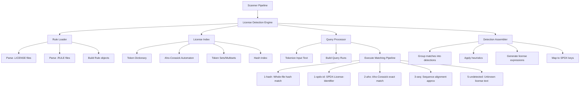
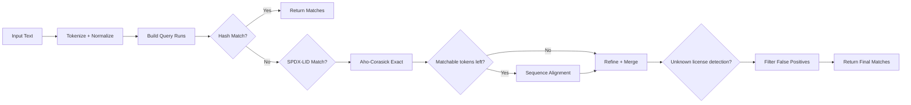

# License Detection Implementation Plan

> **Status**: ✅ Phases 0-7 Complete — Scanner Integration Done
> **Priority**: P0 — Critical Core Feature
> **Dependencies**: None (foundational feature)
> **Last Updated**: 2026-02-12

## Overview

License detection is the core feature of ScanCode — identifying license text in source files and generating SPDX license expressions. This plan describes a ScanCode-compatible implementation in Rust that reuses ScanCode's license rules data to produce **identical output** to the Python reference implementation.

### Key Design Decisions

| Decision | Choice | Rationale |
|----------|--------|-----------|
| **Rules data source** | ScanCode's `licensedcode/data/` via `reference/` submodule | Reuse existing rules; extract to dedicated submodule later |
| **Rules loading** | Runtime from configurable path | Smaller binary, allows rule updates without recompilation |
| **Existing askalono module** | Replace entirely | Fundamentally different algorithm; cannot produce identical output |
| **Index caching** | Skip for now | Rebuild on every run; add caching optimization later if needed |
| **License expression parsing** | Evaluate existing crates vs. custom | Decide during implementation based on ScanCode expression compatibility |
| **Implementation approach** | Incremental — raw matching first, then detection heuristics | Get individual matches correct before layering grouping logic |

## Scope

### What This Covers

- Removal of the existing `src/askalono/` module (Phase 0 — clean slate)
- Loading and parsing ScanCode license rules (`.LICENSE` and `.RULE` files)
- Text tokenization and normalization compatible with ScanCode
- License index construction (dictionary, Aho-Corasick automaton, token sets/multisets)
- Multi-strategy matching pipeline (hash → SPDX-LID → Aho-Corasick exact → approximate sequence → unknown)
- Match scoring, coverage, and relevance calculation
- License expression composition and SPDX key mapping
- Detection grouping and heuristics (intros, false positives, clues, file references)
- Integration with the existing scanner pipeline
- Golden tests against Python ScanCode reference output

### What This Doesn't Cover

- License policy evaluation (separate feature)
- License compatibility checking (separate feature)
- SPDX document generation (covered by `OUTPUT_FORMATS_PLAN.md`)
- Copyright detection (covered by `COPYRIGHT_DETECTION_PLAN.md`)
- Index caching/serialization (future optimization)

## Python Reference Implementation

**Location**: `reference/scancode-toolkit/src/licensedcode/`

### Key Components

| File | Purpose |
|------|---------|
| `models.py` | `License` and `Rule` data structures, rule loading from `.LICENSE`/`.RULE` files |
| `index.py` | `LicenseIndex` — index construction, matching pipeline orchestration |
| `tokenize.py` | Text tokenization (word splitting, normalization) |
| `legalese.py` | Dictionary of common license-specific words (high-value tokens) |
| `match_hash.py` | Strategy 1: Whole-file hash matching |
| `match_spdx_lid.py` | Strategy 2: SPDX-License-Identifier expression parsing |
| `match_aho.py` | Strategy 3: Aho-Corasick automaton exact matching |
| `match_seq.py` | Strategy 4: Sequence alignment approximate matching |
| `match_set.py` | Candidate selection using token set/multiset similarity |
| `match_unknown.py` | Strategy 5: Unknown license text detection |
| `match.py` | `LicenseMatch` class, match merging, refinement, false positive filtering |
| `detection.py` | `LicenseDetection` — grouping matches into detections with heuristics |
| `query.py` | `Query` — tokenized input text with query runs |
| `spans.py` | `Span` — efficient integer range sets for tracking matched positions |
| `cache.py` | Index caching, SPDX expression building |

### Data Sources

| Directory | Contents | Scale |
|-----------|----------|-------|
| `data/licenses/` | `.LICENSE` files — license definitions with YAML frontmatter + full text | ~2000+ files |
| `data/rules/` | `.RULE` files — detection rules with YAML frontmatter + pattern text | ~thousands of files |

### Rule File Format

Both `.LICENSE` and `.RULE` files use YAML frontmatter followed by the text body:

```yaml
---
license_expression: mit
is_license_reference: yes
relevance: 100
ignorable_urls:
    - https://choosealicense.com/licenses/mit/
---

https://choosealicense.com/licenses/mit/
```

Key metadata fields: `license_expression`, `is_license_text`, `is_license_notice`, `is_license_reference`, `is_license_tag`, `is_license_intro`, `is_license_clue`, `is_false_positive`, `relevance` (0-100), `minimum_coverage` (0-100), `is_continuous`, `referenced_filenames`, `ignorable_urls`, `ignorable_emails`, `notes`.

## Current State in Rust

### Implemented

- ✅ SPDX license data embedded at compile time (`resources/licenses/` submodule) — will be removed with askalono; new engine loads ScanCode rules at runtime
- ✅ `LicenseDetection` and `Match` structs in [`src/models/file_info.rs`](../../../src/models/file_info.rs:258) — these stay as the output format
- ✅ Scanner pipeline integration point in [`src/scanner/process.rs`](../../../src/scanner/process.rs:162)

### To Be Removed (Phase 0)

- ❌ `src/askalono/` module (10 files) — fundamentally different algorithm, cannot produce ScanCode-compatible output
- ❌ SPDX license data embedding via `include_dir!` in [`src/main.rs`](../../../src/main.rs:100) — replaced by runtime rule loading
- ❌ `load_license_database()` function in [`src/main.rs`](../../../src/main.rs:102) — feeds askalono Store
- ❌ `ScanStrategy` parameter threading through scanner pipeline

### Missing

- ❌ ScanCode rule loading and parsing
- ❌ Token-based text tokenization and normalization
- ❌ License index construction (dictionary, automaton, sets)
- ❌ Multi-strategy matching pipeline
- ❌ Match scoring, coverage, and relevance
- ❌ License expression composition
- ❌ Detection grouping and heuristics
- ❌ ScanCode license key ↔ SPDX key mapping

## Architecture

### High-Level Component Diagram



### Matching Pipeline Flow



### Module Structure

```text
src/
├── license_detection/
│   ├── mod.rs              # Public API, LicenseDetectionEngine
│   ├── models.rs           # License, Rule, LicenseMatch structs
│   ├── rules/
│   │   ├── mod.rs          # Rule loading orchestration
│   │   ├── loader.rs       # Parse .LICENSE and .RULE files
│   │   └── legalese.rs     # Common license-specific word dictionary
│   ├── index/
│   │   ├── mod.rs          # LicenseIndex construction and query
│   │   ├── dictionary.rs   # Token string ↔ integer ID mapping
│   │   └── thresholds.rs   # Rule threshold computation
│   ├── tokenize.rs         # Text tokenization and normalization
│   ├── query.rs            # Query, QueryRun — tokenized input
│   ├── spans.rs            # Span — efficient integer range sets
│   ├── match_hash.rs       # Strategy 1: hash matching
│   ├── match_spdx_lid.rs   # Strategy 2: SPDX-License-Identifier
│   ├── match_aho.rs        # Strategy 3: Aho-Corasick exact
│   ├── match_seq.rs        # Strategy 4: sequence alignment
│   ├── match_set.rs        # Candidate selection via set similarity
│   ├── match_unknown.rs    # Strategy 5: unknown license detection
│   ├── match_refine.rs     # Match merging, refinement, false positive filtering
│   ├── detection.rs        # Detection grouping and heuristics
│   └── expression.rs       # License expression parsing and SPDX mapping
├── scanner/
│   └── process.rs          # Updated to use new engine instead of askalono
└── models/
    └── file_info.rs        # LicenseDetection, Match structs (already exist)
```

### Key Rust Crates

| Crate | Purpose |
|-------|---------|
| `aho-corasick` | Aho-Corasick automaton for multi-pattern exact matching |
| `serde` + `serde_yaml` | Parse YAML frontmatter in rule files |
| `regex` | Text tokenization patterns |
| `unicode-normalization` | Unicode text normalization |
| `spdx` (evaluate) | SPDX license expression parsing (or custom implementation) |

## Implementation Phases

### Phase 0: Askalono Removal — Clean Slate

**Goal**: Remove the existing askalono-based license detection to start from a clean slate. After this phase, the scanner compiles and runs but produces no license detection output.

#### 0.1 Remove `src/askalono/` Directory

Delete the entire `src/askalono/` directory (10 files):

| File | Purpose (being removed) |
|------|------------------------|
| `mod.rs` | Module exports: `TextData`, `Store`, `ScanStrategy` |
| `license.rs` | `TextData` struct with n-gram matching, `LicenseType` enum |
| `strategy.rs` | `ScanStrategy` with Elimination and TopDown modes |
| `ngram.rs` | N-gram set implementation with Dice coefficient |
| `preproc.rs` | Text normalization |
| `store/mod.rs` | Store module exports |
| `store/base.rs` | `Store` with `LicenseEntry` |
| `store/spdx.rs` | SPDX JSON loading |
| `store/cache.rs` | Binary cache serialization |
| `store/analyze.rs` | License analysis |

#### 0.2 Update `src/main.rs`

- Remove `use askalono::ScanStrategy;` (line 1)
- Remove `use crate::askalono::{Store, TextData};` (line 14)
- Remove `mod askalono;` (line 19)
- Remove `const LICENSE_DETECTION_THRESHOLD: f32 = 0.9;` (line 30)
- Remove `const LICENSES_DIR: Dir = include_dir!(...)` (line 100) and `use include_dir::{Dir, include_dir};` (line 5)
- Remove `load_license_database()` function entirely (lines 102-126)
- Remove `let store = load_license_database()?;` and `let strategy = ScanStrategy::new(&store)...` (lines 47-50)
- Remove `&strategy` parameter from `process()` call (line 65)

#### 0.3 Update `src/lib.rs`

- Remove `pub mod askalono;` (line 253)
- Update all doc comment code examples (lines 12-31, 158-174, 179-198, 204-218) to remove `Store`, `ScanStrategy` references
- Update module documentation (lines 67-71) to remove askalono description

#### 0.4 Update `src/scanner/process.rs`

- Remove `use crate::askalono::{ScanStrategy, TextData};` (line 1)
- Remove `scan_strategy: &ScanStrategy` parameter from `process()` function (line 25)
- Remove `scan_strategy` parameter from `process_file()` (line 100) and `extract_information_from_content()` (line 138)
- Replace `extract_license_information()` body with a no-op stub:

  ```rust
  fn extract_license_information(
      _file_info_builder: &mut FileInfoBuilder,
      _text_content: String,
  ) -> Result<(), Error> {
      // TODO: Implement ScanCode-compatible license detection engine
      Ok(())
  }
  ```

- Update recursive `process()` call (line 78-84) to remove `scan_strategy` parameter

#### 0.5 Update Parser Doc Comments

Remove "License declaration normalization using askalono" from doc comments in:

- [`src/parsers/cargo.rs`](../../../src/parsers/cargo.rs:11)
- [`src/parsers/npm.rs`](../../../src/parsers/npm.rs:11)
- [`src/parsers/composer.rs`](../../../src/parsers/composer.rs:11)
- [`src/parsers/nuget.rs`](../../../src/parsers/nuget.rs:13)
- [`src/parsers/maven.rs`](../../../src/parsers/maven.rs:13)
- [`src/parsers/python.rs`](../../../src/parsers/python.rs:16)

#### 0.6 Clean Up `Cargo.toml`

Remove askalono-only dependencies:

| Dependency | Section | Reason |
|-----------|---------|--------|
| `rmp-serde` | `[dependencies]` | Only used in `askalono/store/cache.rs` |
| `zstd` | `[dependencies]` | Only used by askalono cache |
| `env_logger` | `[dev-dependencies]` | Only used by askalono tests |

Remove the `# askalono` comment headers (lines 36, 89).

**Keep** these dependencies (used elsewhere):

- `flate2` — used by ruby, debian, alpine parsers
- `lazy_static` — used by podspec, cran, podfile parsers
- `unicode-normalization` — will be needed by new license detection tokenizer
- `regex`, `log`, `anyhow` — used widely
- `include_dir` — evaluate if still needed; currently only used for SPDX data feeding askalono. If no other use, remove it too.

Also remove the `spdx` and `gzip` features from `[features]` if they were askalono-specific:

```toml
[features]
default = ["spdx"]
gzip = []
spdx = []
```

#### 0.7 Verification

- Run `cargo build` — must compile without errors
- Run `cargo test` — all existing tests must pass (license detection tests will be gone, package parser tests must still pass)
- Run `cargo clippy` — no warnings
- Run `cargo fmt` — code formatted
- Verify scanner still produces valid JSON output (with empty `license_detections` arrays)

**Testing**: Compile check, full test suite, manual scan of a small directory to verify output format.

---

### Phase 1: Foundation — Rule Loading and Tokenization

**Goal**: Load ScanCode rules from disk and tokenize text identically to ScanCode.

#### 1.1 Rule File Parser

- Parse `.LICENSE` files: YAML frontmatter → `License` struct + full license text
- Parse `.RULE` files: YAML frontmatter → `Rule` struct + pattern text
- Handle all metadata fields: `license_expression`, `is_license_text/notice/reference/tag/intro/clue`, `is_false_positive`, `relevance`, `minimum_coverage`, `is_continuous`, `referenced_filenames`, `ignorable_urls/emails`, `notes`
- Load from configurable path (default: `reference/scancode-toolkit/src/licensedcode/data/`)
- Validate rules on load (no duplicate texts, valid expressions)

#### 1.2 Text Tokenization

- [x] Implement ScanCode-compatible tokenizer: split on non-alphanumeric, lowercase, strip punctuation
- [x] Implement text normalization: collapse whitespace, normalize unicode, handle special characters
- [x] Build the "legalese" dictionary — common license-specific words that are high-value tokens
- [x] Distinguish high-value (legalese) tokens from low-value (junk/common) tokens
- [x] Token ID assignment: legalese tokens get low IDs, other tokens get higher IDs

**Status**: ✅ Complete — Full tokenization with legalese dictionary (2026-02-12)
**Implementation**: `src/license_detection/tokenize.rs`, `src/license_detection/rules/legalese.rs`

- `tokenize()` - Tokenizes text with stopword filtering
- `tokenize_without_stopwords()` - Tokenizes without filtering (for queries)
- `normalize_text()` - Text normalization (passthrough, matches Python)
- Full ScanCode compatibility via regex pattern `[A-Za-z0-9]+\+?[A-Za-z0-9]*`
- Complete STOPWORDS set from reference implementation
- Legalese dictionary with 4506 entries (commit e0714f0)

#### 1.3 Data Structures

- `License` struct: key, name, SPDX key, category, text, URLs, notes
- `Rule` struct: license_expression, text, tokens, flags, relevance, minimum_coverage, thresholds
- Token dictionary: `HashMap<String, u16>` (token string → token ID)
- Span type: efficient integer range set for tracking matched positions

**Testing**: Unit tests for rule parsing, tokenization against known ScanCode outputs.

### Phase 2: Index Construction ✅ **COMPLETE**

**Goal**: Build the license index data structures from loaded rules.

**Implemented**: ✅ Complete index construction with all required data structures
**Tests**: 19 tests passing (builder) + 14 tests passing (engine)
**Date**: 2026-02-12

#### 2.1 Token Dictionary Building ✅

- ✅ Initialize with legalese tokens (low IDs = high value)
- ✅ Add SPDX key tokens
- ✅ Assign IDs to all rule tokens encountered during indexing
- ✅ Track `len_legalese` threshold for high/low token distinction

#### 2.2 Index Structures ✅

- ✅ `rid_by_hash`: `HashMap<u64, usize>` — rule hash → rule ID for hash matching
- ✅ `rules_automaton`: Aho-Corasick automaton built from all rule token sequences
- ✅ `unknown_automaton`: Separate automaton for unknown license detection
- ✅ `sets_by_rid`: Token ID sets per rule (for candidate selection)
- ✅ `msets_by_rid`: Token ID multisets per rule (for candidate ranking)
- ✅ `high_postings_by_rid`: Inverted index of high-value token positions per rule
- ✅ `regular_rids` / `false_positive_rids` / `weak_rids`: Rule classification sets
- ✅ `is_approx_matchable` flag per rule for unknown detection

#### 2.3 Rule Threshold Computation ✅

- ✅ Compute per-rule thresholds: `length_unique`, `high_length_unique`, `high_length`
- ✅ Determine `min_matched_length`, `min_high_matched_length` for match validation
- ✅ Classify rules: tiny, small, approx-matchable based on length and token composition

**Testing**: Verify index construction produces correct structures for known rule sets.

### Phase 3: Query Processing ✅ **COMPLETE**

**Goal**: Tokenize input files and prepare them for matching.

**Implemented**: ✅ Complete query processing with Query and QueryRun
**Date**: 2026-02-12

#### 3.1 Query Construction ✅

- ✅ Tokenize input text using the index dictionary
- ✅ Track token positions and line numbers (`line_by_pos` mapping)
- ✅ Handle unknown tokens (tokens not in dictionary)
- ✅ Detect binary/non-text content and skip
- ✅ Track high/low matchables for efficient matching

#### 3.2 Query Runs ✅

- ✅ Break query into "query runs" — contiguous regions of matchable tokens
- ✅ Implement `QueryRun` with start/end positions, matchable token tracking
- ✅ Support subtraction of matched spans from query runs

#### 3.3 SPDX-License-Identifier Line Detection ✅

- ✅ Detect `SPDX-License-Identifier:` lines in input
- ✅ Extract the expression text for SPDX-LID matching

### Phase 4: Matching Strategies (✅ Complete)

**Goal**: Implement each matching strategy to produce individual `LicenseMatch` results.

#### 4.1 Hash Match (`1-hash`)

- Compute hash of entire query token sequence
- Look up in `rid_by_hash` for exact whole-file match
- If found, return single match covering entire file with 100% coverage

#### 4.2 SPDX-License-Identifier Match (`1-spdx-id`)

- Parse SPDX-License-Identifier expressions
- Map SPDX keys to ScanCode license keys
- Create synthetic matches for each license in the expression
- Handle `WITH` exceptions, `AND`/`OR` operators

#### 4.3 Aho-Corasick Exact Match (`2-aho`)

- Run the rules automaton against the whole query run
- Collect all exact matches (complete rule token sequences found in query)
- Handle overlapping matches — keep best coverage
- Refine matches: merge adjacent, filter contained

#### 4.4 Approximate Sequence Match (`3-seq`)

- **Candidate selection**: Use token set/multiset similarity to find candidate rules
  - Compute Jaccard-like similarity between query run tokens and rule tokens
  - Rank candidates by similarity score
  - Select top-N candidates for detailed alignment
- **Sequence alignment**: For each candidate, perform local alignment
  - Use high-value token positions as anchors
  - Find matching blocks between query and rule token sequences
  - Compute match spans, coverage, and score
- Handle near-duplicate detection (whole-file close matches)

#### 4.5 Unknown License Match (`5-undetected`)

- Run unknown automaton against unmatched query regions
- Detect license-like text that doesn't match any known rule
- Create `unknown` license matches for these regions

#### 4.6 Match Refinement

- Merge overlapping matches
- Filter contained matches (smaller match inside larger match)
- Filter false positive matches (using `false_positive_rids`)
- Compute final scores: `score = coverage * relevance / 100`
- Set matched line numbers from token positions

**Testing**: Golden tests for each strategy against known inputs. Unit tests for scoring.

### Phase 5: License Expression Composition ✅ **COMPLETE**

**Goal**: Combine match results into license expressions with SPDX mapping.

**Implemented**: ✅ Custom license expression parser, SPDX mapping, and expression combination
**Tests**: 67 tests passing
**Date**: 2026-02-12
**Details**: `docs/license-detection/phase-5-expression-composition.md`

#### 5.1 License Expression Parser ✅ **COMPLETE**

- ✅ Evaluated existing Rust crates (`spdx` from embark-studios) - decided custom parser is better
  - `spdx` crate only supports official SPDX identifiers (MIT, Apache-2.0, GPL-2.0)
  - ScanCode uses custom lowercase keys (mit, gpl-2.0-plus) not recognized by crate
  - ScanCode uses `LicenseRef-scancode-*` format for non-SPDX licenses
- ✅ Implemented custom parser supporting:
  - ScanCode license keys (e.g., `mit`, `gpl-2.0-plus`, `apache-2.0`)
  - Operators: `AND`, `OR`, `WITH` (with correct precedence)
  - Parenthetical grouping
  - Simplification and deduplication
  - Error handling with detailed `ParseError` enum
- **File**: `src/license_detection/expression.rs` (920 lines)
- **Tests**: 45 tests (all passing)

#### 5.2 ScanCode Key ↔ SPDX Key Mapping ✅ **COMPLETE**

- ✅ Load mapping from `License` objects (`spdx_license_key` field)
- ✅ Build bidirectional mapping: ScanCode key → SPDX key and vice versa
- ✅ Handle `LicenseRef-scancode-*` keys for non-SPDX licenses
- ✅ Expression-level conversion (recursive AST traversal)
- **File**: `src/license_detection/spdx_mapping.rs` (551 lines)
- **Tests**: 22 tests (all passing)

#### 5.3 Expression Combination ✅ **COMPLETE**

- ✅ Combine multiple match expressions using `AND` and `OR`
- ✅ Deduplicate and simplify combined expressions (via `unique` flag)
- ✅ Generate license expression strings from AST
- **File**: Extended `src/license_detection/expression.rs`
- **Tests**: 11 tests for combination (all passing)

### Phase 6: Detection Assembly and Heuristics ✅ **COMPLETE**

**Goal**: Group raw matches into `LicenseDetection` objects with heuristic analysis.

**Implemented**: ✅ Complete detection pipeline with grouping, analysis, expression generation, and post-processing
**Tests**: 93 tests passing
**Date**: 2026-02-12
**Details**: `docs/license-detection/phase-6-detection-assembly.md`

#### 6.1 Match Grouping ✅ **COMPLETE**

- ✅ Group matches by file region (contiguous or nearby line ranges)
- ✅ Separate matches into detection groups based on proximity and relationship
- ✅ Uses proximity threshold of 4 lines (matches Python reference)
- ✅ Creates DetectionGroup from nearby matches
- **File**: `src/license_detection/detection.rs`
- **Tests**: 7 tests

#### 6.2 Detection Analysis ✅ **COMPLETE**

Implement the detection categories from ScanCode's `detection.py`:

- ✅ **Perfect detection**: All matches are exact (hash/SPDX-LID/Aho) with 100% coverage
- ✅ **Unknown intro before detection**: License intro followed by proper match
- ✅ **Extra words**: Perfect match with additional unmatched words (formula: coverage * relevance / 100 - score > 0.01)
- ✅ **Imperfect coverage**: Match coverage below 100%
- ✅ **License clues**: Low-confidence matches reported as clues, not detections (60% threshold)
- ✅ **False positive**: Spurious matches to non-license text (bare rules, GPL short, late matches)
- ✅ **Low quality matches**: Coverage below clue threshold (60%)
- ✅ **Unknown match**: Matches to unknown license rules
- ✅ **File reference**: Match references another file (e.g., "see LICENSE")
- ✅ **Score computation**: Weighted average of match scores
- ✅ **Classification**: classify_detection() determines valid vs invalid detection
- **File**: `src/license_detection/detection.rs`
- **Tests**: 45+ tests

#### 6.3 License Expression Generation ✅ **COMPLETE**

- ✅ Generate ScanCode license expressions from matches
- ✅ Generate SPDX license expressions from matches
- ✅ Convert ScanCode expressions to SPDX using SpdxMapping
- ✅ Handle LicenseRef-scancode-* format for non-SPDX licenses
- **Testing**: Golden tests comparing full detection output against Python ScanCode.

**Implementation Details (Phase 6.3)**:

Implemented SPDX expression generation in `src/license_detection/detection.rs`:

- `determine_spdx_expression(matches: &[LicenseMatch]) -> Result<String, String>`:
  - ✅ Combines SPDX expressions from matches using AND relation
  - ✅ Uses existing `combine_expressions()` with `CombineRelation::And`
  - ✅ Falls back to ScanCode license_expression if SPDX is empty
  - ✅ Returns error if no expressions available

- `determine_spdx_expression_from_scancode(scancode_expression: &str, spdx_mapping: &SpdxMapping) -> Result<String, String>`:
  - ✅ Converts ScanCode license keys to SPDX keys using SpdxMapping
  - ✅ Uses `SpdxMapping.expression_scancode_to_spdx()` for full expression conversion
  - ✅ Handles `LicenseRef-scancode-*` format for non-SPDX licenses
  - ✅ Based on Python: `detection.spdx_license_expression()` at detection.py:269

- `populate_detection_from_group_with_spdx(detection: &mut LicenseDetection, group: &DetectionGroup, spdx_mapping: &SpdxMapping)`:
  - ✅ Extended version of `populate_detection_from_group()` with SPDX mapping
  - ✅ Generates both ScanCode and SPDX expressions from detection group
  - ✅ Handles cases where SPDX expression may be empty or unknown

- `populate_detection_from_group(detection: &mut LicenseDetection, group: &DetectionGroup)`:
  - ✅ Now auto-generates SPDX expression from matches' `license_expression_spdx` field
- **Tests**: 6 tests (all passing)

#### 6.4 Post-Processing ✅ **COMPLETE**

- ✅ Filter detections by minimum score threshold
- ✅ Remove duplicate detections (same license expression)
- ✅ Rank detections by score and coverage
- ✅ Apply detection-level heuristics (prefer SPDX-LID > hash > Aho > sequence > unknown)
- ✅ Update licenses.json model (via LicenseDetection struct)
- **File**: `src/license_detection/detection.rs`
- **Tests**: 23 tests

**Overall Phase 6: 93 tests passing (1645 total)**

**Implementation Details (Phase 6.3)**:

Implemented SPDX expression generation in `src/license_detection/detection.rs`:

- `determine_spdx_expression(matches: &[LicenseMatch]) -> Result<String, String>`:
  - Combines SPDX expressions from matches using AND relation
  - Uses existing `combine_expressions()` with `CombineRelation::And`
  - Falls back to ScanCode license_expression if SPDX is empty
  - Returns error if no expressions available

- `determine_spdx_expression_from_scancode(scancode_expression: &str, spdx_mapping: &SpdxMapping) -> Result<String, String>`:
  - Converts ScanCode license keys to SPDX keys using SpdxMapping
  - Uses `SpdxMapping.expression_scancode_to_spdx()` for full expression conversion
  - Handles `LicenseRef-scancode-*` format for non-SPDX licenses
  - Based on Python: `detection.spdx_license_expression()` at detection.py:269

- `populate_detection_from_group_with_spdx(detection: &mut LicenseDetection, group: &DetectionGroup, spdx_mapping: &SpdxMapping)`:
  - Extended version of `populate_detection_from_group()` with SPDX mapping
  - Generates both ScanCode and SPDX expressions from detection group
  - Handles cases where SPDX expression may be empty or unknown

- Updated `populate_detection_from_group(detection: &mut LicenseDetection, group: &DetectionGroup)`:
  - Now auto-generates SPDX expression from matches' `license_expression_spdx` field
  - Calls `determine_spdx_expression()` internally

**Tests Added** (72 tests now in detection module):

- `test_determine_spdx_expression_single()`: Single match generates SPDX expression
- `test_determine_spdx_expression_multiple()`: Multiple matches combined with AND
- `test_determine_spdx_expression_empty()`: Empty matches return error

- `test_determine_spdx_expression_from_scancode_single()`: Convert single license
- `test_determine_spdx_expression_from_scancode_multiple()`: Convert AND expression
- `test_determine_spdx_expression_from_scancode_empty()`: Empty expression handled
- `test_determine_spdx_expression_from_scancode_custom_license()`: Custom license with LicenseRef

**Public API Exports** (via `src/license_detection/mod.rs`):

- `determine_spdx_expression`
- `determine_spdx_expression_from_scancode`
- `populate_detection_from_group_with_spdx`

**Note**: Two expression generation approaches available:

1. Direct from match SPDX expressions (simpler, no mapping overhead)
2. Conversion from ScanCode expression (full SPDX mapping with LicenseRef support)

Both are publicly exported for scanner pipeline integration, allowing choice based on performance vs. coverage needs.

### Phase 7: Scanner Integration — ✅ COMPLETE

**Goal**: Wire the new license detection engine into the scanner pipeline.

#### 7.1 Engine API — ✅ Complete

- Create `LicenseDetectionEngine` with `detect(text: &str) -> Vec<LicenseDetection>` API
- Initialize engine once at startup with rule path configuration
- Wrap in `Arc<LicenseDetectionEngine>` for thread-safe sharing across rayon workers

#### 7.2 Scanner Pipeline Integration — ✅ Complete

- Update [`src/scanner/process.rs`](../../../src/scanner/process.rs) to accept `&LicenseDetectionEngine` parameter
- Replace the no-op `extract_license_information()` stub (from Phase 0) with actual detection call
- Populate all `Match` fields: `score`, `matched_length`, `match_coverage`, `rule_relevance`, `rule_identifier`, `rule_url`, `matched_text`, `matcher`
- Populate file-level `license_expression` from detection results

#### 7.3 Output Compatibility — ✅ Complete

- Verify JSON output matches ScanCode format exactly
- Ensure `detected_license_expression_spdx` field is populated correctly
- Verify `license_detections` array structure matches ScanCode
- Handle `from_file` field in matches (for cross-file references)

#### 7.4 CLI Updates — ✅ Complete

- Add `--license-rules-path` CLI option for custom rule directory
- Default to `reference/scancode-toolkit/src/licensedcode/data/` if available
- Add `--include-text` flag to include matched text in output
- Error gracefully if rules directory is not found

**Bug Fixed**: SPDX-LID matcher was creating thousands of duplicate matches (one per rule with matching license_expression). Fixed by selecting single best rule by relevance instead of all matching rules. See `docs/license-detection/improvements/` for details.

**Testing**: Integration tests, golden tests against Python ScanCode output.

### Phase 8: Comprehensive Testing and Validation

**Goal**: Ensure identical output to Python ScanCode across a wide range of inputs.

#### 8.1 Golden Test Suite

- Generate reference outputs from Python ScanCode for test files
- Compare Rust output against reference for:
  - Single-license files (MIT, Apache-2.0, GPL-2.0, etc.)
  - Multi-license files (dual licensing, license stacks)
  - License notices, references, tags
  - SPDX-License-Identifier headers
  - Files with no license
  - Edge cases: very short files, very long files, binary files
  - False positive scenarios

#### 8.2 Per-Strategy Tests

- Hash match: exact whole-file license texts
- SPDX-LID: various SPDX-License-Identifier formats
- Aho-Corasick: exact rule matches in larger files
- Sequence alignment: modified/partial license texts
- Unknown: license-like text not matching any rule

#### 8.3 Performance Testing

- Benchmark index construction time
- Benchmark per-file detection time
- Compare with Python ScanCode performance
- Profile memory usage

## Output Format

The license detection engine populates the existing [`LicenseDetection`](../../../src/models/file_info.rs:258) and [`Match`](../../../src/models/file_info.rs:270) structs:

```json
{
  "license_detections": [
    {
      "license_expression": "mit",
      "license_expression_spdx": "MIT",
      "identifier": "mit-cacd5c0c-204a-422a-8b69-2dd1e4092e37",
      "matches": [
        {
          "license_expression": "mit",
          "license_expression_spdx": "MIT",
          "from_file": null,
          "start_line": 1,
          "end_line": 21,
          "matcher": "2-aho",
          "score": 100.0,
          "matched_length": 161,
          "match_coverage": 100.0,
          "rule_relevance": 100,
          "rule_identifier": "mit.LICENSE",
          "rule_url": "https://github.com/nexB/scancode-toolkit/tree/develop/src/licensedcode/data/licenses/mit.LICENSE",
          "matched_text": "MIT License\n\nPermission is hereby granted..."
        }
      ]
    }
  ]
}
```

### Matcher Identifiers

| Matcher | ID | Description |
|---------|-----|-------------|
| Hash | `1-hash` | Whole-file exact hash match |
| SPDX-LID | `1-spdx-id` | SPDX-License-Identifier expression |
| Aho-Corasick | `2-aho` | Exact token sequence match via automaton |
| Sequence | `3-seq` | Approximate sequence alignment match |
| Unknown | `5-undetected` | Unknown license text detection |

## Success Criteria

- [x] Askalono module fully removed; scanner compiles and runs without it (Phase 0)
- [x] All ScanCode license rules load correctly from disk
- [x] Tokenization produces identical token sequences to Python ScanCode
- [x] Hash matching detects exact whole-file license texts
- [x] SPDX-License-Identifier lines are parsed correctly
- [x] Aho-Corasick matching finds all exact rule matches
- [x] Approximate matching handles modified/partial license texts
- [x] License expressions are generated correctly (both ScanCode and SPDX keys)
- [x] Detection grouping and heuristics produce correct results
- [x] JSON output format matches ScanCode exactly
- [ ] Golden tests pass against Python reference output (Phase 8 - pending)
- [ ] Performance: index construction < 5s, per-file detection < 100ms average (Phase 8 - pending)
- [x] All existing tests continue to pass after askalono removal
- [x] Thread-safe for parallel processing with rayon

## Test Status

**Total Tests**: 1752 passing, 0 failing, 0 ignored
**Clippy**: Clean, no warnings

## Risk Mitigation

| Risk | Mitigation |
|------|------------|
| Tokenization differences causing match divergence | Extensive unit tests comparing token output with Python |
| Aho-Corasick crate behavior differences | Test automaton construction and matching against known patterns |
| Sequence alignment complexity | Start with simpler alignment, iterate toward ScanCode compatibility |
| Large rule set causing slow index construction | Profile early; Rust should be faster than Python here |
| License expression crate incompatibility | Evaluate early in Phase 5; fall back to custom parser if needed |
| Thread safety issues with shared index | Use `Arc<LicenseIndex>` for read-only shared access |

## Improvement Notes

Any bugs or improvements discovered during implementation should be documented in separate files in `docs/license-detection/improvements/`. For the first milestone, the goal is **identical output** — improvements come later.

Potential areas to watch:

- ScanCode's `detection.py` has known TODOs and FIXMEs
- Some threshold values may be suboptimal
- False positive filtering heuristics may have edge cases
- The sequence alignment algorithm has known performance issues noted in comments

## Related Documents

- **Architecture**: [`docs/ARCHITECTURE.md`](../../ARCHITECTURE.md) — scanner pipeline, detection engine placement
- **Testing Strategy**: [`docs/TESTING_STRATEGY.md`](../../TESTING_STRATEGY.md) — golden test approach
- **ADR 0002**: [`docs/adr/0002-extraction-vs-detection.md`](../../adr/0002-extraction-vs-detection.md) — extraction vs. detection separation
- **Existing placeholder**: [`docs/implementation-plans/text-detection/LICENSE_DETECTION_PLAN.md`](../text-detection/LICENSE_DETECTION_PLAN.md) — superseded by this plan
- **Copyright Detection**: [`docs/implementation-plans/text-detection/COPYRIGHT_DETECTION_PLAN.md`](../text-detection/COPYRIGHT_DETECTION_PLAN.md) — related but independent feature
